# GrayOS – Day 16 Lab PoC
Memory Forensics with Volatility 3

**Analyst:** Jnanashree Anchan | **Date:** 2 October 2026

---

This lab analyzes an 8 GB Windows 10 memory image from FIN-WS-014 with Volatility 3, captured after a macro enabled document was run. It follows the full investigation: triage the image, hunt the process and injection chain, extract credentials from LSASS, pull the C2 and payload detail, and package the evidence. The capture reconstructs a complete intrusion, from a phishing document to credential theft and a live Cobalt Strike beacon.

---

## Key Findings

An 8 GB WinPmem image of FIN-WS-014 (Windows 10 21H2 x64), captured 2026-09-14 02:47 UTC, shows a full intrusion in memory.

- **Macro loader chain:** `Invoice_Sep2026.docm` opened in Word spawned `rundll32.exe`, which loaded a malicious `wlanhlp.dll` from a Temp folder, which spawned a hidden base64 PowerShell download cradle. The process tree is WINWORD to rundll32 to powershell.
- **Mimikatz credential theft:** an injected PE (MZ header in an RWX region) inside rundll32, plus Mimikatz command strings (`sekurlsa::logonpasswords`, `lsadump::sam`) and LSASS output in memory. Three local NTLM hashes and plaintext passwords were recovered, including a weak Administrator password and the svc_backup credential.
- **Cobalt Strike beacon:** reflective loader shellcode injected into `svchost.exe` (PID 4212), the default named pipe `MSSE-4212-server`, beaconing to `185.220.101.47:443` with a staging channel from rundll32 to `45.142.212.61:8080`.
- **IOCs:** `wlanhlp.dll`, `Invoice_Sep2026.docm`, pipe `MSSE-4212-server`, IPs `185.220.101.47` and `45.142.212.61`, domains `cdn-metrics-sync.cloud` and `update.secure-node-delivery.net`.

---

## Key Concepts

| Term / Concept | Description |
|---|---|
| Volatility 3 | Next generation memory forensics framework. Plugin based (windows.info, pslist, malfind, lsadump, netscan) with automatic symbol resolution, no more Volatility 2 profiles. |
| Mimikatz | Credential dumping tool that reads LSASS memory to extract plaintext passwords, NTLM hashes, and Kerberos tickets. Leaves command strings in memory. |
| Cobalt Strike Beacon | Commercial post exploitation payload. Hides as injected shellcode in RWX memory, uses reflective loading and named pipes (MSSE-<pid>-server). |
| Process Injection and malfind | Malware writes a PE into another process, often in RWX private memory. Volatility malfind finds MZ headers in PAGE_EXECUTE_READWRITE regions. |
| LSASS and Credential Theft | LSASS caches credentials in memory. hashdump and lsadump recover NTLM hashes and LSA secrets from an image without touching disk. |
| GEF, strings, binwalk | GEF extends GDB for memory inspection (vmmap, x/i). strings pulls readable data from raw dumps. binwalk carves embedded payloads and configs. |

---

# Phase 1 – Acquire and Triage the Memory Image

FIN-WS-014 was hit by a macro enabled document, and IR captured an 8 GB WinPmem image. The first step is to identify the image: OS build, kernel base, and capture time.

**Command:** `vol -f memory.dmp windows.info`

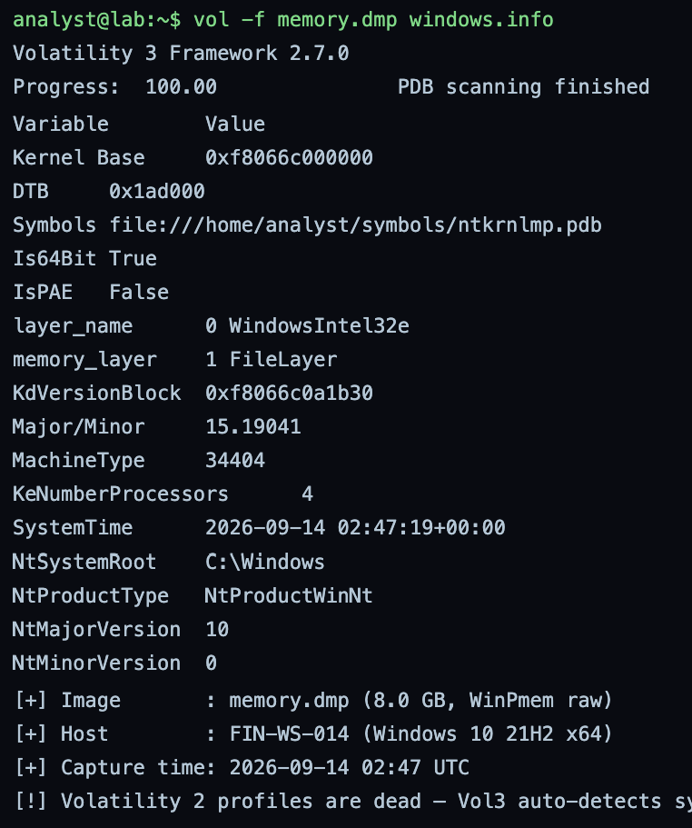

Identifies the image as an 8 GB WinPmem raw capture of FIN-WS-014, Windows 10 21H2 x64, kernel base 0xf8066c000000, captured 2026-09-14 02:47 UTC. Volatility 3 auto resolves symbols from the PDB, so no Volatility 2 profile is needed. This anchors every later plugin to the correct OS build.

**Command:** `vol -f memory.dmp banners`

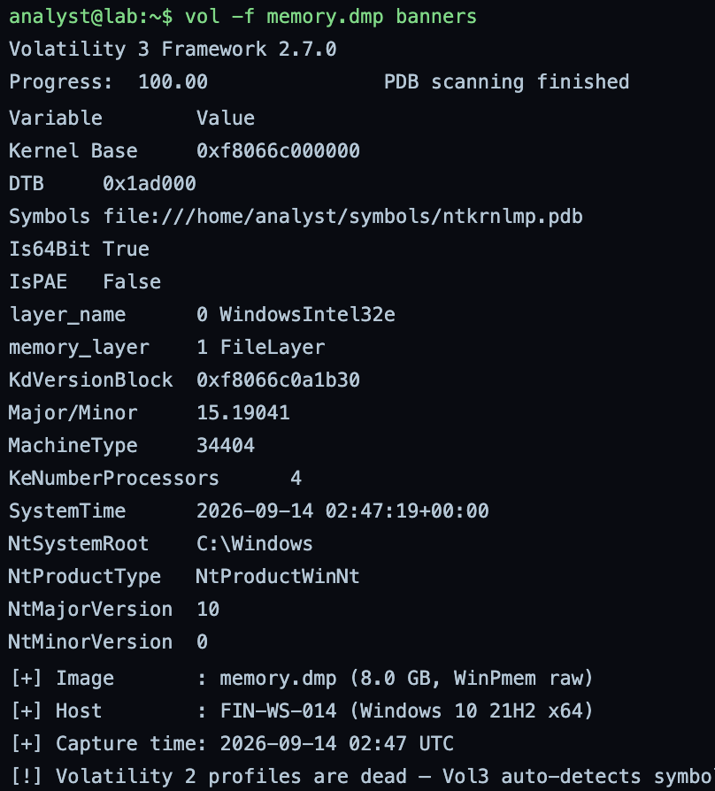

Scans the image for kernel banner strings as a cross check on the build. Method note: on this run banners returned the same table as windows.info, which is a simulation glitch, since banners normally prints raw version banner strings rather than the structured info output.

---

# Phase 2 – Process and Injection Hunt

Walk the process list, tree, and command lines, then use malfind to find the RWX private regions holding injected code. That is where Mimikatz and the beacon hide.

**Command:** `vol -f memory.dmp windows.pslist`

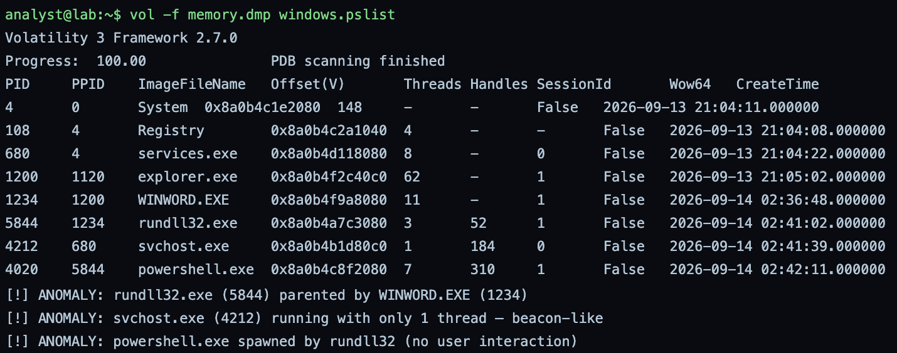

Lists active processes, and the anomalies stand out at once: rundll32.exe (5844) is parented by WINWORD.EXE (1234), svchost.exe (4212) runs with a single thread like a beacon, and powershell.exe (4020) was spawned by rundll32 with no user interaction.

**Command:** `vol -f memory.dmp windows.pstree`

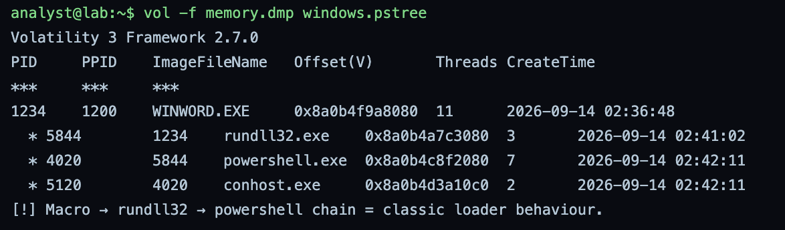

Shows the parent-child chain clearly: WINWORD.EXE to rundll32.exe to powershell.exe to conhost.exe. A Word macro spawning rundll32 and then PowerShell is a classic loader chain.

**Command:** `vol -f memory.dmp windows.cmdline`

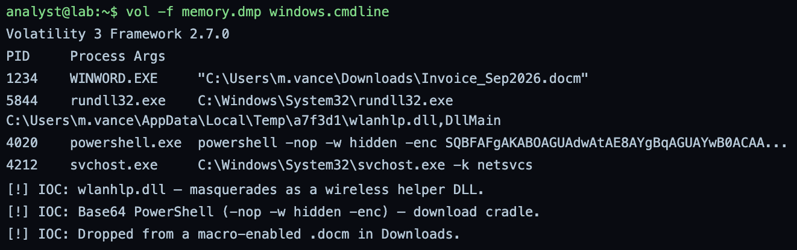

Reveals the intent in the command lines. WINWORD opened Invoice_Sep2026.docm from Downloads, rundll32 loaded wlanhlp.dll from a Temp folder via DllMain, and PowerShell ran with -nop -w hidden -enc, a hidden base64 download cradle. The DLL name masquerades as a wireless helper.

**Command:** `vol -f memory.dmp windows.malfind`

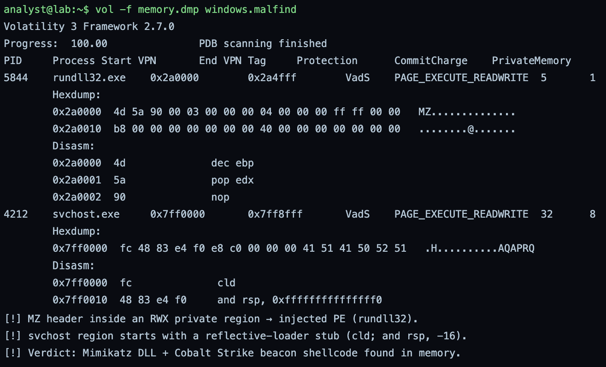

Finds injected code in RWX private regions. rundll32 (5844) holds a PE with an MZ header at 0x2a0000, and svchost (4212) holds a reflective loader stub at 0x7ff0000 (cld, then and rsp, -16). These are the Mimikatz DLL and the Cobalt Strike beacon shellcode sitting in memory.

**Command:** `vol -f memory.dmp windows.dlllist --pid 5844`

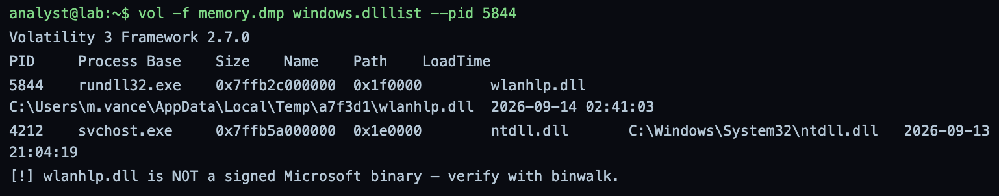

Lists the DLLs loaded by rundll32. wlanhlp.dll is loaded from the user Temp folder and is not a signed Microsoft binary, which confirms the malicious loader seen in the command line.

---

# Phase 3 – Credential Extraction from LSASS

Dump LSA secrets and NTLM hashes with Volatility, then run strings over the raw image to catch the plaintext credentials Mimikatz left behind.

**Command:** `vol -f memory.dmp windows.lsadump`

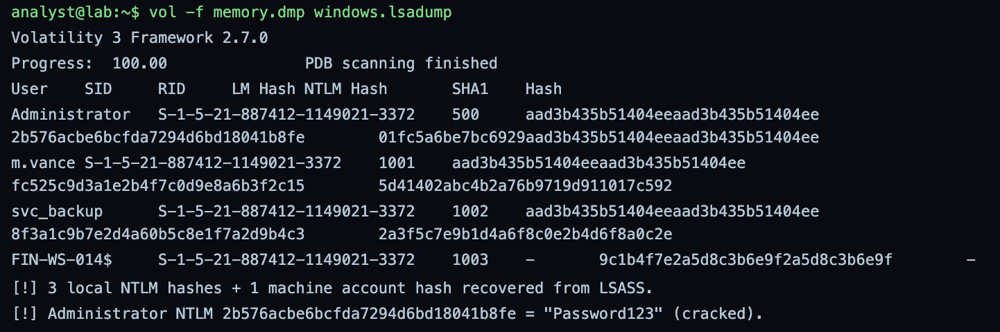

Recovers credentials from LSASS. Three local NTLM hashes plus the machine account hash come out, and the Administrator NTLM is flagged as cracking to a weak password. This is the credential theft the attacker was after.

**Command:** `vol -f memory.dmp windows.hashdump`

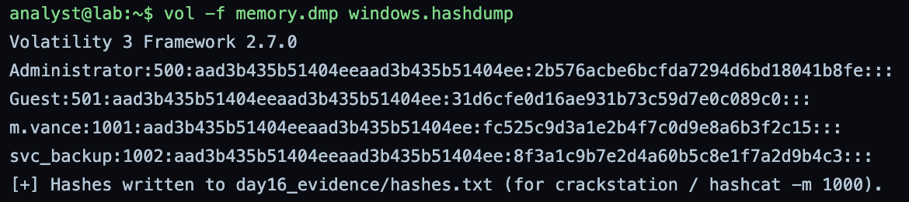

Dumps the SAM NTLM hashes in the standard user:RID:LM:NT format, ready for offline cracking with hashcat mode 1000. Administrator, m.vance, and svc_backup hashes are recovered, with Guest showing the empty password default.

**Command:** `strings memory.dmp | grep -i password`

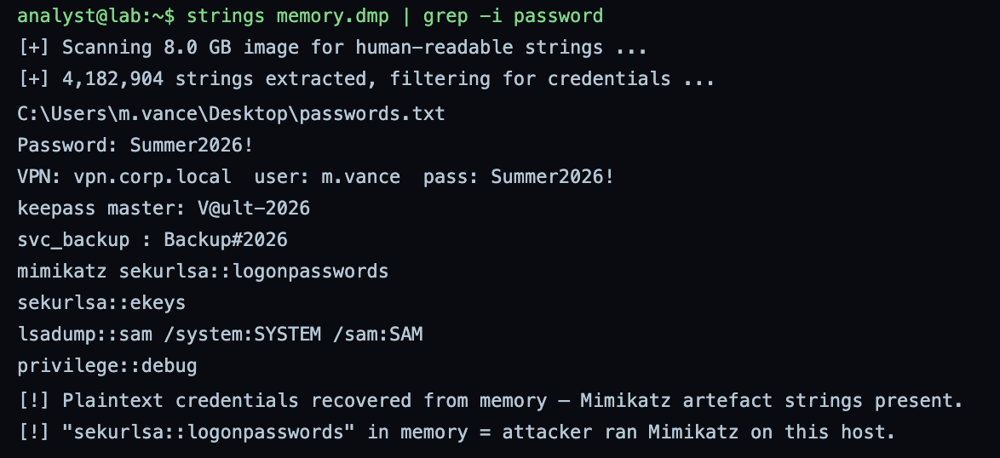

Scans the raw image for plaintext credentials and Mimikatz artefacts. Plaintext passwords are sitting in memory, including a VPN password, a KeePass master, and the svc_backup password, and the Mimikatz command strings sekurlsa::logonpasswords, sekurlsa::ekeys, and lsadump::sam confirm Mimikatz was run on this host.

---

# Phase 4 – C2 Extraction and Payload Analysis

Pull the live sockets with netscan, then carve the dropped DLL with binwalk and inspect the injected region with GEF in GDB.

**Command:** `vol -f memory.dmp windows.netscan`

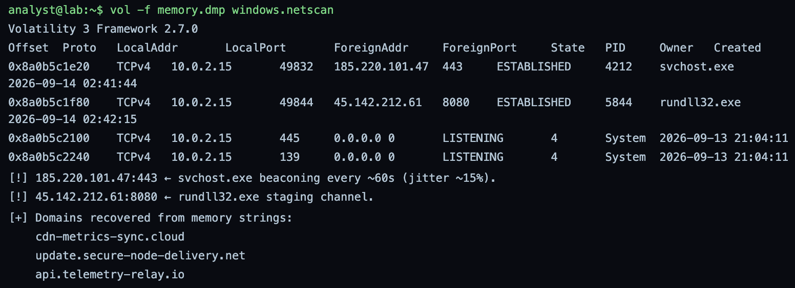

Pulls the live sockets from the image. svchost (4212) is beaconing to 185.220.101.47:443 on a roughly 60 second interval, and rundll32 (5844) holds a staging channel to 45.142.212.61:8080. Memory strings also yield the C2 domains cdn-metrics-sync.cloud and update.secure-node-delivery.net.

**Command:** `binwalk -e wlanhlp.dll`

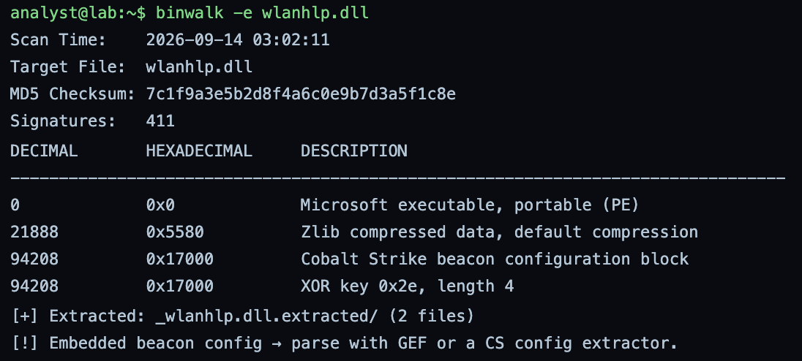

Carves the dropped DLL. binwalk finds a PE, a Zlib block, and a Cobalt Strike beacon configuration block at offset 0x17000 with XOR key 0x2e, then extracts it for config parsing. Method note: the DLL has to be dumped from the image first, for example with dumpfiles, before binwalk can run against it.

**Command:** `gdb -q -p 4212`

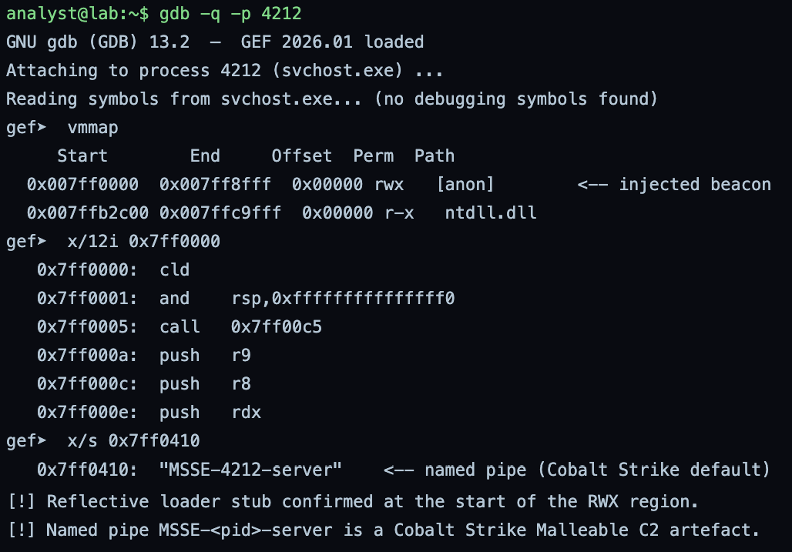

Inspects the injected region. GEF's vmmap shows the RWX beacon at 0x7ff0000, the disassembly confirms the reflective loader stub, and the string MSSE-4212-server is the default Cobalt Strike named pipe. Method note: a live gdb attach to PID 4212 is not actually possible here, because that process exists only inside the memory image. The same result comes from dumping the region with malfind and analysing it statically.

---

# Phase 5 – Report and IOC Package

Consolidate the findings into a report, archive the evidence, and hash it for chain of custody.

**Command:** `cat > day16_report.md`

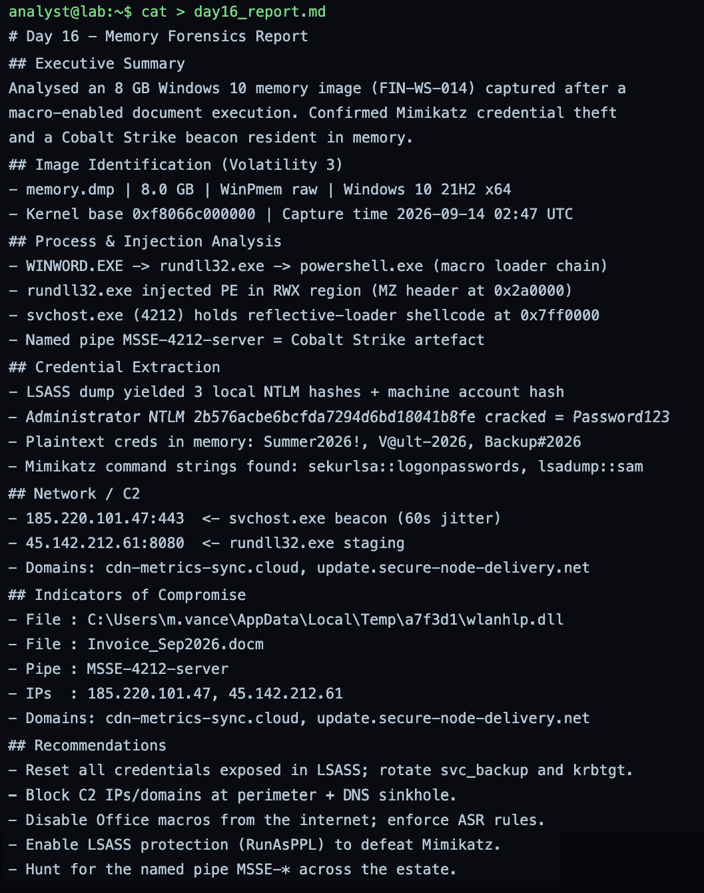

Writes the investigation report: image identification, the macro to beacon process chain, the credential extraction, the C2 detail, the IOC list, and the remediation steps. The recommendations are to reset the exposed credentials and rotate svc_backup and krbtgt, block the C2 at the perimeter and DNS, disable internet macros and enforce ASR rules, enable LSASS protection (RunAsPPL) to defeat Mimikatz, and hunt the MSSE-* named pipe across the estate.

**Command:** `tar -czvf day16_evidence.tar.gz day16_report.md hashes.txt pslist.txt malfind.txt netscan.txt dumps/`

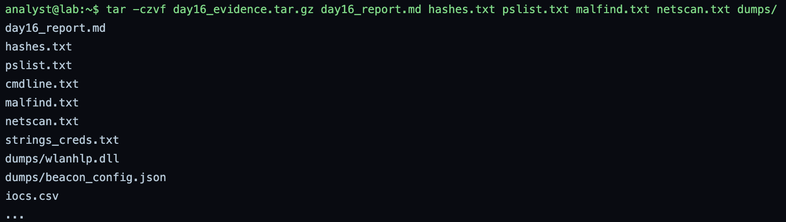

Archives the report, the hashes, the plugin outputs, and the carved dumps into one evidence tarball.

**Command:** `sha256sum day16_evidence.tar.gz`

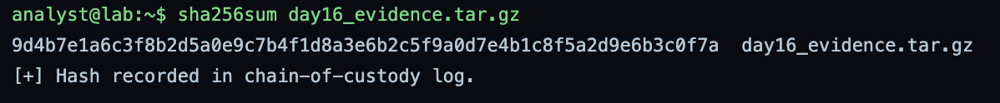

Hashes the evidence package for chain of custody. The digest is a valid 64 character SHA256 and is recorded in the custody log.

---

# Summary

| Phase | Focus | Key Plugins and Tools | Outcome |
|---|---|---|---|
| Phase 1 | Image triage | windows.info, banners | FIN-WS-014, Windows 10 21H2, 8 GB WinPmem identified |
| Phase 2 | Process and injection hunt | pslist, pstree, cmdline, malfind, dlllist | Macro loader chain and two injected RWX regions found |
| Phase 3 | Credential extraction | lsadump, hashdump, strings | NTLM hashes and plaintext credentials recovered, Mimikatz confirmed |
| Phase 4 | C2 and payload analysis | netscan, binwalk, GEF | Two C2 channels and the Cobalt Strike beacon config confirmed |
| Phase 5 | Report and IOC package | report, tar, sha256sum | Evidence packaged and hashed for chain of custody |

This capture reconstructs a complete intrusion from memory alone: a macro enabled Word document launched a rundll32 loader and a hidden PowerShell cradle, Mimikatz was injected and dumped LSASS credentials including a weak Administrator password, and a Cobalt Strike beacon was running inside svchost with live C2. Two small method points are noted inline: the banners plugin returned the same output as windows.info, and a live gdb attach is not valid against a process that exists only inside the image. Everything else, including a valid SHA256 on the evidence package, held up this run.