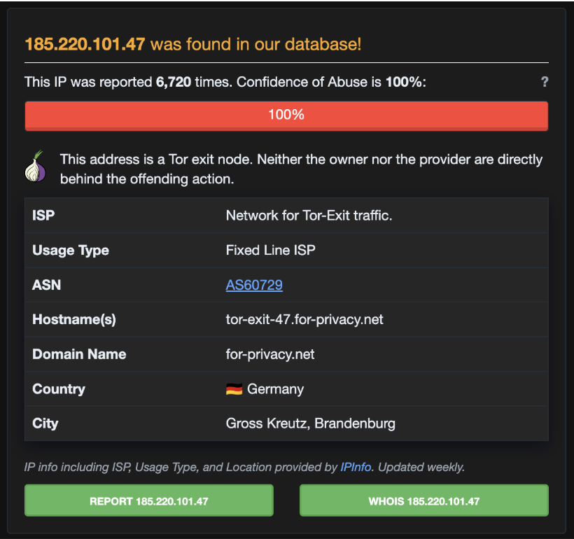
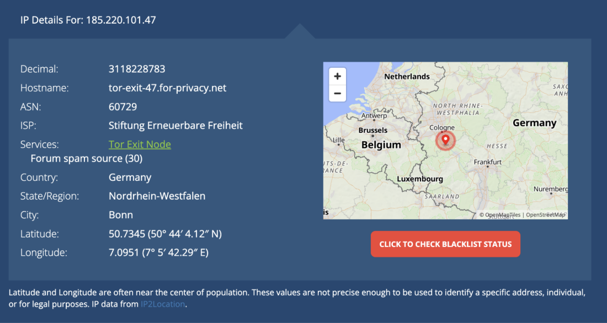

# SOC Triage Report
### SOC-2026-0910-05
**Analyst:** Jnanashree Anchan | **Date:** 10 September 2026

---

## Alert Details

| Field | Value |
|---|---|
| Alert ID | SOC-2026-0910-05 |
| Rule | Impossible Travel - Same User From 2 Countries in 10 Mins |
| Severity | CRITICAL |
| User | priya.sharma@company.com |

---

| | |
|---|---|
| **WHAT** | Impossible Travel - Same user login from India and Netherlands in 8 mins |
| **WHEN** | Sep 10, 09:10:15 IST (Mumbai) and 09:18:42 IST (Amsterdam) |
| **WHERE** | App: prod-app-01 | User: priya.sharma@company.com |
| **WHO** | Legit User (Mumbai) + Attacker IP 185.220.101.47 (Amsterdam/TOR) |
| **WHY** | Account Takeover - MITRE T1078 Valid Accounts |
| **HOW** | Attacker used stolen credentials (phishing) to login from TOR node just after legit login |

---

## Verdict
**TRUE POSITIVE - Confirmed Account Compromise - Impossible Travel**

---

## Evidence

1. 2 logins in 8 mins from 2 countries 7000km apart - Physically impossible
2. 2nd IP is TOR Exit Node with 100% abuse score
3. Unknown device / browser for 2nd login

**IP Location:**

**AbuseIPDB (Germany TOR):**

---

## Impact
**HIGH** - Account takeover confirmed. Attacker has full access to priya.sharma's account.

---

## Actions

- Disable user priya.sharma immediately + Force password reset + Reset MFA
- Block IP 185.220.101.47 on firewall
- Check mailbox forwarding rules (attacker may have created rule)
- Check Azure AD Sign-in logs for other locations
- Escalate to L2 / IR Team

---

## MITRE ATT&CK

| Technique | ID | Description |
|---|---|---|
| Valid Accounts | T1078 | Attacker used stolen valid credentials to authenticate |
| Proxy: TOR | T1090.003 | Login originated from TOR exit node to anonymise origin |

---

## Status
**Escalated to L2**