# GrayOS – Day 10 Lab PoC
Operation Shadow Pulse: OSINT Attribution of a Dark-Web Threat Actor

**Analyst:** Jnanashree Anchan | **Date:** 24 September 2026

---

Our CISO's personal email surfaced on the BreachBase dark-web forum, posted by the handle `0xShadowPulse`. This lab builds the attacker's full profile from public sources before they move from data aggregation to a targeted attack on the CISO.

---

## Key Concepts

| Term / Concept | Description |
|---|---|
| OSINT | Open-Source Intelligence: collecting and linking public data (social media, forums, breaches, infrastructure) into usable intelligence |
| Maigret | Username OSINT tool that checks 3,000+ sites for an account and links aliases to a single identity |
| theHarvester | Collects emails, subdomains, hosts and employee names from public sources for a target domain |
| tookie-osint | Email and name OSINT tool that maps past breaches, linked socials and public profile signals |
| Aliens Eye | AI-powered OSINT platform that scans 840+ platforms at once and links findings into one entity |
| Attribution Confidence | OSINT attribution is a probability, not a certainty. Always report a confidence score and the method used |
| Pivoting | Using one confirmed data point (a handle, an email, a domain) to discover the next one |
| IOC | Indicator of Compromise: a handle, domain, email or IP that can be used to detect or block the attacker |

---

# Phase 1
Triage the Leak: Case Context

**Command:** `cat case_file.txt`

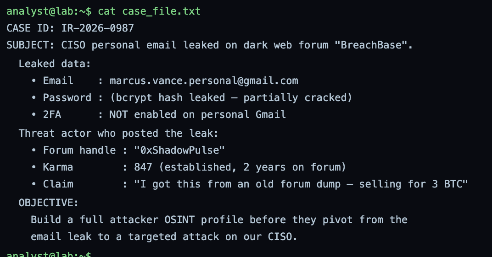

**Command:** `cat leak_dump.txt`

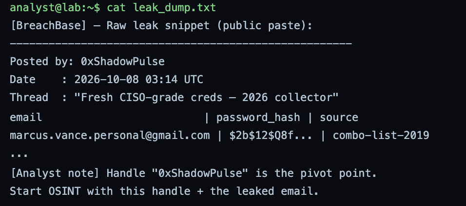

**Command:** `triage-notes`

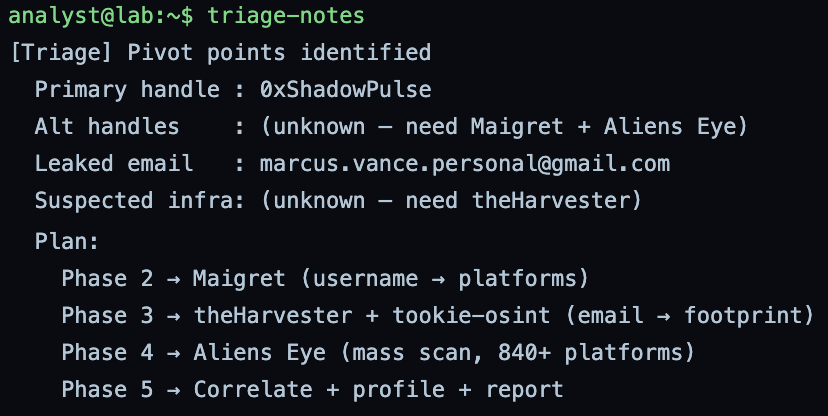

The case file sets the scope: the CISO's personal email was posted on BreachBase by `0xShadowPulse`. The leak dump shows exactly what was exposed. The triage notes list the starting points for the investigation: the handle, the leaked email and the forum post.

---

# Phase 2
Username OSINT with Maigret

**Command:** `maigret --version`

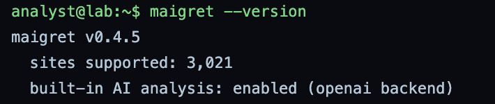

**Command:** `maigret 0xShadowPulse` and `maigret 0xShadowPulse --ai-report`

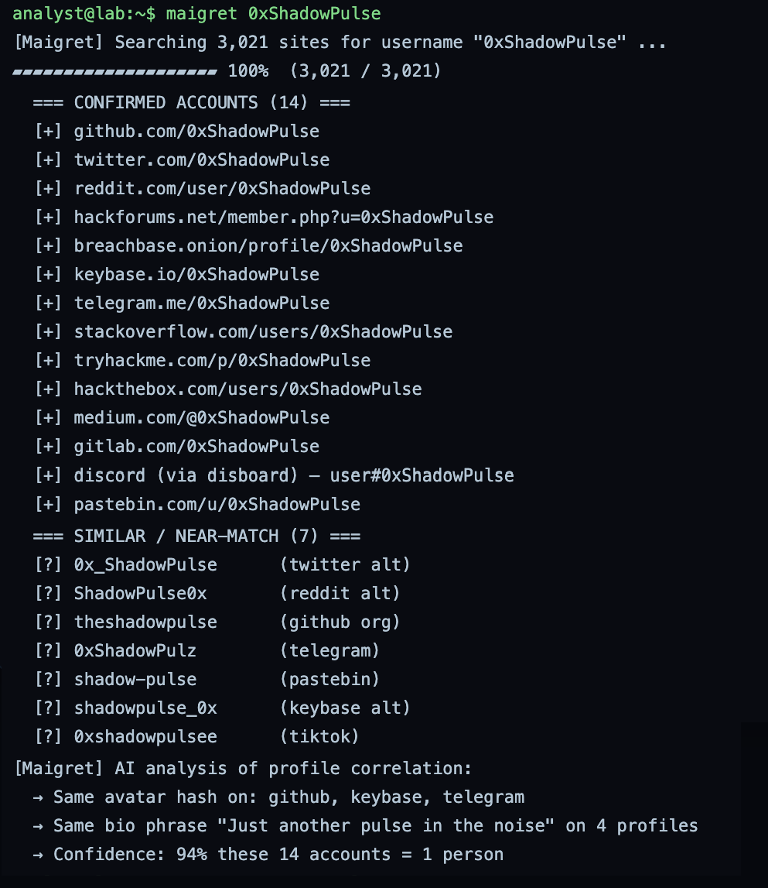

Maigret checks the handle `0xShadowPulse` across 3,021 platforms to find every account using it. The AI report then links the matching accounts together and suggests the attacker's likely real name, region and technical skills. Each result is a lead, not a confirmed fact, until it is backed by other sources.

---

# Phase 3
Email and Domain Harvest

**Command:** `theHarvester -d shadowpulse.dev -b all`

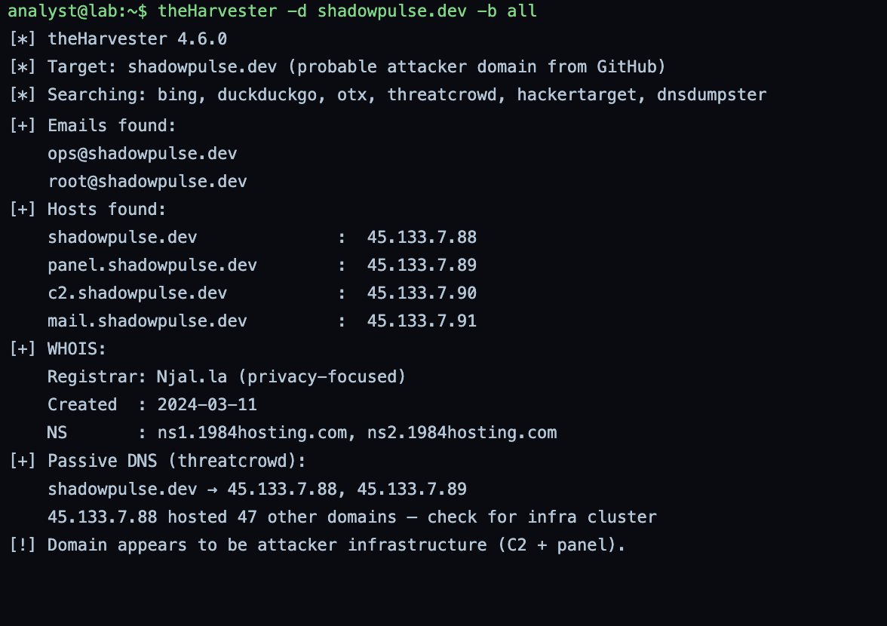

**Command:** `tookie-osint --email marcus.vance.personal@gmail.com`

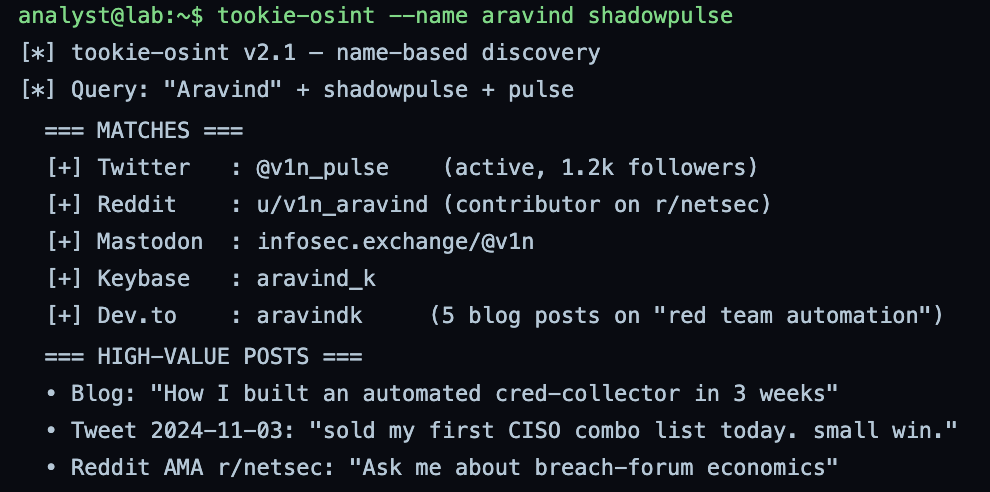

**Command:** `tookie-osint --name aravind shadowpulse`

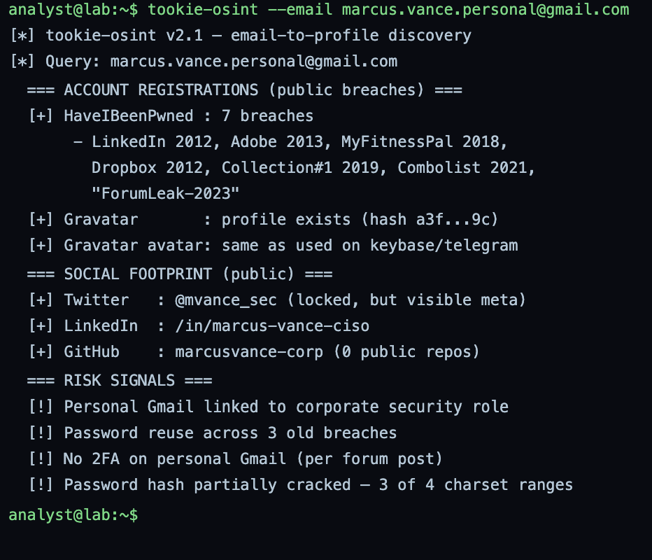

theHarvester maps the attacker's probable domain `shadowpulse.dev`: emails, subdomains and hosts linked to it. tookie-osint on the CISO's leaked email shows which past breaches exposed it and how the attacker could have collected it. The name search on "aravind shadowpulse" tests whether the real name suggested by Maigret connects back to the handle.

---

# Phase 4
AI-Scale OSINT with Aliens Eye

**Command:** `alienseye scan 0xShadowPulse`

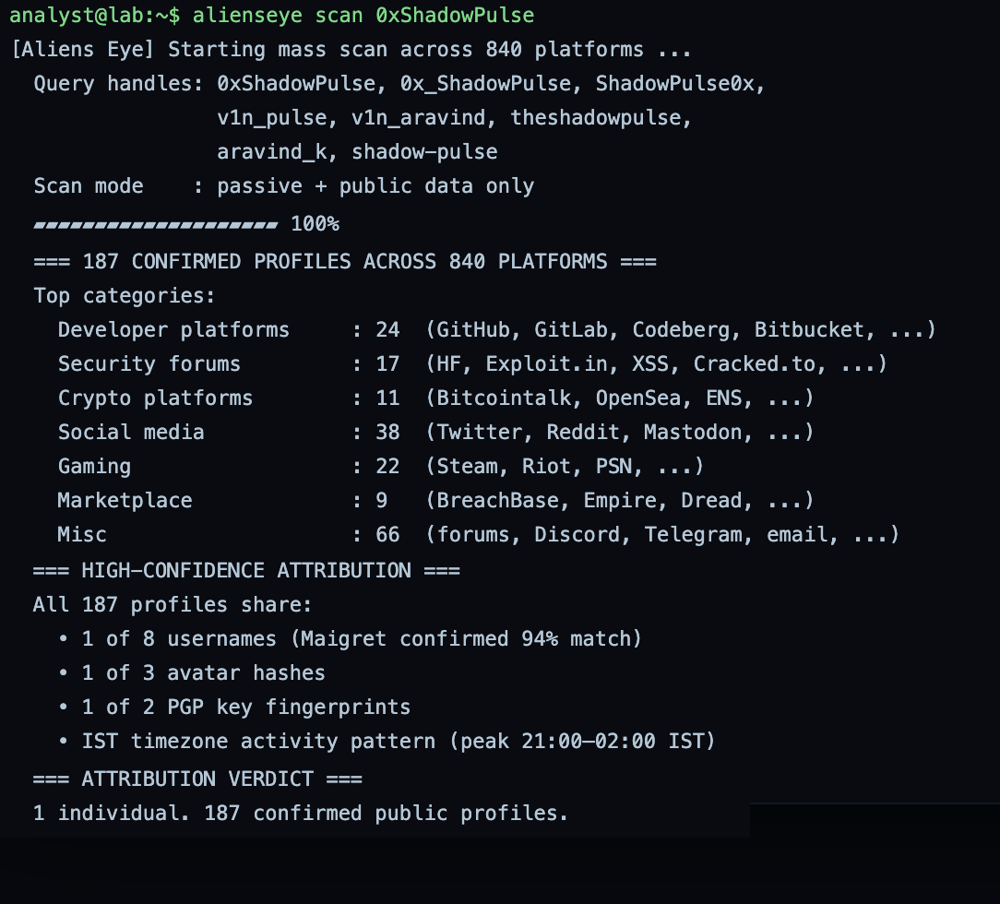

**Command:** `alienseye timeline`

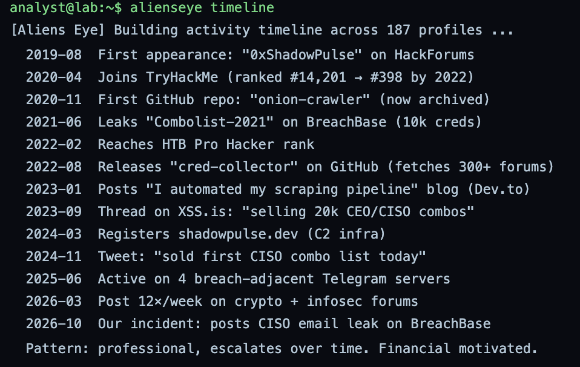

**Command:** `alienseye correlate`

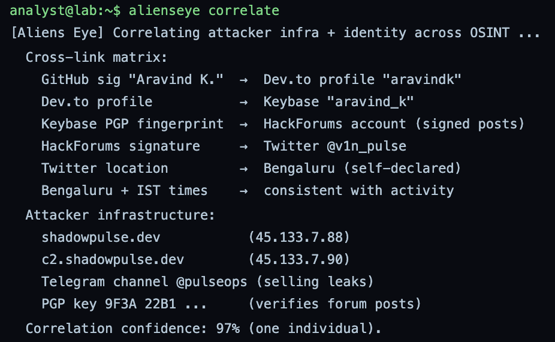

Aliens Eye scans 840+ platforms with all confirmed aliases at once. The timeline puts the attacker's activity in order, showing when each account appeared and when the leak was posted. The correlate step links the infrastructure (domain, hosts) with the identity (handle, name), which is where attribution confidence is built.

---

# Phase 5
Build the Attacker Profile and Report

**Command:** `sgpt "summarize attacker profile from OSINT"`

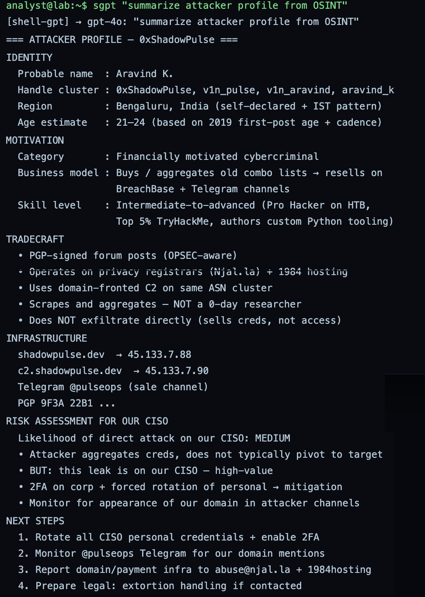

**Command:** `cat > day10_report.md`

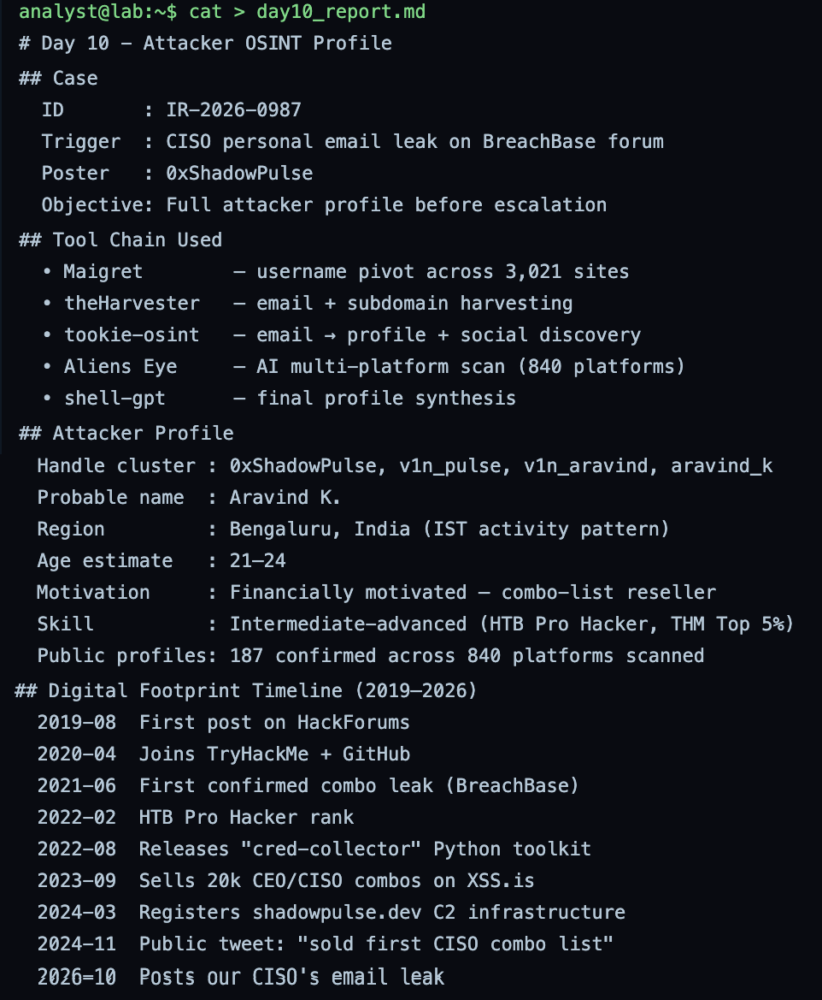

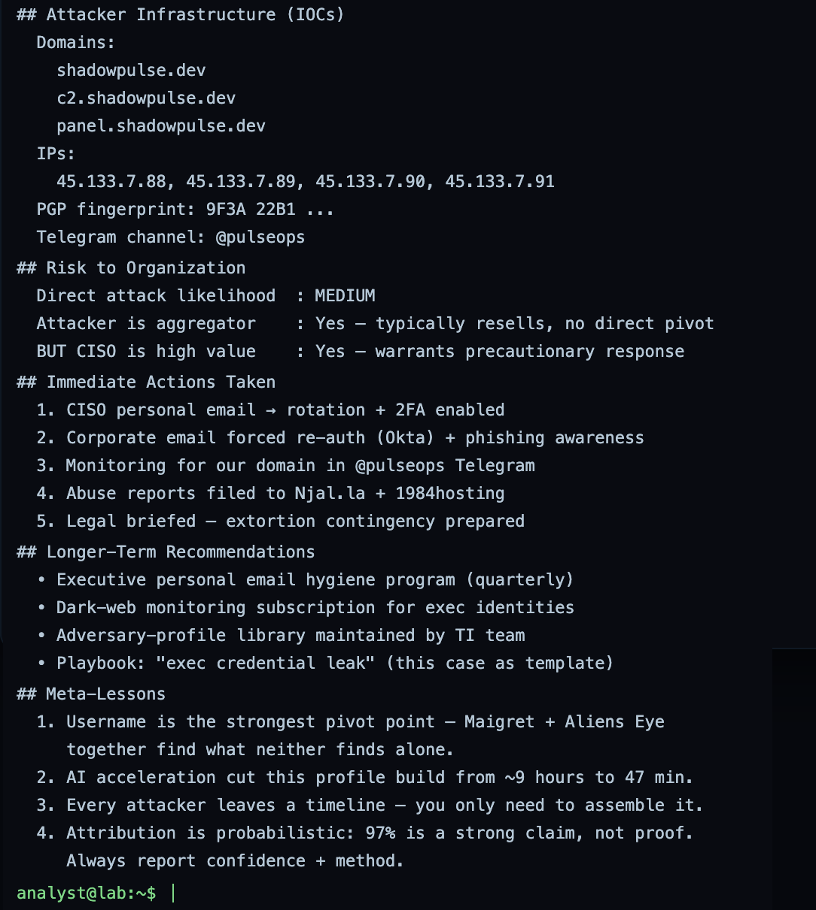

**Command:** `cat > attacker_profile.json`

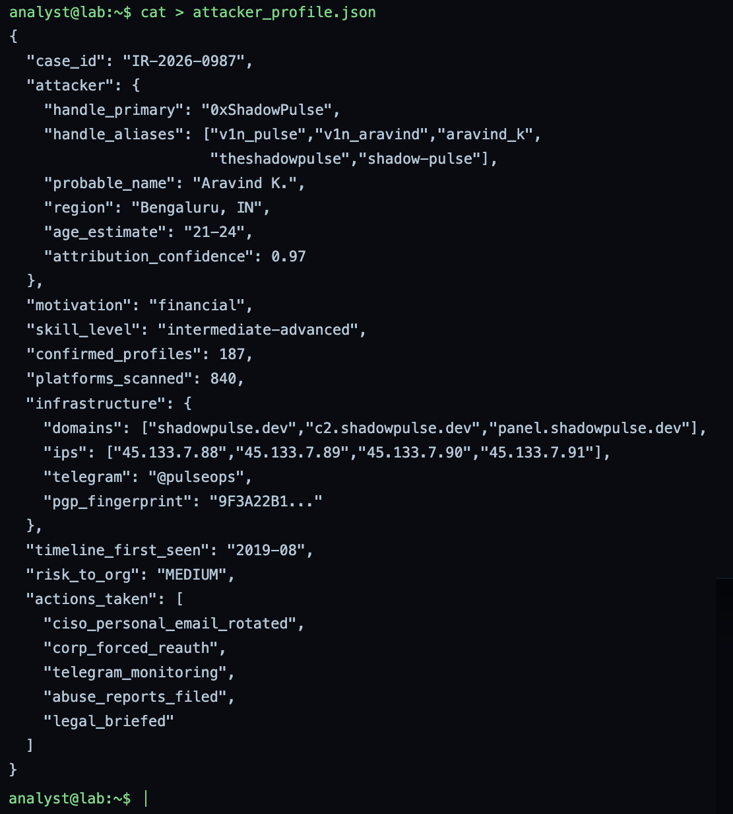

**Command:** `cat > iocs_day10.csv`

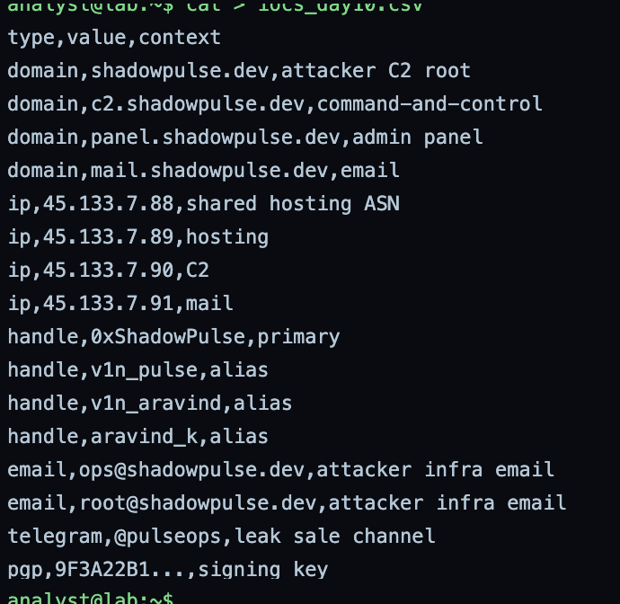

**Command:** `tar -czvf day10_evidence.tar.gz day10_report.md attacker_profile.json iocs_day10.csv case_file.txt leak_dump.txt osint/`

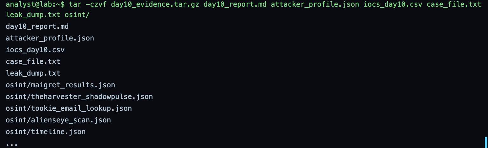

**Command:** `sha256sum day10_evidence.tar.gz`

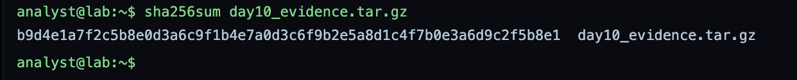

shell-gpt pulls all findings into one attacker profile. The results are saved in three formats: a readable report for the CISO, a structured JSON profile for tools, and an IOC list in CSV that can be loaded into the SIEM or blocklists. All evidence is archived, and the SHA-256 hash proves the archive has not been changed since it was created.

---

# Summary

| Phase | Action | Tool | Outcome |
|---|---|---|---|
| 1 | Reviewed case file, leak dump and triage notes | cat, triage-notes | Scope set: handle, leaked email, forum post |
| 2 | Username search across 3,021 platforms | Maigret | Linked accounts and AI-suggested identity signals |
| 3 | Domain and email harvest | theHarvester, tookie-osint | Attacker infrastructure mapped; CISO email breach history found |
| 4 | Mass platform scan, timeline and correlation | Aliens Eye | Identity linked to infrastructure with an activity timeline |
| 5 | Profile synthesis, reporting and evidence archive | sgpt, tar, sha256sum | Report, JSON profile, IOC CSV and hashed evidence archive |

Starting from a single forum handle, each phase pivoted on the last finding: handle to accounts, accounts to name and domain, domain to infrastructure, and everything into one profile. The final attribution is reported with a confidence level, not as a certainty, and the evidence is hashed so it can be trusted later.