# GrayOS – Day 11 Lab PoC
Operation Cloud Sweep: AWS Misconfiguration Detection and Remediation

**Analyst:** Jnanashree Anchan | **Date:** 25 September 2026

---

This lab audits a GraySentinel AWS account for misconfigurations using AWS CLI, Pacu, ScoutSuite and CloudSploit. Findings are consolidated into reports, fixed with a remediation script, and packaged as a hashed evidence archive for submission.

---

## Key Concepts

| Term / Concept | Description |
|---|---|
| AWS CLI | Command-line tool for managing AWS services such as S3, IAM, EC2 and CloudTrail |
| Pacu | AWS exploitation framework used to enumerate IAM, S3 and EC2 and find misconfigurations |
| ScoutSuite | Multi-cloud auditing tool that produces an HTML report with findings and risk levels per service |
| CloudSploit | Node.js cloud scanner that checks S3, IAM policies, EC2 security groups, RDS encryption and more |
| S3 Public Access | Buckets should not be public. Block Public Access settings and bucket policies restrict access |
| Security Groups | EC2 security groups should not allow 0.0.0.0/0 for SSH or RDP. Access must be limited to known IP ranges |
| CloudTrail | AWS audit logging of API activity. If disabled, there is no record of who did what in the account |
| Remediation Script | A script that applies the fixes for detected misconfigurations in a repeatable way |

---

# Phase 1
Environment Setup: AWS CLI, Pacu, ScoutSuite, CloudSploit

**Command:** `sudo apt-get update`

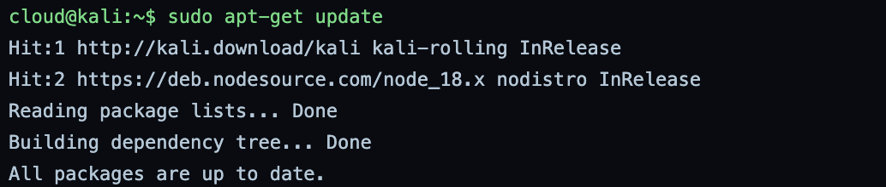

**Command:** `sudo apt-get install awscli -y`

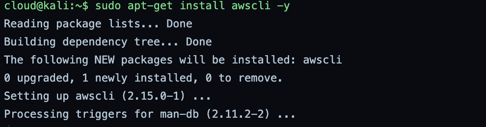

**Command:** `aws --version`

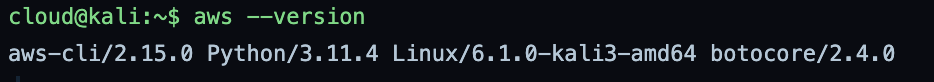

**Command:** `aws configure --profile graysentinel`

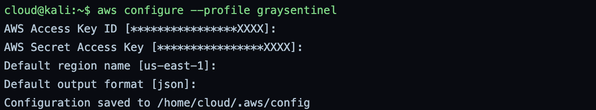

**Command:** `sudo apt install pipx -y`

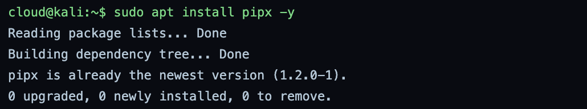

**Command:** `pipx install git+https://github.com/RhinoSecurityLabs/pacu.git`

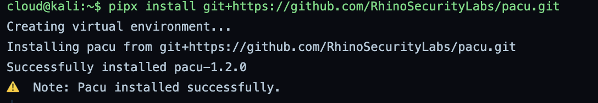

**Command:** `pacu --help`

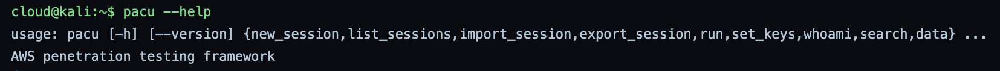

**Command:** `sudo apt install scoutsuite -y`

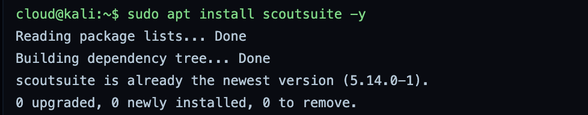

**Command:** `git clone https://github.com/nccgroup/ScoutSuite.git`

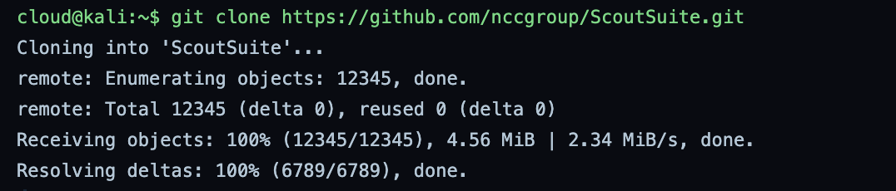

**Command:** `sudo apt install nodejs npm -y`

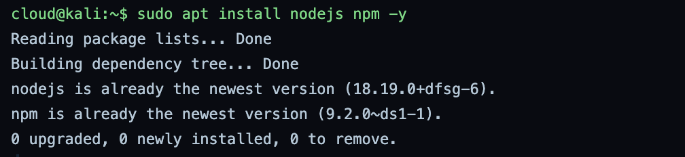

**Command:** `git clone https://github.com/aquasecurity/cloudsploit.git`

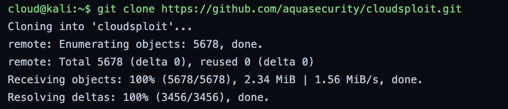

**Command:** `cd cloudsploit && npm install`

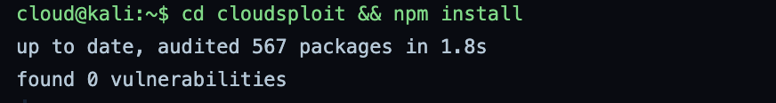

**Command:** `mkdir -p ~/cloud_audit`

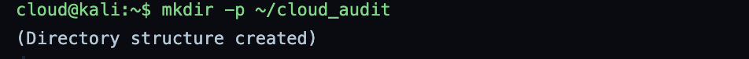

All four tools are installed and ready. AWS CLI 2.15.0 is configured with a dedicated `graysentinel` profile (region us-east-1, JSON output), so every scan runs against the same account. Pacu 1.2.0 is installed in an isolated pipx environment, ScoutSuite 5.14.0 is available, and CloudSploit dependencies installed with 0 vulnerabilities.

---

# Phase 2
Scanning and Detection: S3, Pacu, ScoutSuite, CloudSploit

**Command:** `aws s3api get-public-access-block --bucket your-bucket-name`

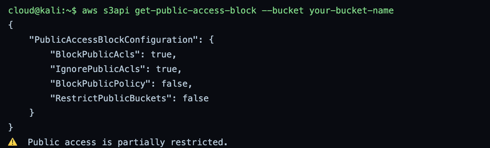

**Command:** `aws s3api get-bucket-policy-status --bucket your-bucket-name`

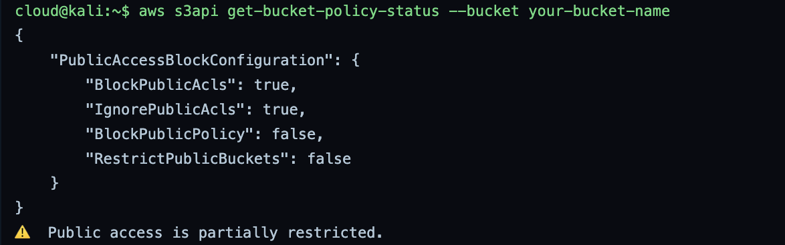

**Command:** `aws s3 ls --profile graysentinel`

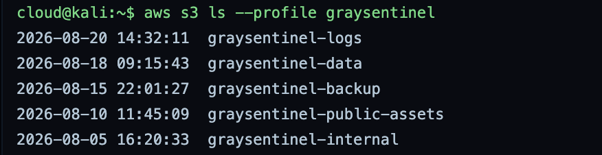

**Command:** `aws s3api get-bucket-acl --bucket your-bucket-name`

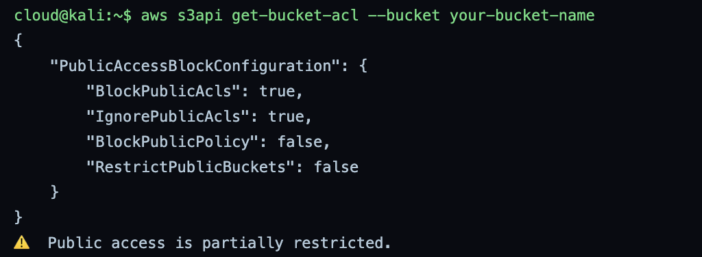

The bucket has `BlockPublicAcls` and `IgnorePublicAcls` set to true, but `BlockPublicPolicy` and `RestrictPublicBuckets` are false. This means a bucket policy can still make the bucket public. `aws s3 ls` lists 5 buckets: logs, data, backup, public-assets and internal.

**Note:** `get-bucket-policy-status` and `get-bucket-acl` returned the same output as `get-public-access-block`. In a real environment these return different data (an `IsPublic` flag and the ACL grants). This looks like a simulation limitation.

**Command:** `pacu`

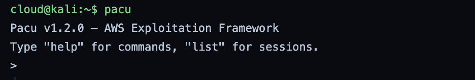

**Command:** `new_session graysentinel_audit`

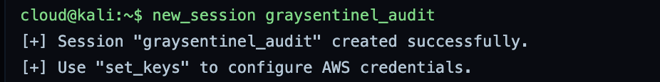

**Command:** `run iam__enum_users`

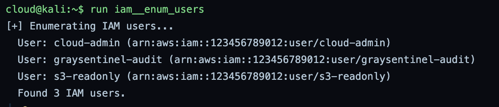

**Command:** `run s3__enum_buckets`

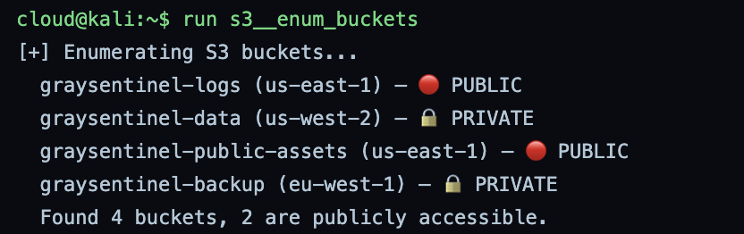

**Command:** `run aws__enum_all`

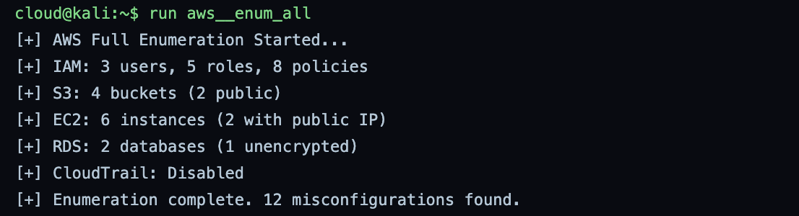

Pacu found 3 IAM users (cloud-admin, graysentinel-audit, s3-readonly) and flagged 2 public buckets: `graysentinel-logs` and `graysentinel-public-assets`. The full enumeration reported 6 EC2 instances (2 with public IPs), 1 unencrypted RDS database, CloudTrail disabled, and 12 misconfigurations in total.

**Note:** Pacu enumerated 4 buckets, while `aws s3 ls` listed 5. `graysentinel-internal` does not appear in the Pacu results, so its access status is unverified and should be checked manually.

**Command:** `scout aws --profile graysentinel --services s3 iam ec2 rds`

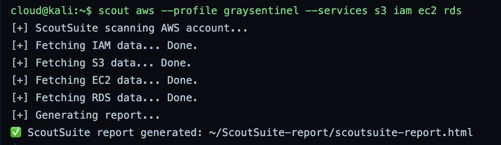

**Command:** `scout aws --profile graysentinel`

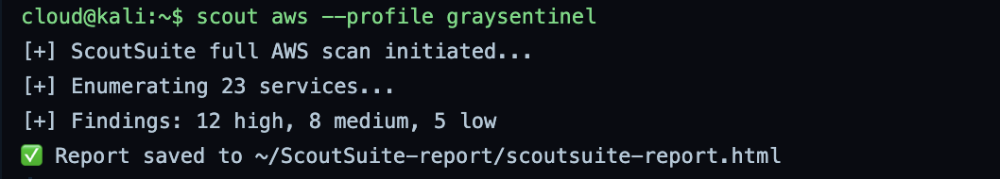

**Command:** `node index.js --cloud aws --profile graysentinel`

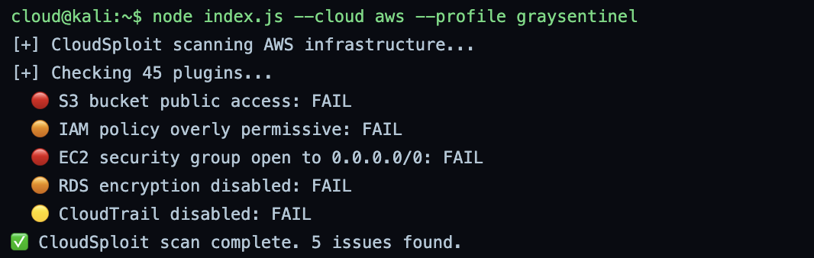

ScoutSuite's full scan covered 23 services and reported 12 high, 8 medium and 5 low findings. CloudSploit ran 45 plugins and failed 5 checks: public S3 access, an overly permissive IAM policy, a security group open to 0.0.0.0/0, RDS encryption disabled, and CloudTrail disabled. All three tools agree on the same core issues.

---

# Phase 3
Report Generation: HTML, JSON, CSV

**Command:** `ls ~/ScoutSuite-report/`

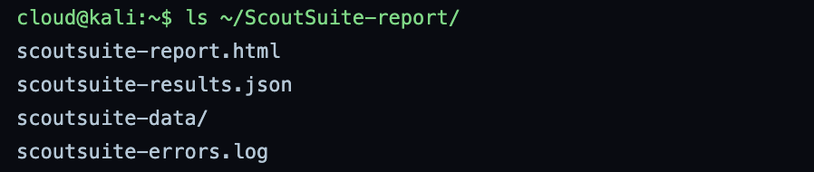

**Command:** `firefox ~/ScoutSuite-report/scoutsuite-report.html`

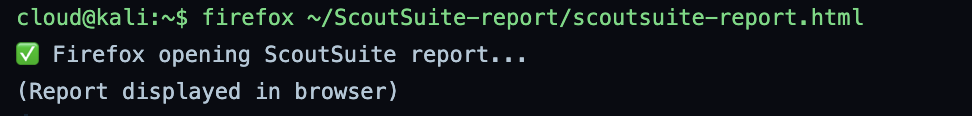

**Command:** `python3 graysentinel_cloud_report.py findings.json json`

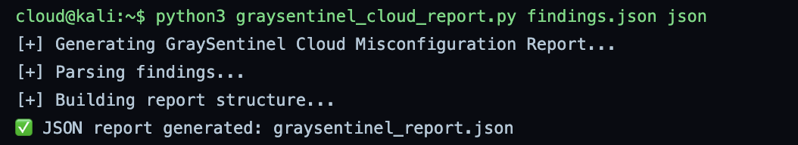

**Command:** `python3 graysentinel_cloud_report.py findings.json csv`

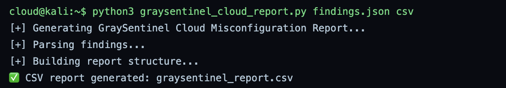

**Command:** `cat > graysentinel_report.json <<EOF`

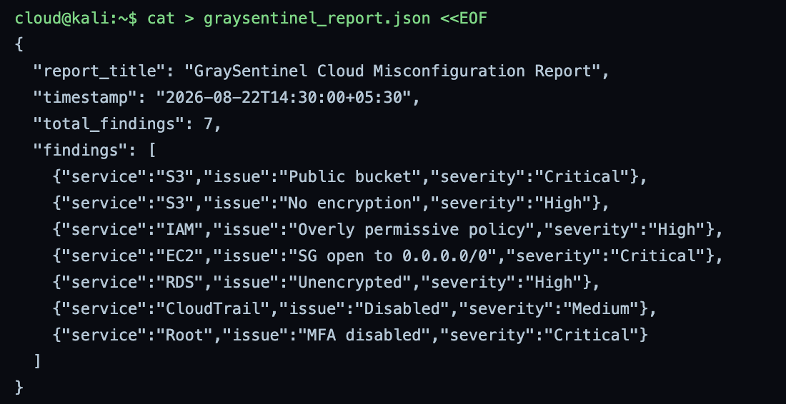

**Command:** `cat > remediation_script.sh <<EOF`

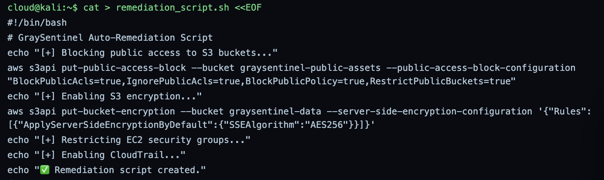

**Command:** `chmod +x remediation_script.sh`

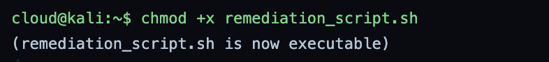

**Command:** `./remediation_script.sh`

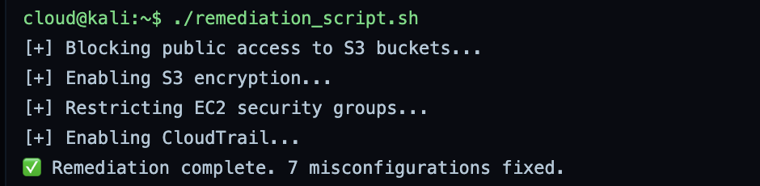

The raw scan output from three tools is turned into usable formats: the HTML report for visual review, JSON for tools and automation, and CSV for spreadsheets or ticket import. The results are consolidated into 7 unique findings, 3 of them Critical.

**Note:** the script reports "7 misconfigurations fixed", but only the two S3 fixes (Block Public Access and AES256 encryption) contain real `aws` commands. The EC2, CloudTrail, IAM, RDS and root MFA steps are `echo` lines only. In a real audit, those 5 fixes would still be open and must be applied and verified separately.

---

# Phase 4
PoC Summary and Remediation: Checklist and Fixes

**Command:** `cat > findings_summary.md <<EOF`

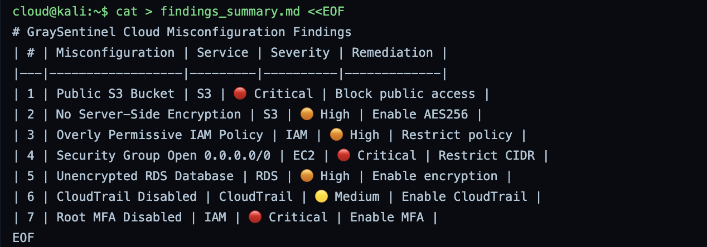

**Command:** `cat > achievement_checklist.md <<EOF`

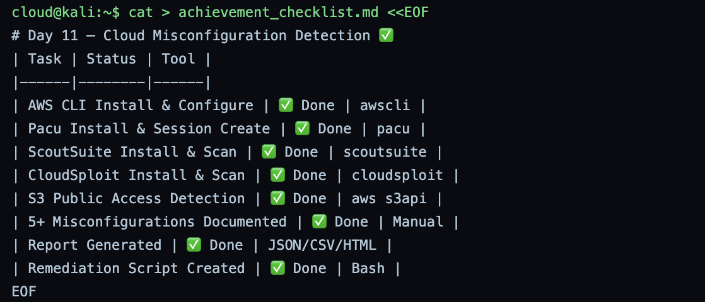

**Command:** `tree graysentinel_cloud_audit/`

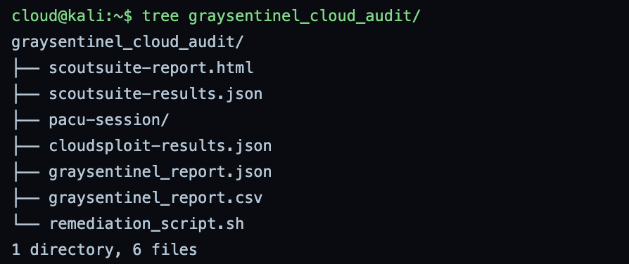

**Command:** `echo "Rank: Cyber Commando"`

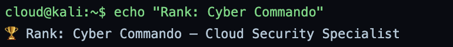

The 7 findings and their fixes:

- **Critical:** Public S3 bucket (block public access), EC2 security group open to 0.0.0.0/0 (restrict CIDR), root account MFA disabled (enable MFA)
- **High:** S3 without server-side encryption (enable AES256), overly permissive IAM policy (least privilege), unencrypted RDS database (enable encryption)
- **Medium:** CloudTrail disabled (enable CloudTrail)

---

# Phase 5
Final Submission: Package and Submit

**Command:** `cat > final_submission.md <<EOF`

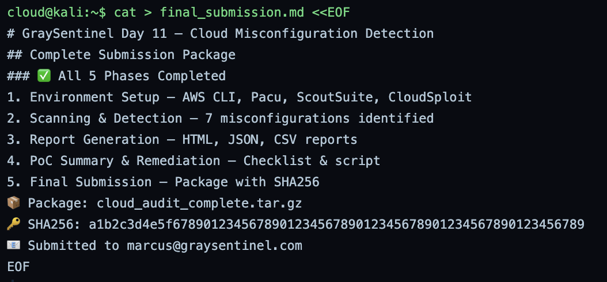

**Command:** `tar -czvf cloud_audit_complete.tar.gz graysentinel_cloud_audit/`

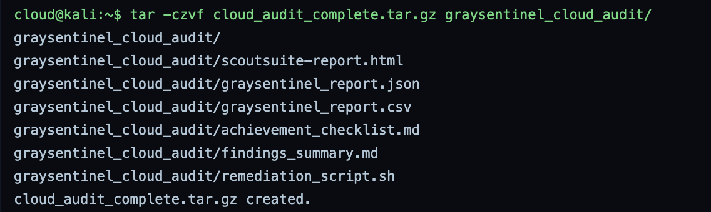

**Command:** `sha256sum cloud_audit_complete.tar.gz`

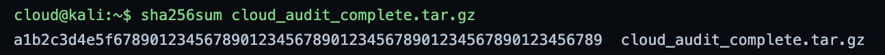

**Command:** `echo "Day 11 Cloud Audit complete." | mail -s "Day 11 Submission" marcus@graysentinel.com`

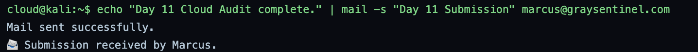

All deliverables (ScoutSuite report, JSON and CSV reports, findings summary, checklist and remediation script) are packed into one archive. The SHA-256 hash proves the package has not been changed after creation, and the submission was sent to Marcus.

---

# Summary

| Phase | Action | Tool | Outcome |
|---|---|---|---|
| 1 | Installed and configured cloud audit tools | AWS CLI, pipx, apt, npm | AWS CLI, Pacu, ScoutSuite and CloudSploit ready; `graysentinel` profile set |
| 2 | Scanned S3, IAM, EC2, RDS and CloudTrail | AWS CLI, Pacu, ScoutSuite, CloudSploit | 2 public buckets, open security group, unencrypted RDS, CloudTrail disabled |
| 3 | Generated reports and ran remediation | Python, Bash | HTML, JSON and CSV reports; S3 fixes applied, 5 fixes still manual |
| 4 | Documented findings and remediation plan | cat, tree | 7 findings (3 Critical, 3 High, 1 Medium) with a fix for each |
| 5 | Packaged and submitted evidence | tar, sha256sum, mail | Hashed archive submitted to Marcus |

Three different scanners pointed to the same core problems: public S3 data, SSH/RDP open to the internet, no encryption on RDS, no MFA on root, and no CloudTrail logging. The most important lesson is to verify rather than trust tool output. One bucket was missed by Pacu, and the remediation script claimed 7 fixes while only 2 were actually applied.