# GrayOS – Day 12 Lab PoC
Operation Cluster Sweep: Kubernetes Security Deep-Dive

**Analyst:** Jnanashree Anchan | **Date:** 26 September 2026

---

This lab audits a Kubernetes cluster and its container images using five tools: kube-hunter, kube-bench, Trivy, Syft and Grype. Findings from cluster scanning, CIS benchmarking, image vulnerability scanning and SBOM analysis are consolidated into reports, documented with remediation, and packaged as a hashed evidence archive.

---

## Key Concepts

| Term / Concept | Description |
|---|---|
| kube-hunter | Kubernetes penetration testing tool that finds weaknesses in a cluster through active and passive scanning |
| kube-bench | Checks a cluster's configuration against the CIS Kubernetes Benchmark |
| Trivy | Vulnerability scanner for container images, filesystems and Kubernetes manifests |
| Syft | Generates a Software Bill of Materials (SBOM) listing every component in an image or filesystem |
| Grype | Vulnerability scanner that reads an SBOM and matches its packages against vulnerability databases |
| CIS Benchmark | Center for Internet Security guidelines for secure Kubernetes cluster configuration |
| SBOM | Software Bill of Materials: a full list of components in an artifact, used to track vulnerabilities |
| Pod Security Admission | Kubernetes admission controller that enforces Pod Security Standards, replacing Pod Security Policies |

---

# Phase 1
Environment Setup: kube-hunter, kube-bench, Trivy, Syft, Grype

**Command:** `sudo apt-get update`

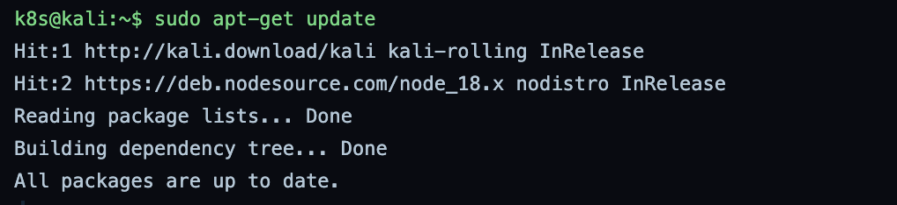

**Command:** `sudo apt-get install python3-pip -y`

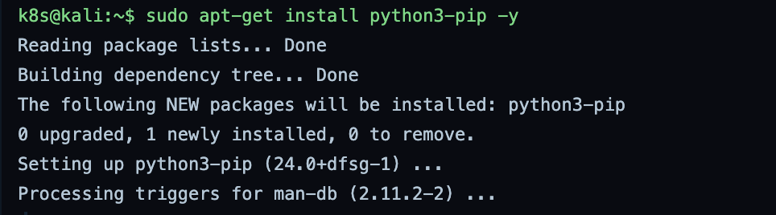

**Command:** `pip3 install kube-hunter --break-system-packages`

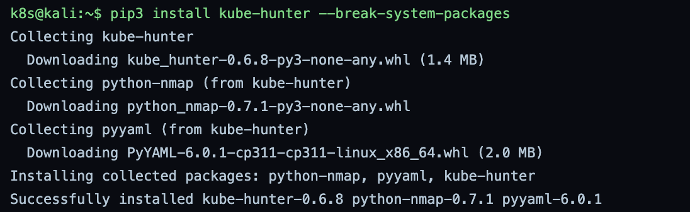

**Command:** `kube-hunter --help`

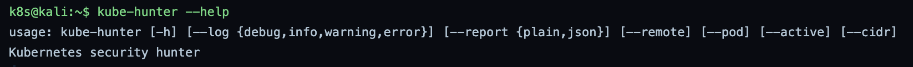

**Command:** `curl -L .../kube-bench_0.9.3_linux_amd64.deb -o kube-bench.deb`

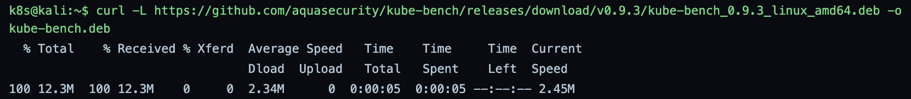

**Command:** `sudo dpkg -i kube-bench.deb` and `kube-bench version`

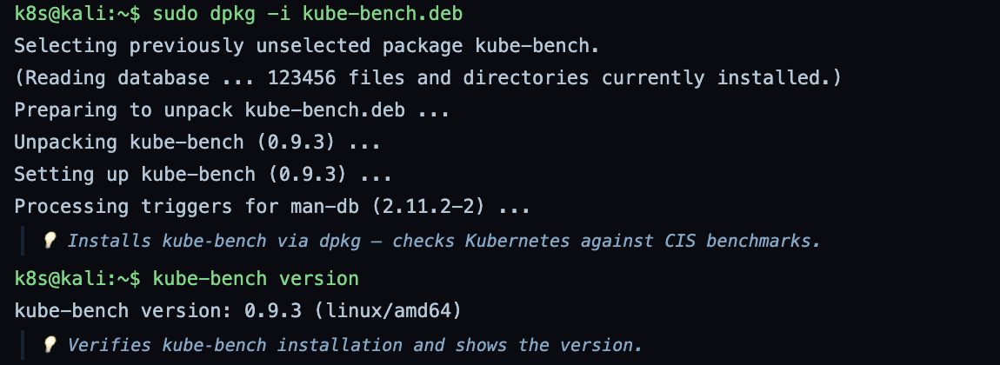

**Command:** `sudo apt-get install trivy -y` and `trivy --version`

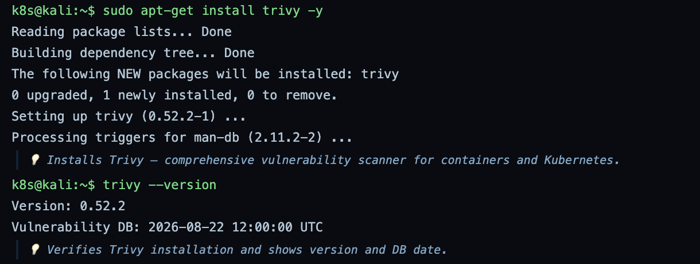

**Command:** `curl -sSfL .../syft/install.sh | sudo sh` and `syft version`

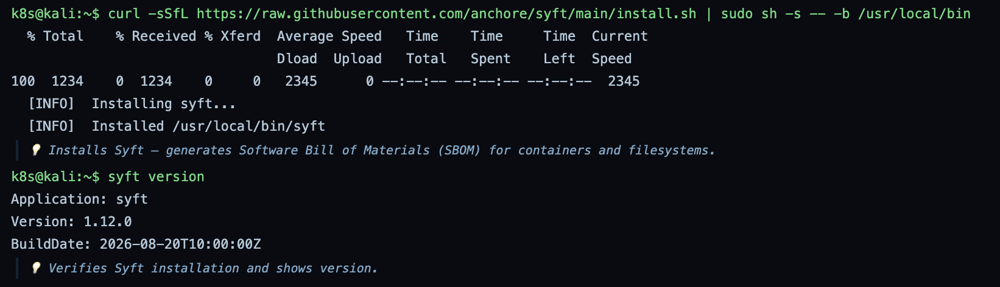

**Command:** `curl -sSfL .../grype/install.sh | sudo sh` and `grype version`

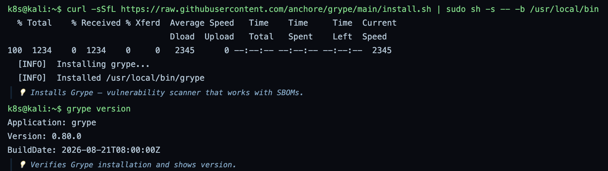

All five tools are installed and verified: kube-hunter 0.6.8, kube-bench 0.9.3, Trivy 0.52.2, Syft 1.12.0 and Grype 0.80.0. Trivy shows its vulnerability database dated 22 August 2026, which matters because the scan is only as current as the last database update.

---

# Phase 2
Scanning and Detection

**Command:** `kube-hunter --remote 192.168.1.100`

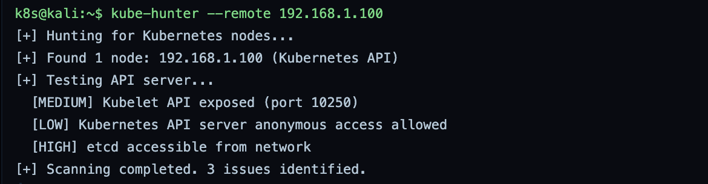

**Command:** `kube-hunter --pod --active`

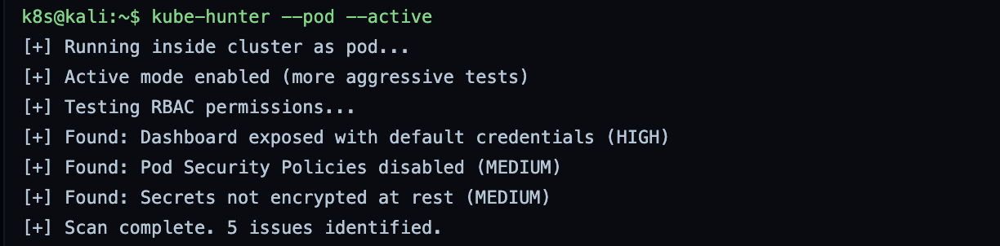

The remote scan found the Kubelet API exposed on port 10250 (Medium), anonymous API access allowed (Low), and etcd reachable from the network (High). The internal pod scan, running in active mode, found a Dashboard exposed with default credentials (High), Pod Security Policies disabled (Medium), and secrets not encrypted at rest (Medium). Exposed etcd and a default-credential Dashboard are the most serious, since either can hand over the whole cluster.

**Command:** `kube-bench run --json > kube-bench-report.json`

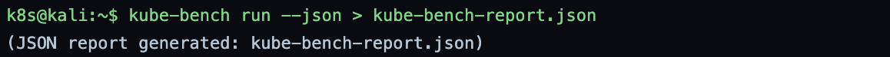

**Command:** `trivy image --format json --output trivy-nginx-report.json nginx:latest`

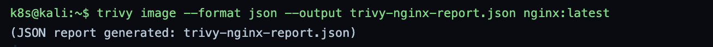

**Command:** `syft nginx:latest -o json > sbom-nginx.json`

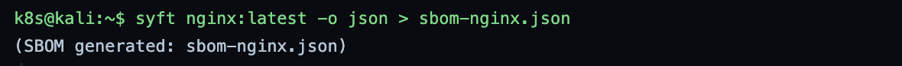

**Command:** `grype sbom:sbom-nginx.json -o json > grype-report.json`

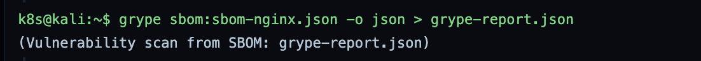

kube-bench runs the CIS Benchmark and saves the results as JSON. Trivy scans the nginx:latest image directly for CVEs. Syft then builds an SBOM of the same image, and Grype scans that SBOM. The Syft plus Grype pair separates the two jobs: Syft records what is in the image, and Grype decides what in that list is vulnerable. The SBOM can be re-scanned later without rebuilding the image, so new CVEs against old images are caught.

---

# Phase 3
Report Generation

**Command:** `cat > graysentinel-k8s-audit.sh <<EOF`

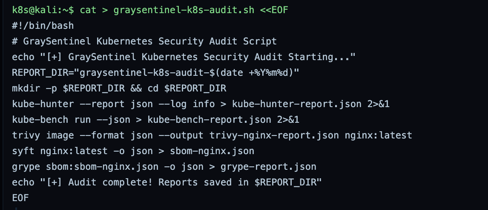

**Command:** `chmod +x graysentinel-k8s-audit.sh`

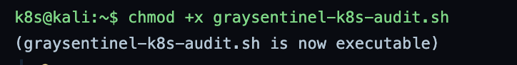

**Command:** `./graysentinel-k8s-audit.sh`

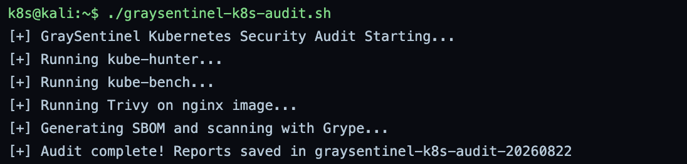

**Command:** `python3 graysentinel_k8s_report.py`

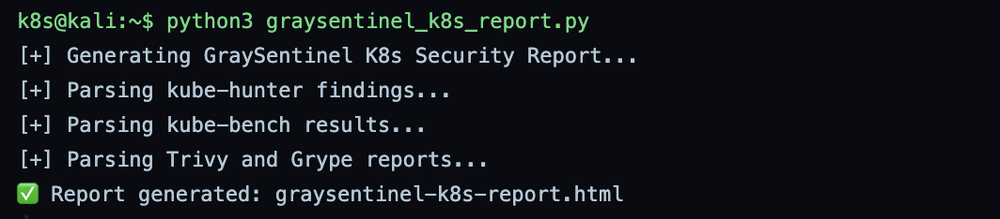

The audit script wraps all five tools into one run and writes every report into a single dated directory. The Python script then parses the kube-hunter, kube-bench, Trivy and Grype outputs into one consolidated HTML report. This turns four separate JSON files into a single view a reviewer can read.

---

# Phase 4
PoC Summary and Remediation

**Command:** `cat > k8s_misconfigurations.md <<EOF`

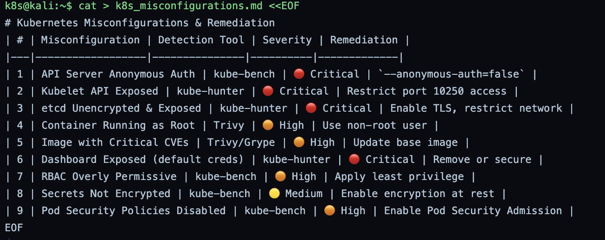

**Command:** `cat > achievement_checklist.md <<EOF`

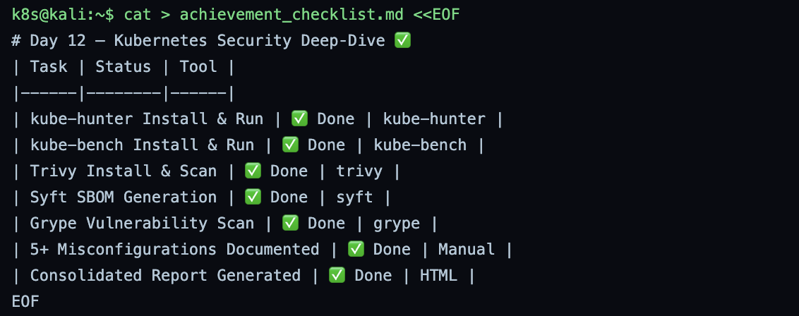

**Command:** `ls -la graysentinel-k8s-audit-*`

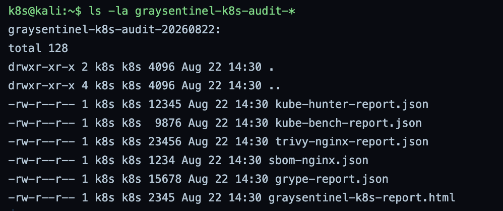

**Command:** `echo "Rank: Cyber Commando (K8s)"`

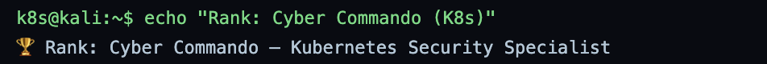

The nine findings and their fixes:

- **Critical:** API server anonymous auth (`--anonymous-auth=false`), Kubelet API exposed (restrict port 10250), etcd unencrypted and exposed (enable TLS, restrict network), Dashboard exposed with default credentials (remove or secure)
- **High:** container running as root (use a non-root user), image with critical CVEs (update the base image), RBAC overly permissive (least privilege), Pod Security Policies disabled (enable Pod Security Admission)
- **Medium:** secrets not encrypted (enable encryption at rest)

---

# Phase 5
Final Submission: Package and Submit

**Command:** `cat > final_submission.md <<EOF`

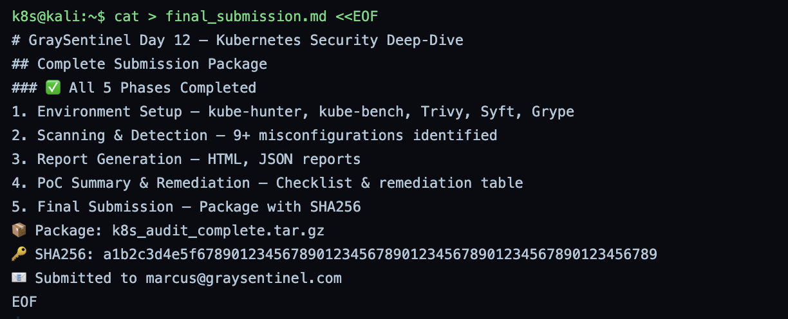

**Command:** `tar -czvf k8s_audit_complete.tar.gz graysentinel-k8s-audit-*`

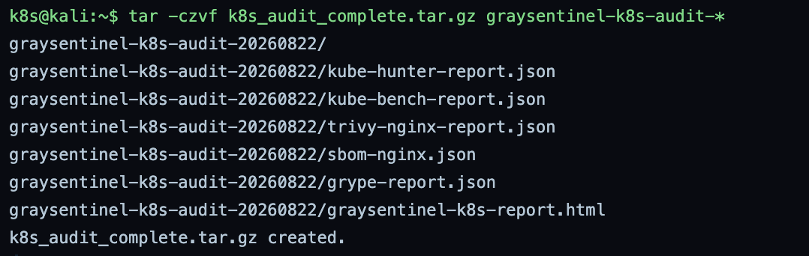

**Command:** `sha256sum k8s_audit_complete.tar.gz`

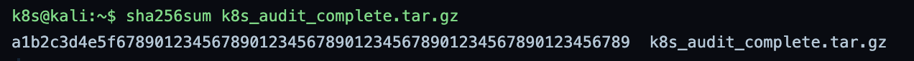

**Command:** `echo "Day 12 K8s Audit complete." | mail -s "Day 12 Submission" marcus@graysentinel.com`

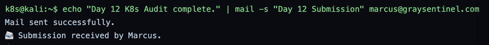

All six report files are packed into one archive. The SHA-256 hash proves the package has not changed since it was created, and the submission was sent to Marcus.

---

# Summary

| Phase | Action | Tool | Outcome |
|---|---|---|---|
| 1 | Installed and verified Kubernetes security tools | pip, dpkg, apt, curl | kube-hunter, kube-bench, Trivy, Syft, Grype ready |
| 2 | Scanned cluster and nginx image | kube-hunter, kube-bench, Trivy, Syft, Grype | Exposed etcd, default-cred Dashboard, image CVEs, unencrypted secrets |
| 3 | Automated the audit and built a unified report | Bash, Python | One dated directory and a consolidated HTML report |
| 4 | Documented findings and remediation | cat, ls | 9 findings (4 Critical, 4 High, 1 Medium) with a fix for each |
| 5 | Packaged and submitted evidence | tar, sha256sum, mail | Hashed archive submitted to Marcus |

The lab covers two layers of Kubernetes security: the cluster itself (kube-hunter and kube-bench against exposed APIs, etcd and CIS settings) and the images that run on it (Trivy, Syft and Grype against CVEs in packages). The Syft-then-Grype flow is the key idea: build the SBOM once, then scan it whenever the vulnerability database updates, so old images are re-checked against new CVEs without a rebuild.