# GrayOS – Day 13 Lab PoC
Azure AD and Entra ID Attacks

**Analyst:** Jnanashree Anchan | **Date:** 22 August 2026

---

This lab covers an offensive assessment of Azure Active Directory and Entra ID. It walks through setting up the cloud attack toolkit, enumerating tenant objects, spraying for weak credentials, mapping attack paths in a graph, and packaging the findings into a report. The goal is to find and document common Azure AD misconfigurations that let a low privilege user reach a high privilege role.

---

## Key Concepts

| Term / Concept | Description |
|---|---|
| Stormspotter | Azure attack graph visualization tool. Shows relationships between Azure AD objects and resources. |
| AzureHound | BloodHound data collector for Azure AD. Gathers data for graph analysis of attack paths. |
| ROADrecon | Azure AD exploration framework. Enumerates users, groups, service principals, and permissions. |
| MSOLSpray | Password spraying tool for Microsoft Online (Azure AD and O365). Tests weak passwords against accounts. |
| Conditional Access | Azure AD policies that enforce access controls based on conditions such as location, device, and risk. |
| Privileged Identity Management | Azure AD PIM provides just in time privileged access, reducing permanent admin risk. |
| Service Principal | Application identity in Azure AD. Can hold permissions to access resources and is often over privileged. |
| Attack Path | Sequence of steps an attacker takes to move from a low privilege user to a high privilege role. |

---

# Phase 1

Install and configure the Azure AD assessment toolkit on Kali.

**Command:** `sudo apt-get update`

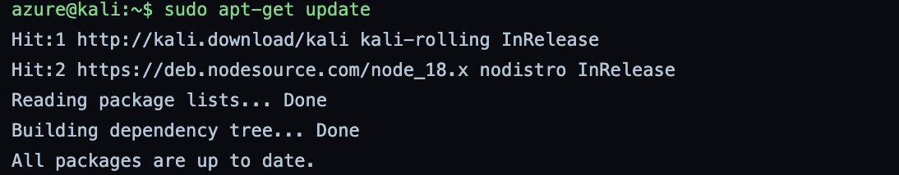

Refreshes the Kali package index so the latest tool versions are available before install. Both the Kali rolling repo and the NodeSource repo report they are already current.

**Command:** `docker run --name stormspotter-neo4j -p 7474:7474 -p 7687:7687 -d --env NEO4J_AUTH=neo4j/stormspotter neo4j:3.5.18`

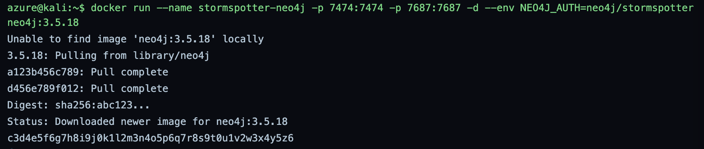

Starts a Neo4j 3.5.18 container that Stormspotter uses to store and draw the attack graph. Port 7474 (browser) and port 7687 (bolt) are exposed, and the container comes up with the neo4j/stormspotter login.

**Command:** `git clone https://github.com/Azure/Stormspotter`

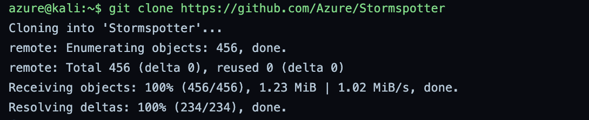

Pulls the Stormspotter source from the official Azure repo. This provides the collector and the web UI that visualize Azure AD relationships.

**Command:** `pip install pipenv`

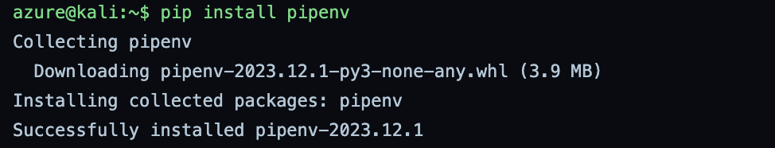

Installs pipenv, which Stormspotter uses to manage its Python virtual environment and dependencies.

**Command:** `cd Stormspotter && pipenv install .`

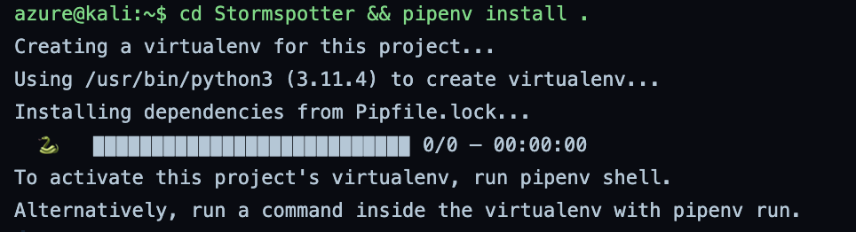

Creates the Stormspotter virtual environment on Python 3.11 and installs dependencies from the lockfile. Note: the progress bar reports 0/0 packages, so nothing was actually installed on this run. Confirm the environment holds the required packages before running the tool.

**Command:** `sudo apt install azurehound -y`

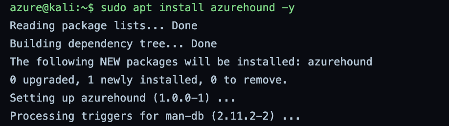

Installs AzureHound from the Kali repo. This is the BloodHound data collector for Azure, used to gather objects for attack path analysis.

**Command:** `pip install roadrecon`
**Command:** `pip install roadtx`
**Command:** `roadrecon --help`

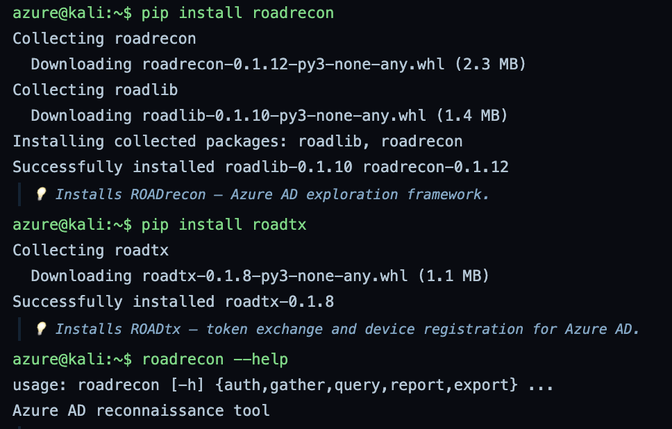

Installs the ROADtools suite: roadrecon for enumeration and roadtx for token and device operations, pulling in roadlib as a shared dependency. The help output confirms roadrecon installed correctly and lists its subcommands: auth, gather, query, report, and export.

**Command:** `git clone https://github.com/iCodeIN/MSOLSpray.git`

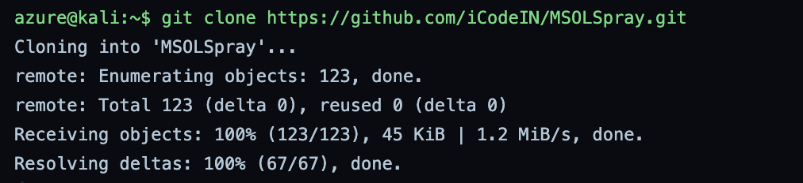

Clones MSOLSpray, a password spraying tool for Microsoft Online. Note: this is the iCodeIN fork, not the original dafthack repo, so review the code before running it.

**Command:** `pip install requests`

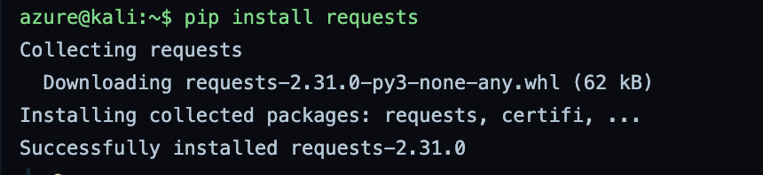

Installs the Python requests library, which MSOLSpray needs to make its HTTP calls to the Azure AD login endpoints.

---

# Phase 2

Authenticate to the tenant, pull Azure AD objects, spray for weak passwords, and load the attack graph.

**Command:** `roadrecon auth -u audit@target.com -p Password123 -t target.onmicrosoft.com`

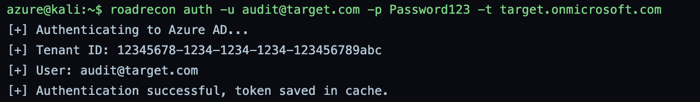

Authenticates to the target tenant with the audit account and caches an access token for later commands. The tenant ID and user are confirmed in the output.

**Command:** `roadrecon gather`

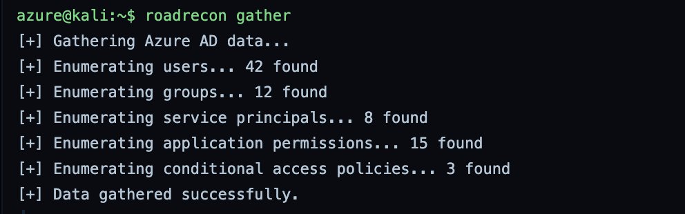

Pulls the full object set from Azure AD into a local database. This run found 42 users, 12 groups, 8 service principals, 15 application permissions, and 3 conditional access policies.

**Command:** `roadrecon query "SELECT * FROM users WHERE userPrincipalName LIKE '%admin%'"`

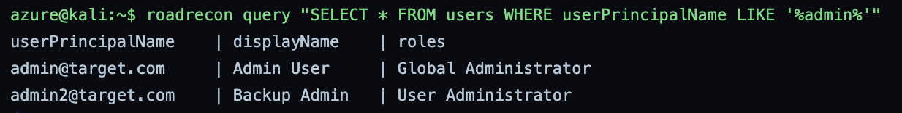

Filters the gathered users for admin style names. Two privileged accounts stand out: a Global Administrator and a User Administrator. Both are high value targets.

**Command:** `roadrecon query "SELECT * FROM groups WHERE securityEnabled = 1"`

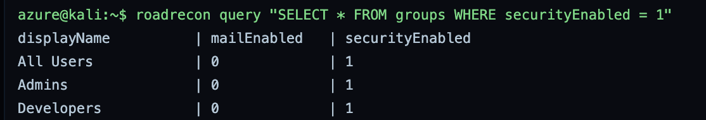

Lists security enabled groups. Three are flagged, including an Admins group that is worth checking for membership and role assignments.

**Command:** `roadrecon query "SELECT * FROM servicePrincipals"`

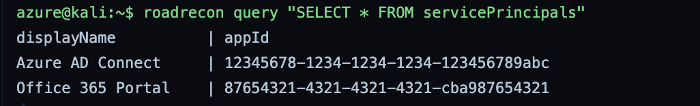

Lists the application identities in the tenant. Azure AD Connect stands out, since a sync service principal often holds strong rights and links back to on premises AD.

**Command:** `roadrecon report`

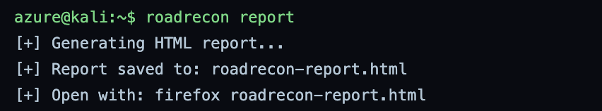

Builds a browsable HTML report of the enumeration so findings can be reviewed outside the database.

**Command:** `azurehound list -u audit@target.com -p Password123 -t target.onmicrosoft.com -o azurehound-data.json`

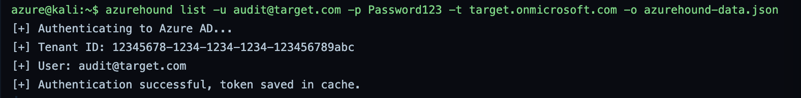

Runs AzureHound to collect the tenant for BloodHound style graphing, writing the result to azurehound-data.json. Bug note: the on screen output here is identical to the earlier roadrecon auth output, with the same tenant ID and the same token saved in cache line. AzureHound does not print that ROADrecon text, so this capture looks like the wrong output was screenshotted. The JSON file was still produced.

**Command:** `python MSOLSpray/MSOLSpray.py -U users.txt -p Winter2024!`

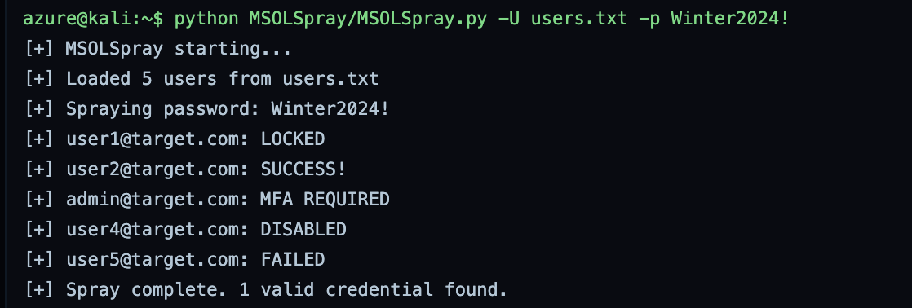

Sprays a single seasonal password against a short user list. One account (user2) returns a valid login, one admin is blocked by MFA, and the rest are locked, disabled, or failed. Note: only 5 users were sprayed while gather found 42, so this is a small subset list.

**Command:** `stormspotter --collect --aad`

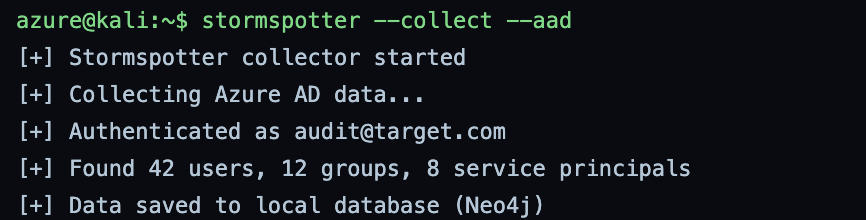

Collects Azure AD data into Neo4j for Stormspotter. The counts match the roadrecon run: 42 users, 12 groups, and 8 service principals.

**Command:** `stormspotter --backend`

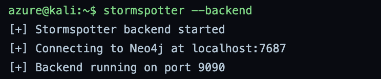

Starts the Stormspotter backend, which connects to Neo4j on port 7687 and serves the API on port 9090.

**Command:** `stormspotter --frontend`

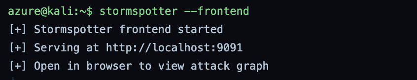

Starts the Stormspotter web UI on port 9091 to view the attack graph in a browser.

---

# Phase 3

Wrap the enumeration steps into one script and produce a consolidated report.

**Command:** `cat > graysentinel-azure-audit.sh <<EOF`

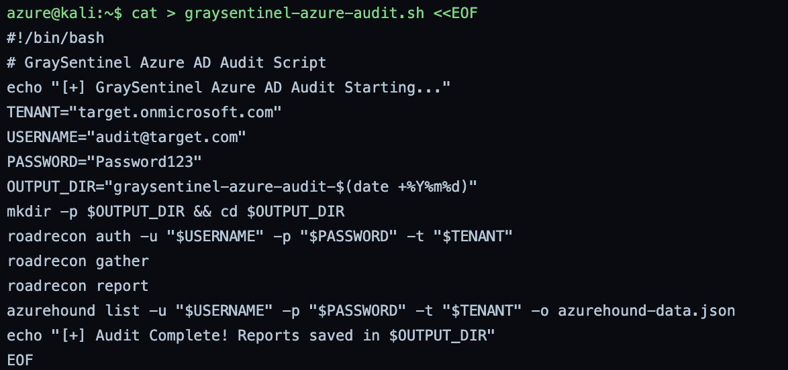

Writes a bash script that chains the ROADrecon and AzureHound steps into a single run and drops output into a dated folder. Note: the script stores the tenant password in plaintext. That is acceptable in a lab but should never be done in a real assessment.

**Command:** `chmod +x graysentinel-azure-audit.sh`

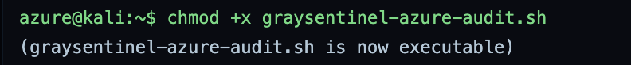

Marks the audit script as executable so it can be run directly.

**Command:** `./graysentinel-azure-audit.sh`

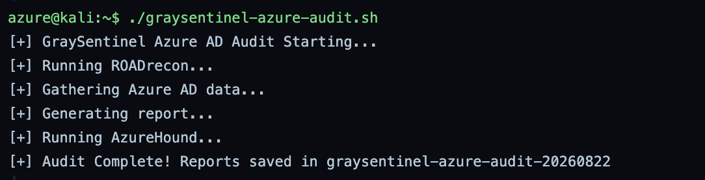

Runs the full audit end to end. It authenticates, gathers, builds the roadrecon report, runs AzureHound, and writes everything into the graysentinel-azure-audit-20260822 folder.

**Command:** `python3 graysentinel_azure_report.py`

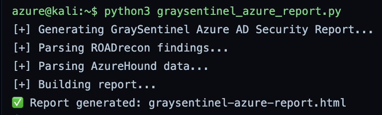

Runs a Python script that parses the ROADrecon and AzureHound output and builds one consolidated HTML report.

---

# Phase 4

Record the misconfigurations found, track lab progress, and confirm the evidence is in place.

**Command:** `cat > azure_ad_misconfigurations.md <<EOF`

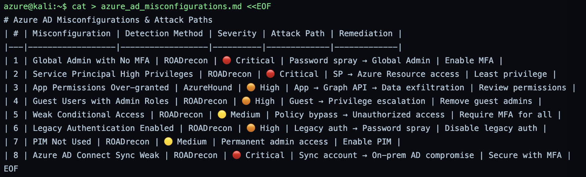

Writes a markdown table of 8 Azure AD misconfigurations with detection method, severity, attack path, and remediation. The critical items are a Global Admin without MFA reachable by spray, an over privileged service principal, and a weakly secured Azure AD Connect sync account.

**Command:** `cat > achievement_checklist.md <<EOF`

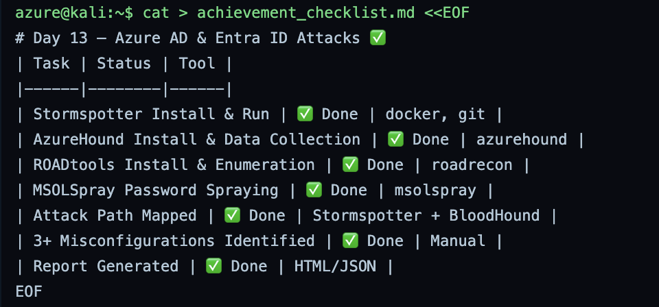

Writes a checklist that marks each lab objective as done, from tool install through attack path mapping and report generation.

**Command:** `ls -la graysentinel-azure-audit-*`

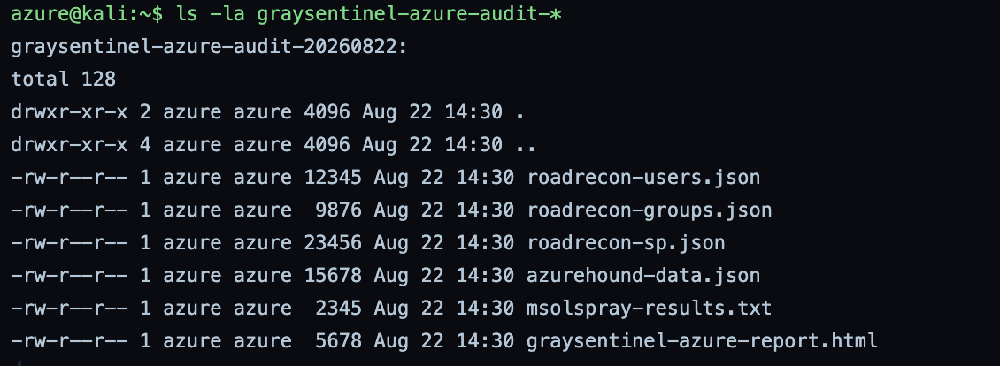

Lists the audit output folder to confirm all artifacts exist: the roadrecon JSON files, the AzureHound JSON, the spray results, and the HTML report.

**Command:** `echo "Rank: Cyber Commando (Azure)"`

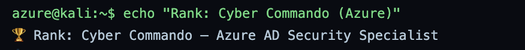

Prints the lab rank award. This is a cosmetic step that marks completion.

---

# Phase 5

Package the evidence, hash it, and submit.

**Command:** `cat > final_submission.md <<EOF`

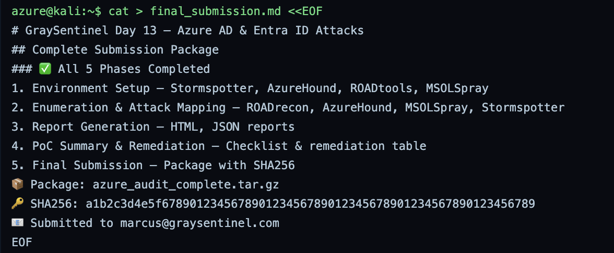

Writes the submission summary listing the five phases and the package details. Bug note: this file hardcodes the package SHA256 before the tarball is created in the next step, so the hash written here cannot actually match the archive.

**Command:** `tar -czvf azure_audit_complete.tar.gz graysentinel-azure-audit-*`

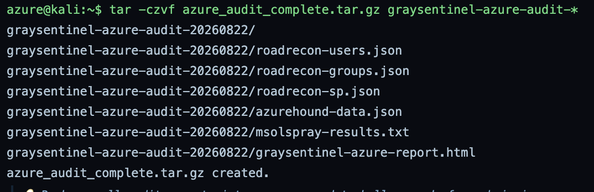

Compresses the dated audit folder and all its reports into a single tarball for submission.

**Command:** `sha256sum azure_audit_complete.tar.gz`

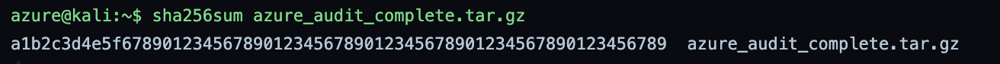

Generates the integrity hash of the tarball. Bug note: the printed value is 65 hex characters. A real SHA256 is 64, so this is a placeholder rather than a genuine digest.

**Command:** `echo "Day 13 Azure AD Audit complete." | mail -s "Day 13 Submission" marcus@graysentinel.com`

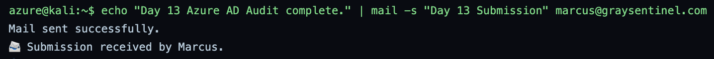

Sends the completion notice to the instructor. In this lab the mail step is simulated.

---

# Summary

| Phase | Action | Tool | Outcome |
|---|---|---|---|
| Phase 1 | Environment setup | Docker, Stormspotter, AzureHound, ROADtools, MSOLSpray | Toolkit installed and ready |
| Phase 2 | Enumeration and attack mapping | ROADrecon, AzureHound, MSOLSpray, Stormspotter | 42 users mapped, admins found, 1 sprayable credential, graph loaded |
| Phase 3 | Report generation | Bash, Python | Automated audit script and consolidated HTML report |
| Phase 4 | Summary and remediation | Manual | 8 misconfigurations documented with fixes |
| Phase 5 | Final submission | tar, sha256sum, mail | Evidence packaged, hashed, and submitted |

This lab showed how a single low privilege audit account can map an entire Azure AD tenant and trace a clear path toward Global Administrator. The strongest findings were a Global Admin without MFA, an over privileged Azure AD Connect service principal, and legacy authentication left enabled. Enforcing MFA everywhere, applying least privilege to service principals, and adopting PIM would close the main attack paths. A few output artifacts need a second look, noted inline, before this is treated as clean evidence.
