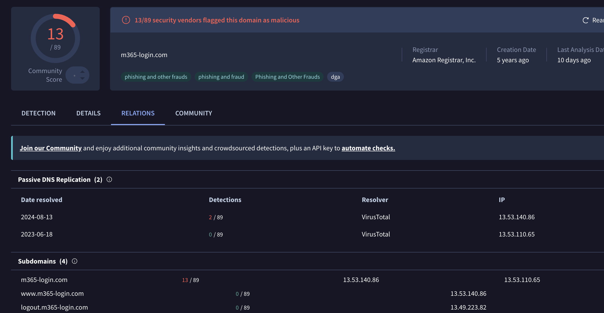
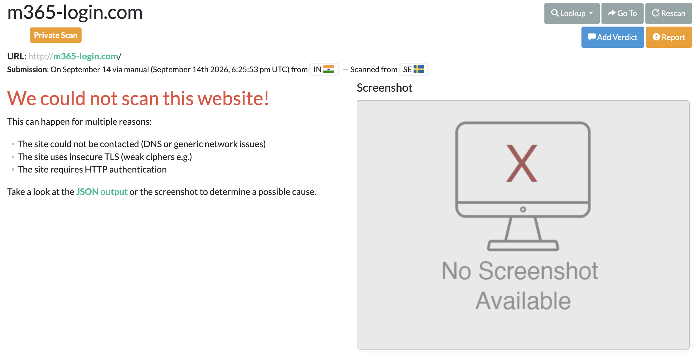

# DSOU Day 14 | QR Code Phishing (Quishing) Detection | 14 Sept 2026
**Analyst:** Jnanashree Anchan | **Program:** GraySentinel Blue Team

---

## Executive Summary
A QR code phishing (quishing) email targeting Microsoft 365 credentials was identified and analysed. The attacker embedded a malicious QR code inside a PDF attachment to bypass URL scanning tools, redirecting victims to a credential harvesting page hosted on AWS infrastructure.

---

## Email Header Analysis

| Field | Value |
|---|---|
| From | accounts@supplier-invoices[.]net |
| To | john.smith@company.com |
| Subject | ACTION REQUIRED: Invoice #INV-2026-09-14 - Scan to Verify |
| Date | 14 Sep 2026 08:42:31 UTC |
| Sending IP | 185.220.101.47 (synthetic) |
| SPF | FAIL |
| DKIM | FAIL |
| DMARC | FAIL (p=reject) |

All three email authentication checks failed, confirming a spoofed sender domain.

---

## QR Code Analysis

The PDF attachment contained a QR code redirecting to:

`hxxps://m365-login[.]com`

The domain mimics a legitimate Microsoft 365 login page, designed to harvest credentials from victims who scan with their mobile device, bypassing endpoint email security that cannot parse QR codes embedded in images.

**QR Code:**


**VirusTotal Result:** Flagged by 13/89 security vendors as malicious. Registered via Amazon Registrar, categorised as phishing and fraud, and classified as a DGA (Domain Generation Algorithm) domain. Created 5 years ago, last analysed 10 days ago. Resolved to hosting IP 13.53.140.86.



**URLScan.io Result:** Could not scan the domain, consistent with anti-analysis techniques used by phishing infrastructure to evade automated scanning.



---

## Why Quishing Bypasses Security Tools

Traditional email security scans URLs in email body and attachments. A QR code is an image and the malicious URL is hidden inside it. It cannot be extracted or scanned automatically. The victim's personal mobile device, which has no corporate security controls, performs the scan and opens the phishing page outside the corporate network perimeter.

---

## MITRE ATT&CK

| Technique | ID | Description |
|---|---|---|
| Phishing: Spearphishing Link | T1566.002 | Malicious QR code in PDF redirecting to phishing URL |
| User Execution: Malicious Link | T1204.001 | Victim scans QR code and opens credential harvesting page |
| Credentials from Web Browser | T1555.003 | Credential harvesting via fake M365 login page |

---

## Hunting Query — Microsoft Sentinel KQL

```kql
EmailAttachmentInfo
| where FileType == "pdf"
| where Subject contains "QR" or Subject contains "scan"
| join EmailEvents on NetworkMessageId
| where ThreatTypes has "Phish"
```

This query identifies emails with PDF attachments where the subject references QR codes or scanning, flagged as phishing by Microsoft Defender. Note: query not executed in live environment, documented for detection engineering reference.

---

## IOCs

| Type | Value | Source |
|---|---|---|
| Sender Domain | supplier-invoices[.]net | Synthetic |
| Sending IP | 185.220.101.47 | Synthetic |
| Phishing Domain | m365-login[.]com | Real |
| Hosting IP | 13.53.140.86 | VirusTotal |
| Registrar | Amazon Registrar, Inc. | VirusTotal |
| VirusTotal Detections | 13/89 — Phishing and Fraud, DGA | VirusTotal |
| Domain Created | 5 years ago | VirusTotal |
| Attachment | Invoice_INV-2026-09-14.pdf | Synthetic |
| File Hash | d4f8a2c1b9e3f7a0c2d5e8b1f4a7c0d3e6b9f2a5 | Synthetic |

---

## Recommended Actions

**Block:**
- IP 13.53.140.86 on email gateway and firewall
- Domains supplier-invoices[.]net and m365-login[.]com
- Hash of malicious PDF attachment

**Detect:**
- Deploy hunting query in Microsoft Sentinel
- Enable QR code URL extraction in email security gateway
- Alert on PDF attachments with embedded QR codes from external senders

**User Awareness:**
- Notify all staff about quishing technique
- Advise never to scan QR codes received via email without verification
- Report suspicious emails to SOC immediately

---

*Note: Synthetic .eml sample used for demonstration purposes. Real threat intelligence sourced from VirusTotal for m365-login[.]com.*

---

**Status:** Contained. IOCs blocked. User awareness initiated.
