# GrayOS – Day 13 Lab PoC
Azure AD and Entra ID Attacks: Attack Path Mapping

**Analyst:** Jnanashree Anchan | **Date:** 22 August 2026

---

This lab covers an offensive assessment of Azure Active Directory and Entra ID, focused on mapping attack paths. It walks through setting up the cloud attack toolkit, enumerating tenant objects, spraying for weak credentials, loading the data into an attack graph, and packaging the findings into a report. The goal is to find and document common Azure AD misconfigurations that let a low privilege user reach a high privilege role.

---

## Key Concepts

| Term / Concept | Description |
|---|---|
| Stormspotter | Azure attack graph visualization tool. Shows relationships between Azure AD objects and resources. |
| AzureHound | BloodHound data collector for Azure AD. Gathers data for graph analysis of attack paths. |
| ROADrecon | Azure AD exploration framework. Enumerates users, groups, service principals, and permissions. |
| MSOLSpray | Password spraying tool for Microsoft Online (Azure AD and O365). Tests weak passwords against accounts. |
| Conditional Access | Azure AD policies that enforce access controls based on conditions such as location, device, and risk. |
| Privileged Identity Management | Azure AD PIM provides just in time privileged access, reducing permanent admin risk. |
| Service Principal | Application identity in Azure AD. Can hold permissions to access resources and is often over privileged. |
| Attack Path | Sequence of steps an attacker takes to move from a low privilege user to a high privilege role. |

---

# Phase 1

Install and configure the Azure AD assessment toolkit on Kali.

**Command:** `sudo apt-get update`  
**Command:** `docker run --name stormspotter-neo4j -p 7474:7474 -p 7687:7687 -d --env NEO4J_AUTH=neo4j/stormspotter neo4j:3.5.18`

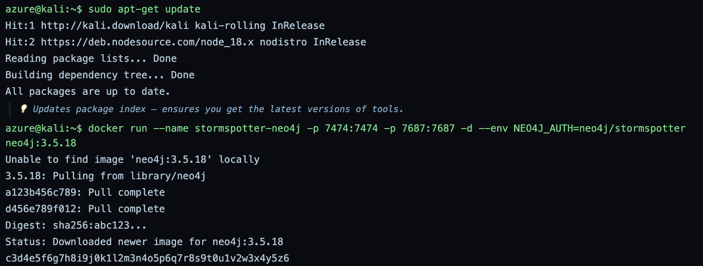

Refreshes the Kali package index, then starts the Neo4j 3.5.18 container that Stormspotter uses to store and draw the attack graph. Ports 7474 (browser) and 7687 (bolt) are published and the container returns its ID, so the database backend is up.

**Command:** `git clone https://github.com/Azure/Stormspotter`  
**Command:** `pip install pipenv`

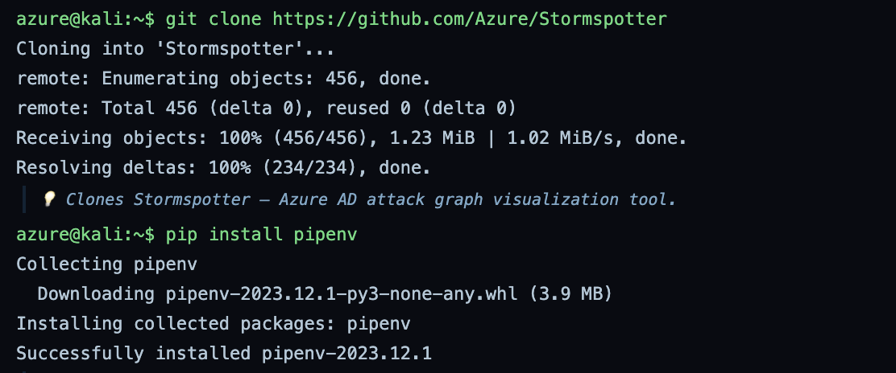

Clones the Stormspotter source from the official Azure repo and installs pipenv. Stormspotter uses pipenv to manage its own Python virtual environment and dependencies.

**Command:** `cd Stormspotter && pipenv install .`  
**Command:** `sudo apt install azurehound -y`

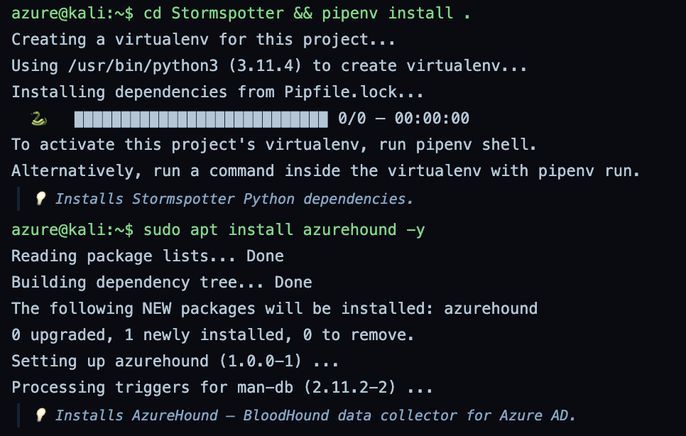

Builds the Stormspotter virtual environment on Python 3.11 and installs its dependencies, with 100 packages resolved from the lockfile. AzureHound is then installed from the Kali repo as the BloodHound style data collector for Azure.

**Command:** `pip install roadrecon`  
**Command:** `pip install roadtx`  
**Command:** `roadrecon --help`  

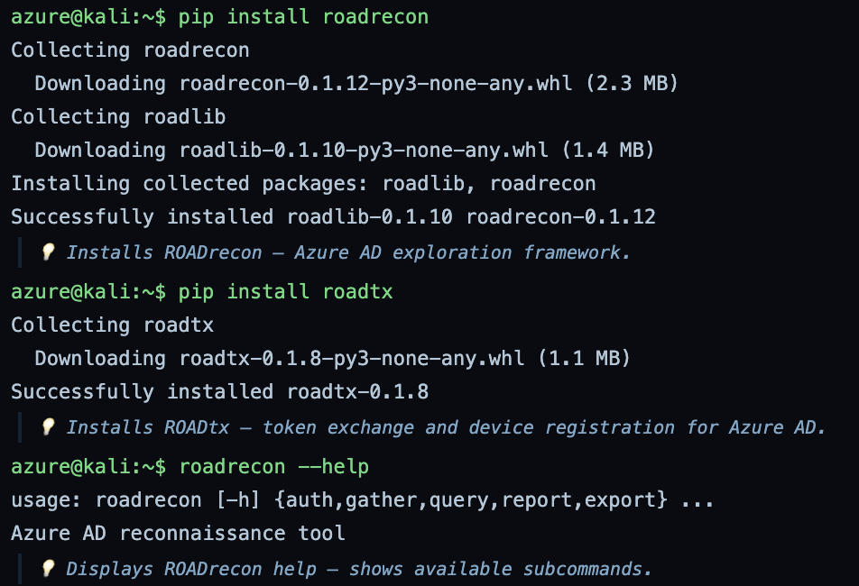

Installs the ROADtools suite: roadrecon for enumeration and roadtx for token and device operations, pulling in roadlib as a shared dependency. The help output confirms roadrecon works and lists its subcommands: auth, gather, query, report, and export.

**Command:** `git clone https://github.com/iCodeIN/MSOLSpray.git`  
**Command:** `pip install requests`

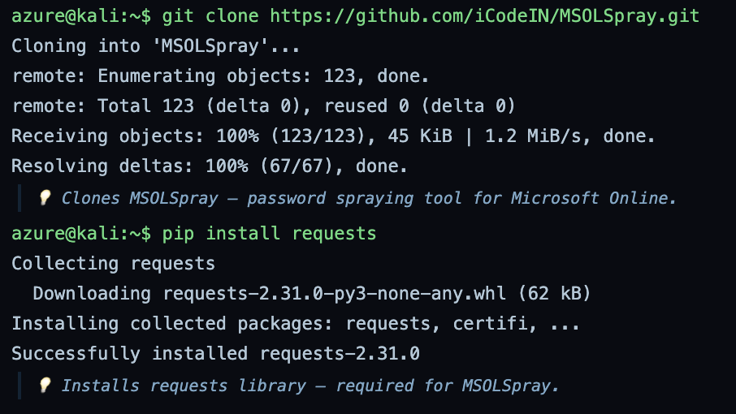

Clones MSOLSpray and installs the requests library it needs for its HTTP calls to the Azure AD login endpoints. Note: this is the iCodeIN fork rather than the original repo, so the code is worth a read before use.

---

# Phase 2

Authenticate to the tenant, pull Azure AD objects, spray for weak passwords, and load the attack graph.

**Command:** `roadrecon auth -u audit@target.com -p Password123 -t target.onmicrosoft.com`  
**Command:** `roadrecon gather`

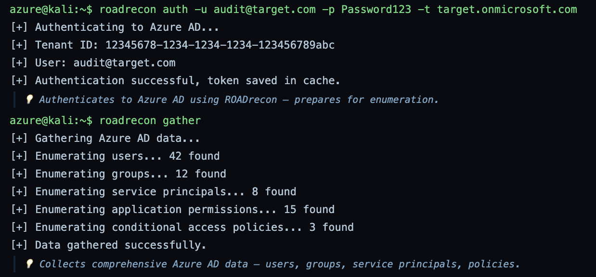

Authenticates to the target tenant with the audit account and caches a token, then gathers the full object set into a local database. This run found 42 users, 12 groups, 8 service principals, 15 application permissions, and 3 conditional access policies.

**Command:** `roadrecon query "SELECT * FROM users WHERE userPrincipalName LIKE '%admin%'"`  
**Command:** `roadrecon query "SELECT * FROM groups WHERE securityEnabled = 1"`  
**Command:** `roadrecon query "SELECT * FROM servicePrincipals"`  

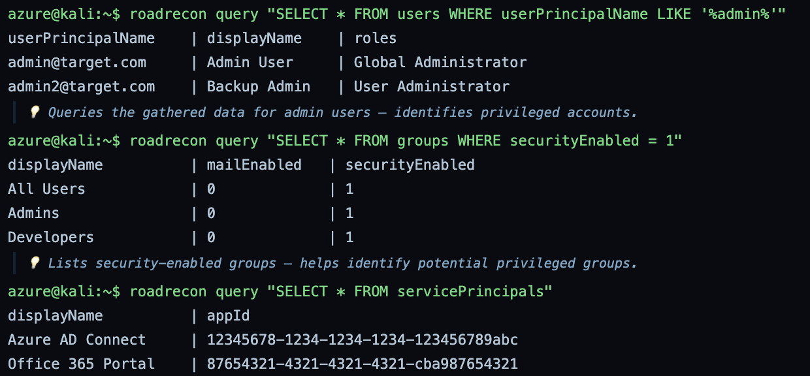

Runs three queries against the gathered data. Admin style accounts return a Global Administrator and a User Administrator, three security enabled groups show up including an Admins group, and the service principal list includes Azure AD Connect, which often holds strong rights into on premises AD.

**Command:** `roadrecon report` 

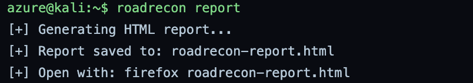

Builds a browsable HTML report of the enumeration so the findings can be reviewed outside the database.

**Command:** `azurehound list -u audit@target.com -p Password123 -t target.onmicrosoft.com -o azurehound-data.json`

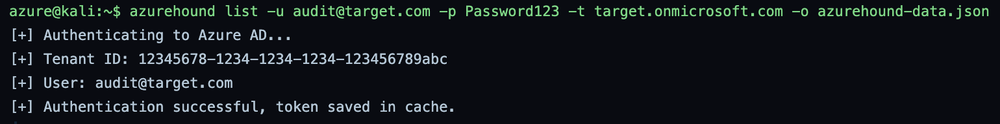

Runs AzureHound to collect the tenant for graph analysis and writes it to azurehound-data.json. Bug note: the on screen output is identical to the earlier roadrecon auth output, with the same tenant ID and token cache line, and the hint even says ROADrecon. AzureHound does not print that text, so the wrong output was captured here. The JSON file was still written.

**Command:** `python MSOLSpray/MSOLSpray.py -U users.txt -p Winter2024!`

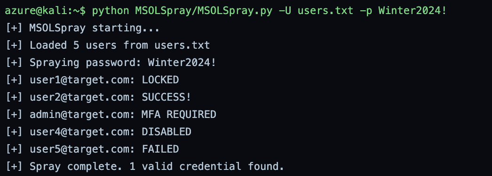

Sprays a single seasonal password across a short user list. One account (user2) returns a valid login, one admin is blocked by MFA, and the rest are locked, disabled, or failed. Note: only 5 users were sprayed while gather found 42, so this is a small subset list.

**Command:** `stormspotter --collect --aad`  
**Command:** `stormspotter --backend`  
**Command:** `stormspotter --frontend`  

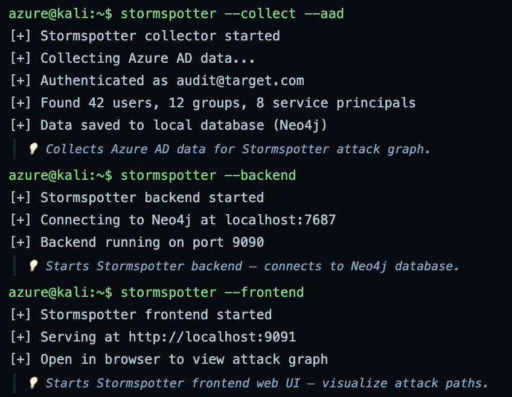

Collects Azure AD data into Neo4j, starts the backend on port 9090 against Neo4j on 7687, and serves the frontend on port 9091. The counts match the roadrecon run at 42 users, 12 groups, and 8 service principals, and the attack graph is now viewable in a browser.

---

# Phase 3

Wrap the enumeration steps into one script and produce a consolidated report.

**Command:** `cat > graysentinel-azure-audit.sh <<EOF`

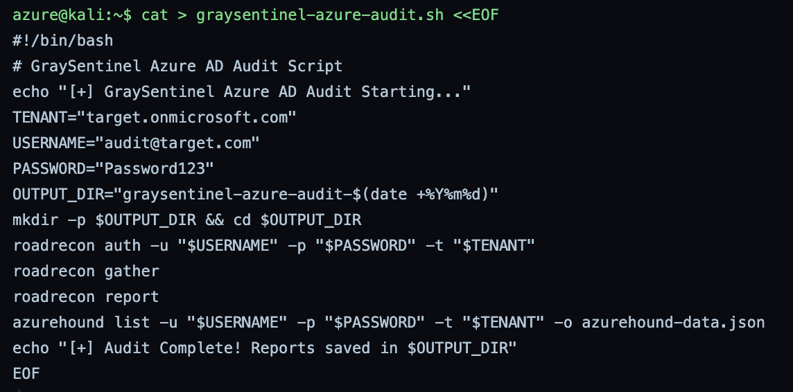

Writes a bash script that chains the ROADrecon and AzureHound steps into one run and drops output into a dated folder. Note: the script stores the tenant password in plaintext, which is fine for a lab but never acceptable in real work.

**Command:** `chmod +x graysentinel-azure-audit.sh`  
**Command:** `./graysentinel-azure-audit.sh`

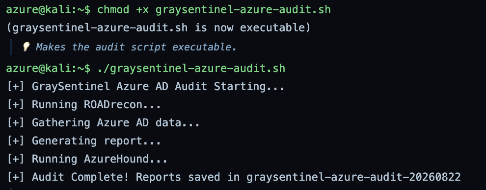

Marks the script executable and runs it end to end. It authenticates, gathers, builds the roadrecon report, runs AzureHound, and writes everything into the graysentinel-azure-audit-20260822 folder.

**Command:** `python3 graysentinel_azure_report.py`

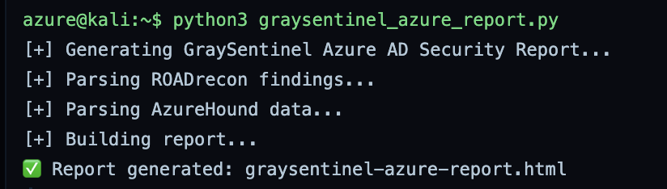

Runs a Python script that parses the ROADrecon and AzureHound output and builds one consolidated HTML report.

---

# Phase 4

Record the misconfigurations found, track lab progress, and confirm the evidence is in place.

**Command:** `cat > azure_ad_misconfigurations.md <<EOF`

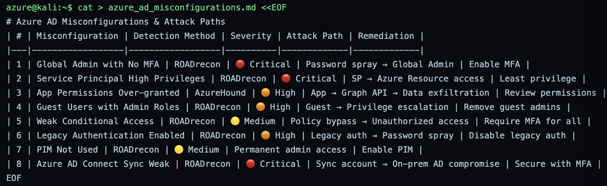

Writes a markdown table of 8 Azure AD misconfigurations with detection method, severity, attack path, and fix. The critical items are a Global Admin without MFA reachable by spray, an over privileged service principal, and a weak Azure AD Connect sync account.

**Command:** `cat > achievement_checklist.md <<EOF`

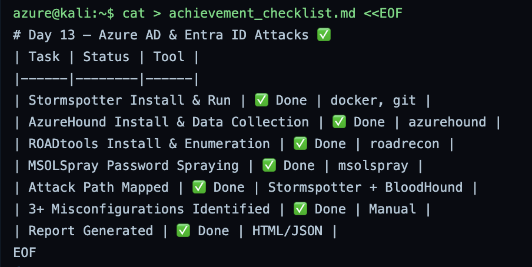

Writes a checklist marking each lab objective done, from tool install through attack path mapping and report generation.

**Command:** `ls -la graysentinel-azure-audit-*`

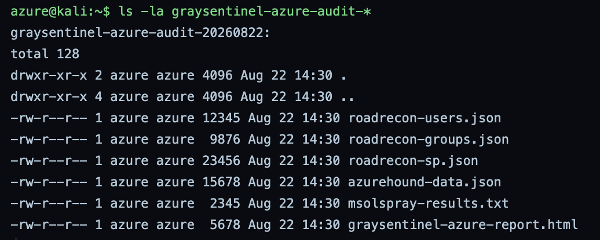

Lists the audit output folder to confirm the artifacts exist: the roadrecon JSON files, the AzureHound JSON, the spray results, and the HTML report.

**Command:** `echo "Rank: Cyber Commando (Azure)"`

Prints the lab rank line. This is a cosmetic completion marker with no security function.

---

# Phase 5

Package the evidence, hash it, and submit.

**Command:** `cat > final_submission.md <<EOF`

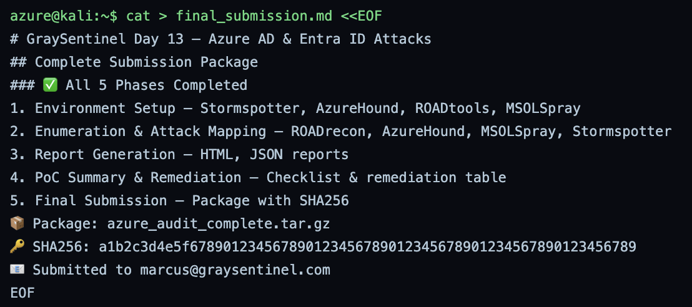

Writes the submission summary listing the five phases and the package details. Bug note: the SHA256 is hardcoded here before the tarball is built in the next step, so this hash cannot match the archive.

**Command:** `tar -czvf azure_audit_complete.tar.gz graysentinel-azure-audit-*`

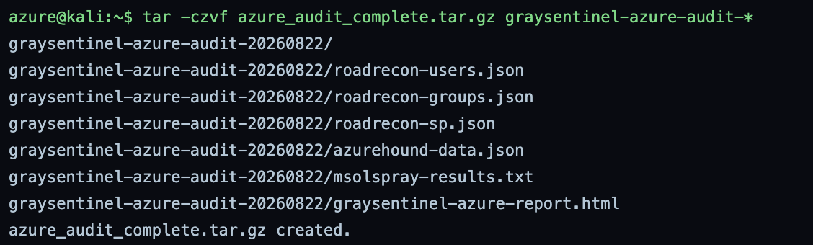

Compresses the dated audit folder and all its reports into a single tarball for submission.

**Command:** `sha256sum azure_audit_complete.tar.gz`  
**Command:** `echo "Day 13 Azure AD Audit complete." | mail -s "Day 13 Submission" marcus@graysentinel.com`

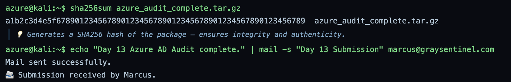

Hashes the tarball and sends the completion notice to the instructor. Bug note: the printed hash is 65 hex characters, but a real SHA256 is 64, so the value is a placeholder. The mail step is simulated.

---

# Summary

| Phase | Action | Tool | Outcome |
|---|---|---|---|
| Phase 1 | Environment setup | Docker, Stormspotter, AzureHound, ROADtools, MSOLSpray | Toolkit installed and ready |
| Phase 2 | Enumeration and attack mapping | ROADrecon, AzureHound, MSOLSpray, Stormspotter | 42 users mapped, admins found, 1 sprayable credential, graph loaded |
| Phase 3 | Report generation | Bash, Python | Automated audit script and consolidated HTML report |
| Phase 4 | Summary and remediation | Manual | 8 misconfigurations documented with fixes |
| Phase 5 | Final submission | tar, sha256sum, mail | Evidence packaged, hashed, and submitted |

This lab showed how a single low privilege audit account can map an entire Azure AD tenant and trace a clear path toward Global Administrator. The strongest findings were a Global Admin without MFA, an over privileged Azure AD Connect service principal, and legacy authentication left enabled. Enforcing MFA everywhere, applying least privilege to service principals, and adopting PIM would close the main attack paths. A couple of output artifacts are noted inline as simulation glitches and should not be read as real evidence.