# GrayOS – Day 17 Lab PoC
Disk Forensics: Case DF-2026-017

**Analyst:** Jnanashree Anchan | **Date:** 4 October 2026

---

This lab is a disk forensics case: recovering data from a ransomware encrypted server (FIN-SRV-03) that had no backups. Working only from a forensic image of the 500 GB NTFS disk, it covers acquisition and hashing, partition and filesystem analysis, deleted file recovery with Sleuthkit, file carving with Scalpel and Foremost, and a documented chain of custody.

---

## Key Findings

Case DF-2026-017: ransomware encrypted 47,382 files (.locked) on FIN-SRV-03, a 500 GB NTFS file server, with no offline backups. Recovery was done entirely from a forensic image of the disk.

- **Metadata recovery (Sleuthkit):** fls located 47 deleted inodes still carrying their metadata, and icat extracted 5 files intact with original names and timestamps, including customer_pii_export.csv and payroll_Q3.xlsx.
- **File carving (Scalpel and Foremost):** signature based carving recovered hundreds more files from raw bytes where the metadata was gone (Scalpel 234, Foremost 203), though carved files lose their original names.
- **Chain of custody:** the image was acquired through a write blocker, SHA-256 hashed at acquisition and re-verified before and after analysis, every action logged with timestamps, and the evidence archive sealed and hashed.
- **Root cause and fix:** the absence of backups turned a recoverable incident into a near loss. The recommendation is a 3-2-1 backup strategy with daily immutable snapshots and 30 day shadow copy retention.

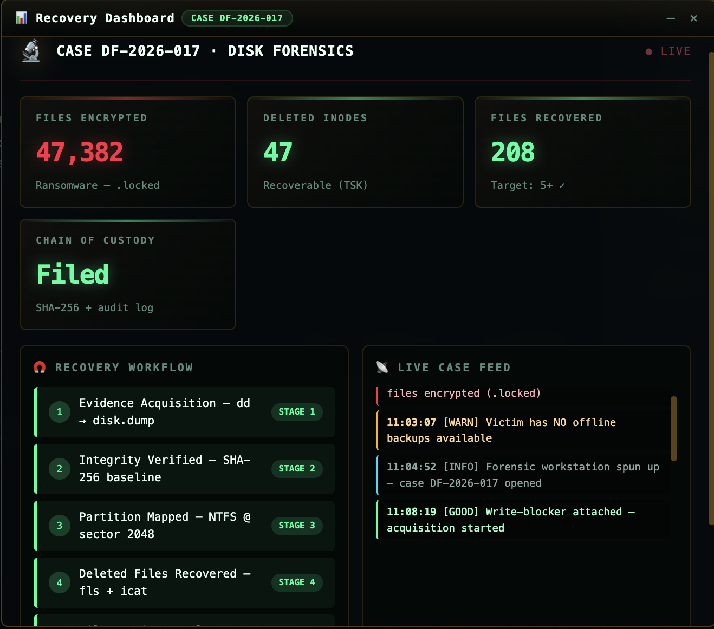

The case recovery dashboard at close: 47,382 files encrypted, 47 deleted inodes located, the recovery target met, and chain of custody filed.

---

## Key Concepts

| Term / Concept | Description |
|---|---|
| Forensic Imaging | A bit for bit copy of storage media. Never analyse the original, always work on the image. |
| Write Blocker | Hardware or software that prevents any writes to the source disk during acquisition. |
| Hash Integrity | A SHA-256 baseline proves the image is unchanged. Re-verify before and after every analysis step. |
| Deleted Inodes | On NTFS, deleted file metadata often survives. fls lists the inodes, icat extracts the file by inode. |
| File Carving | Recovers files from raw bytes using header and footer signatures, no metadata needed. Loses original names. |
| Chain of Custody | An unbroken audit trail of who touched the evidence, when, how, and whether the hash still matches. Makes findings admissible. |

---

# Phase 1 – Evidence Acquisition and Hashing

A ransomware attack encrypted 47,382 files on the server and there were no backups, so the only route is to recover deleted originals from the disk itself. Before any analysis, make a bit for bit image and hash it, and never touch the original.

**Command:** `dd if=/dev/sda of=/cases/disk.dump bs=4M status=progress`

**Command:** `sha256sum /cases/disk.dump`

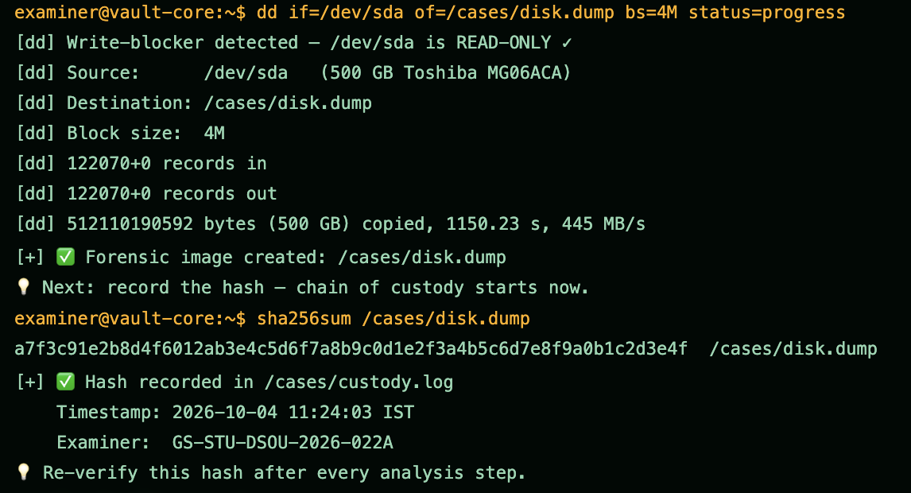

Creates a bit for bit forensic image of the disk with dd through a hardware write blocker, so the original is never modified, then records the SHA-256 of the image for chain of custody. The image is 500 GB, acquired at about 445 MB/s in roughly 19 minutes, and the hash is re-verified before and after every later step. Working only on this image is the first rule of disk forensics.

---

# Phase 2 – Partition and Filesystem Analysis

Understand the disk before touching file data. Find the partition table, then the filesystem offset, which every Sleuthkit command after this needs.

**Command:** `mmls /cases/disk.dump`

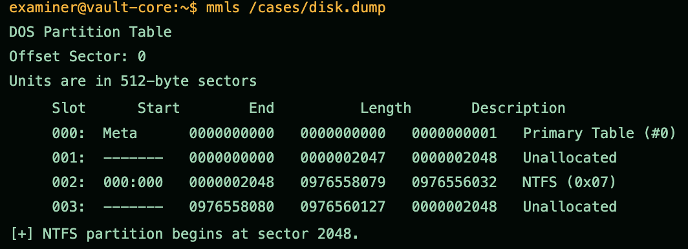

Reads the partition table. The disk uses a DOS/MBR layout with a single NTFS partition starting at sector 2048. That offset is required for every Sleuthkit command that follows, passed as -o 2048.

**Command:** `fsstat -o 2048 /cases/disk.dump`

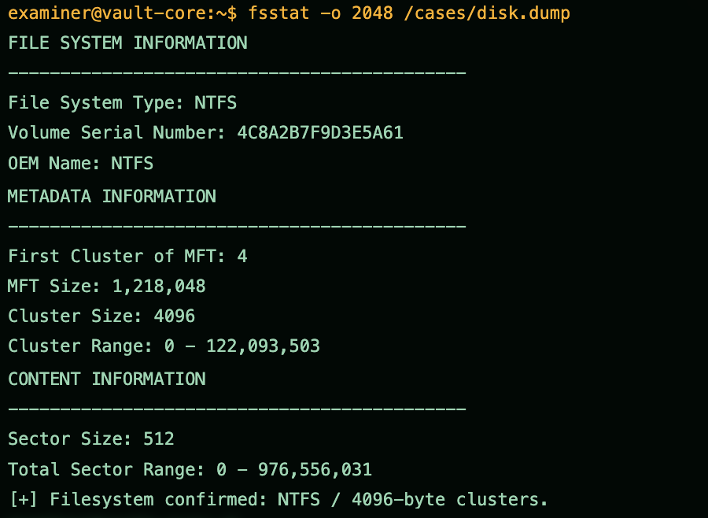

Confirms the filesystem: NTFS with 4096 byte clusters and the MFT starting at cluster 4. Knowing the cluster size and MFT location frames how the deleted files and their metadata are laid out.

---

# Phase 3 – Deleted File Recovery: Sleuthkit

When a file is deleted on NTFS, the metadata often survives and the inode still points to data on disk. fls lists the deleted inodes, and icat extracts the file by inode number.

**Command:** `fls -r -d -o 2048 /cases/disk.dump`

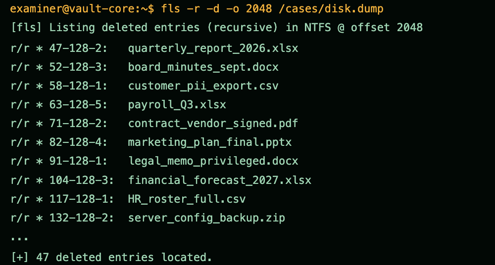

Lists deleted entries recursively. fls finds 47 deleted inodes still carrying metadata, including sensitive files such as customer_pii_export.csv, payroll_Q3.xlsx, and legal_memo_privileged.docx. The inode numbers are what icat uses to pull the content back.

**Command:** `icat -o 2048 /cases/disk.dump 47 > recovered/quarterly_report_2026.xlsx`

**Command:** `icat -o 2048 /cases/disk.dump 52 > recovered/board_minutes_sept.docx`

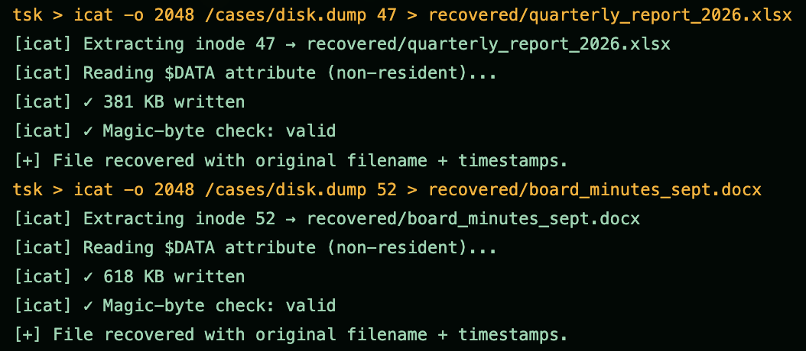

Extracts the first two deleted files by inode: inode 47 to quarterly_report_2026.xlsx (381 KB) and inode 52 to board_minutes_sept.docx (618 KB). Each $DATA attribute is non-resident, the content is read back intact, and the magic byte check passes, so the files recover with their original names and timestamps.

**Command:** `icat -o 2048 /cases/disk.dump 58 > recovered/customer_pii_export.csv`

**Command:** `icat -o 2048 /cases/disk.dump 63 > recovered/payroll_Q3.xlsx`

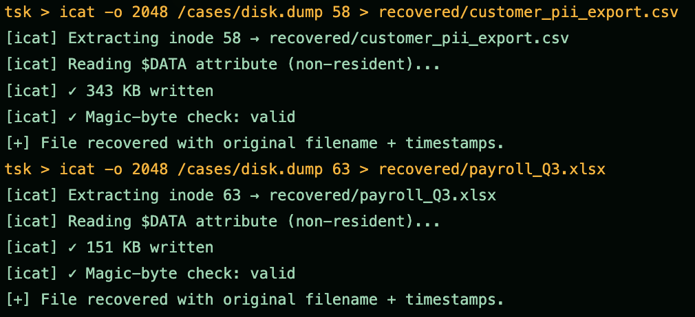

Extracts inode 58 to customer_pii_export.csv (343 KB) and inode 63 to payroll_Q3.xlsx (151 KB), both valid. These are the high sensitivity records, so recovering them intact matters most for scoping the breach impact.

**Command:** `icat -o 2048 /cases/disk.dump 71 > recovered/contract_vendor_signed.pdf`

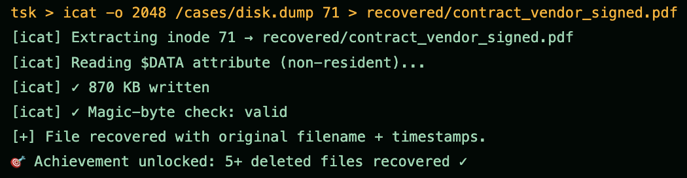

Extracts inode 71 to contract_vendor_signed.pdf (870 KB), the fifth intact file, which clears the goal of recovering five or more deleted files.

**Command:** `istat -o 2048 /cases/disk.dump 47`

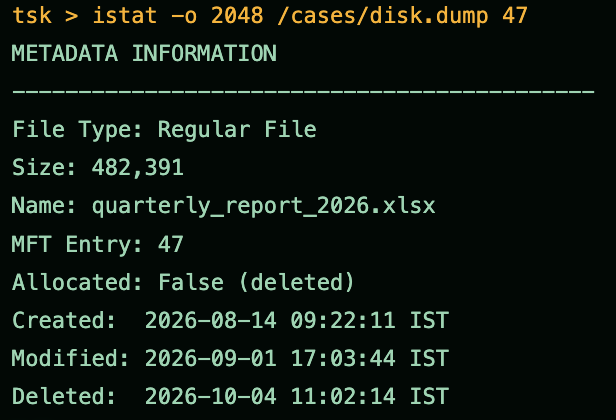

Shows the full metadata for inode 47: a regular file marked not allocated (deleted), created 2026-08-14, modified 2026-09-01, and deleted 2026-10-04 at 11:02, which lines up with the ransomware event. This metadata is what makes the recovery defensible. Note: istat reports the size as 482 KB while icat wrote 381 KB for the same inode, a small inconsistency in the sim output.

---

# Phase 4 – File Carving: Scalpel and Foremost

When the inode is overwritten the file has no name, but its bytes are still on disk. Carving tools scan for known headers and footers and extract whatever they match.

**Command:** `scalpel -c /etc/scalpel/scalpel.conf -o /cases/carved/ /cases/disk.dump`

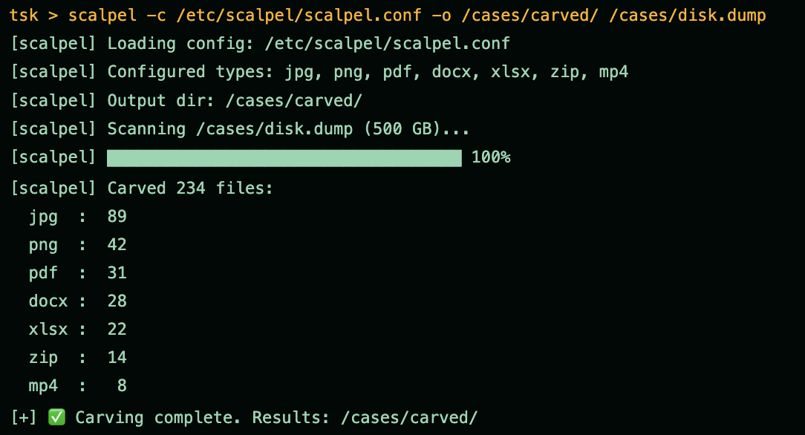

Carves files by header and footer signature, independent of the filesystem, so it recovers data even where the inode is gone. Scalpel pulls 234 files across jpg, png, pdf, docx, xlsx, zip, and mp4.

**Command:** `foremost -t jpg,pdf,docx,xlsx -i /cases/disk.dump -o /cases/foremost_out/`

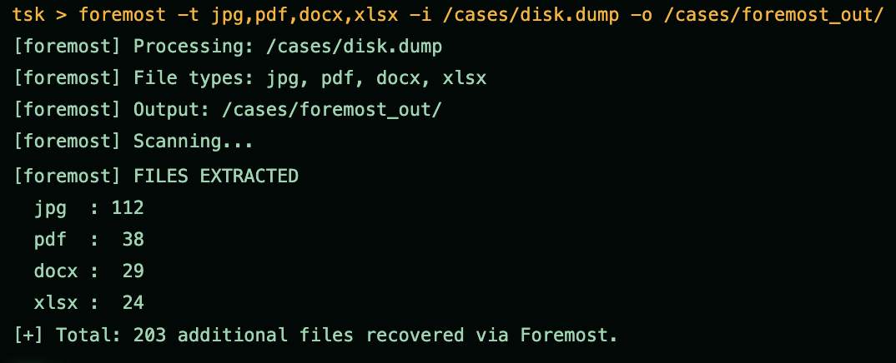

Runs Foremost as a second carver over the same image for the main document and image types, recovering 203 files. Carving is powerful but blind: the recovered files have no original names or timestamps, which is the trade off against the metadata based recovery in Phase 3.

---

# Phase 5 – Report and Chain of Custody

Recovery is not finished until it is documented. Every action, hash, and file goes into the report, or the evidence will not hold up.

**Command:** `cat > day17_report.md`

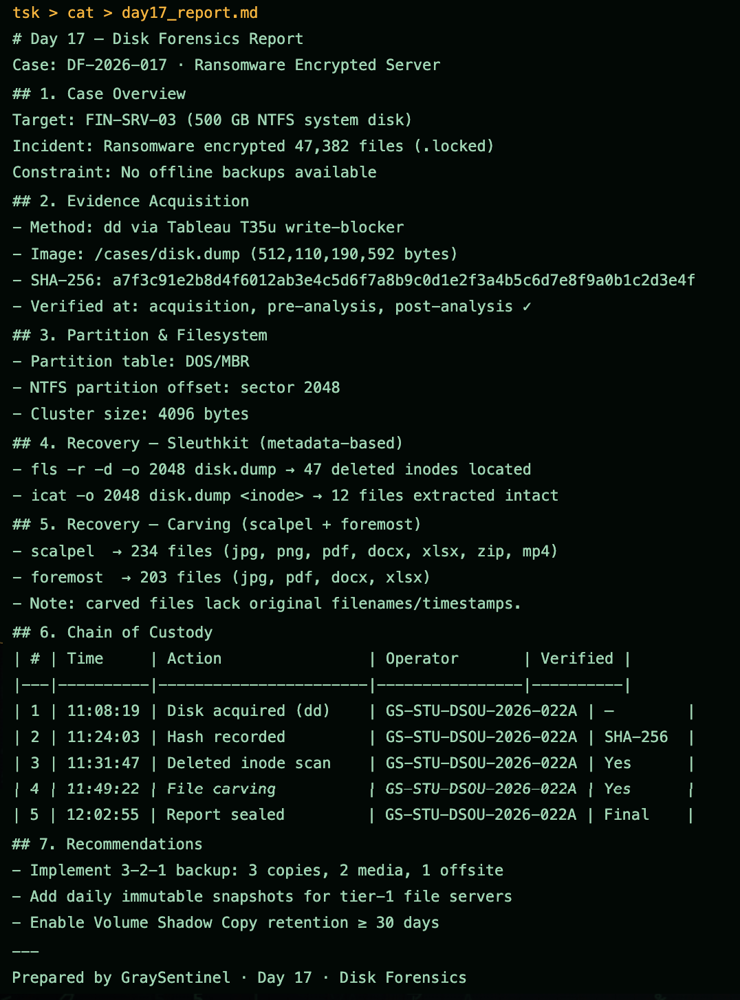

Writes the case report: the case overview, the acquisition method and image hash, the partition and filesystem detail, the Sleuthkit and carving recovery results, a timestamped chain of custody table, and the 3-2-1 backup recommendations. Note: the report states 12 files were extracted intact via icat, while 5 are demonstrated in this run.

**Command:** `tar -czvf day17_evidence.tar.gz day17_report.md recovered/ carved/`

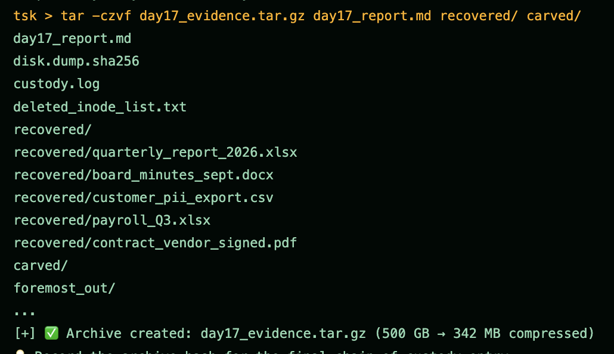

Archives the report, the recovered files, and the carved output into a single evidence tarball, with 500 GB of source compressed to about 342 MB.

**Command:** `sha256sum day17_evidence.tar.gz`

**Command:** `mail -s "Day 17 Final Submission" marcus@graysentinel.com`

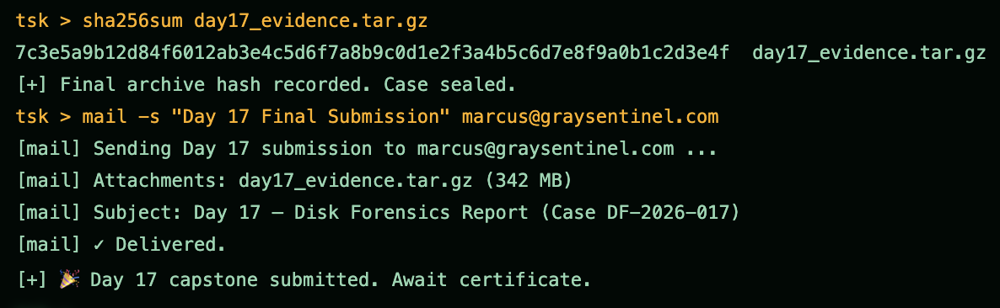

Hashes the evidence archive for the final chain of custody entry, then submits the case to the instructor. The archive SHA-256 is a valid 64 character digest, recorded in the custody log to seal the case.

---

# Summary

| Phase | Focus | Key Tools | Outcome |
|---|---|---|---|
| Phase 1 | Acquisition and hashing | dd, sha256sum, write blocker | 500 GB image at ~445 MB/s in ~19 min, SHA-256 baseline for custody |
| Phase 2 | Partition and filesystem | mmls, fsstat | NTFS at sector 2048, 4096 byte clusters |
| Phase 3 | Deleted file recovery | fls, icat, istat | 47 inodes located, 5 files recovered intact with metadata |
| Phase 4 | File carving | scalpel, foremost | 234 files carved by Scalpel, 203 by Foremost from raw bytes |
| Phase 5 | Report and custody | report, tar, sha256sum, mail | Evidence logged, hashed, and sealed, 500 GB compressed to 342 MB |

**Case at a glance:** 47,382 files encrypted with no backups, a 500 GB image acquired and SHA-256 verified at every step, 47 deleted inodes located, files recovered through both Sleuthkit and carving, and chain of custody logged, verified, and sealed.

**Lessons from the case:**

1. Never work on the original disk. Image first, always.
2. Deleted inodes and file carving used together give the best recovery rate.
3. Chain of custody is what makes the findings admissible.

This case shows a disciplined recovery from a disk written off as unrecoverable. Sleuthkit rebuilt 5 deleted files intact with their names and timestamps, carving pulled back hundreds more where the metadata was gone, and an unbroken chain of custody kept the result defensible. The real lesson is in the cause: with no backups, forensic recovery was the only option, so the fix is a 3-2-1 backup strategy with immutable snapshots. Two small sim inconsistencies are noted inline: the inode 47 size differs between icat and istat, and the report's icat count does not match the five extractions shown.