# GrayOS – Day 18 Lab PoC
YARA and Sandboxing: Case MAL-2026-018

**Analyst:** Jnanashree Anchan | **Date:** 6 October 2026

---

This lab triages a novel AV-evading RAT (OBSIDIAN) caught by a honeypot, then takes it through the full malware analysis pipeline: triage, static analysis, YARA rule authoring, sandbox detonation, and production detection deployment. Everything runs on an open source stack (YARA, Cuckoo, oletools, FlareVM) against case MAL-2026-018.

---

## Key Findings

A honeypot caught obsidian.exe, a new RAT that antivirus was barely catching (3/72 on VirusTotal). Full triage, static analysis, YARA authoring, and sandbox detonation were completed in one shift.

- **The sample:** a 2.4 MB UPX-packed .NET loader (entropy 7.94, ConfuserEx markers) with process injection, keylogging, screenshot capture, and TLS C2. Mapped to MITRE T1055, T1547.001, T1056.001, T1113, and T1071.001.
- **C2 and persistence:** two domains (cdn-obsidian.io, api-cdn-obsidian.net) and two hardcoded IPs (185.243.115.87, 91.219.236.14) over TLS 443, with persistence via the HKCU Run key ObsidianUpdater and a dropper at %APPDATA%\Microsoft\Obsidian\obs.dat.
- **Detection built and shipped:** a YARA rule (ObsidianRAT_Gen1, five strings plus a "2 of" condition) matched 3 of 3 family samples with 0 false positives, then was exported to Sigma and pushed to the SIEM and EDR.
- **Delivery:** a macro enabled invoice.docm was the dropper, using URLDownloadToFile to pull and run obsidian.exe.

---

## Key Concepts

| Term / Concept | Description |
|---|---|
| YARA | Pattern matching rule engine. Write signatures that catch malware families, not just single samples, using strings, hex patterns, and boolean conditions. |
| Cuckoo Sandbox | Automated malware detonation. Runs the sample in an isolated KVM guest and captures process, file, registry, and network activity. |
| oletools | Office macro analysis. olevba extracts and deobfuscates VBA, mraptor flags malicious macros, oleid checks file risk. |
| FlareVM MCP | Bridge between the Kali analysis host and a Windows FlareVM target. Run Volatility, x64dbg, and PE-bear remotely. |
| IOC Extraction | Indicators of Compromise: domains, IPs, hashes, registry keys, mutexes. The actionable output of every analysis. |
| Static vs Dynamic | Static analysis reads the file without running it (strings, PE headers). Dynamic analysis observes behavior in a sandbox. Both are needed, they answer different questions. |

---

The malware analysis dashboard at the start of the case, before any triage has run:

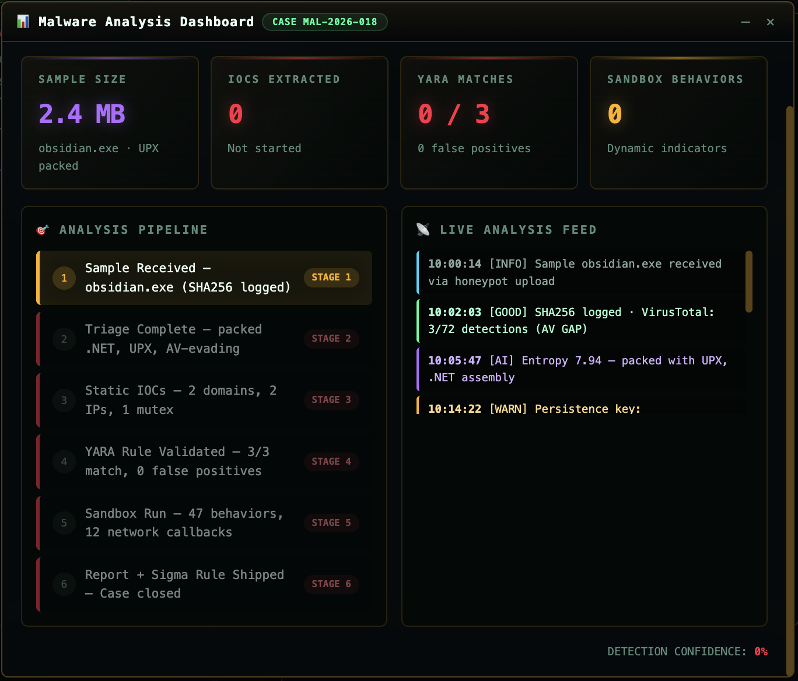

---

# Phase 1 – Triage and Sample Intelligence

A honeypot caught obsidian.exe at 10:00. VirusTotal flags it only 3/72, so antivirus has not caught up. The goal is to identify it fast: hash it, identify the family, pull the strings, and find the C2 and persistence before it spreads.

**Command:** `malware-triage --sample /samples/obsidian.exe`

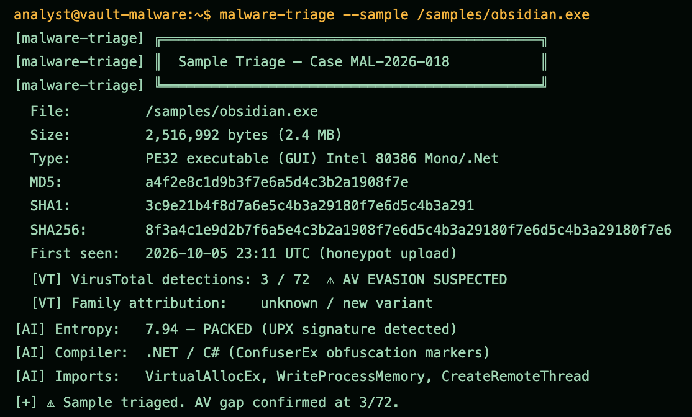

Runs the automated triage. It fingerprints obsidian.exe as a 2.4 MB PE32 .NET assembly, records the MD5, SHA1, and SHA256, and confirms the AV gap at 3/72 on VirusTotal with no family attribution yet. It flags entropy 7.94 (UPX packed), ConfuserEx obfuscation, and injection imports (VirtualAllocEx, WriteProcessMemory, CreateRemoteThread), so this is a packed .NET loader that can inject code.

**Command:** `file obsidian.exe`

**Command:** `sha256sum obsidian.exe`

**Command:** `strings -n 8 obsidian.exe`

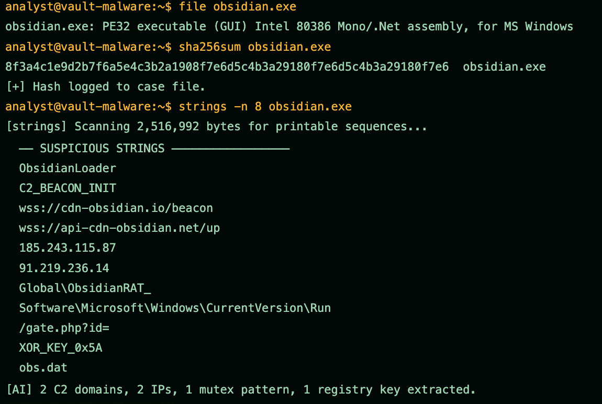

Confirms the file type as a .NET PE32 assembly, logs the SHA256 to the case file, and pulls printable strings. The strings are the first real intelligence: the C2 URLs wss://cdn-obsidian.io/beacon and wss://api-cdn-obsidian.net/up, two hardcoded IPs, the mutex pattern Global\ObsidianRAT_, the HKCU Run persistence key, and an XOR key marker. Two C2 domains, two IPs, a mutex, and a registry key are in hand before anything is run.

---

# Phase 2 – Static Analysis and IOC Extraction

PE headers and strings are the cheap wins. Before detonating anything, drain the static intelligence. Imports show what it can do, strings show where it talks.

**Command:** `pe-analyze obsidian.exe`

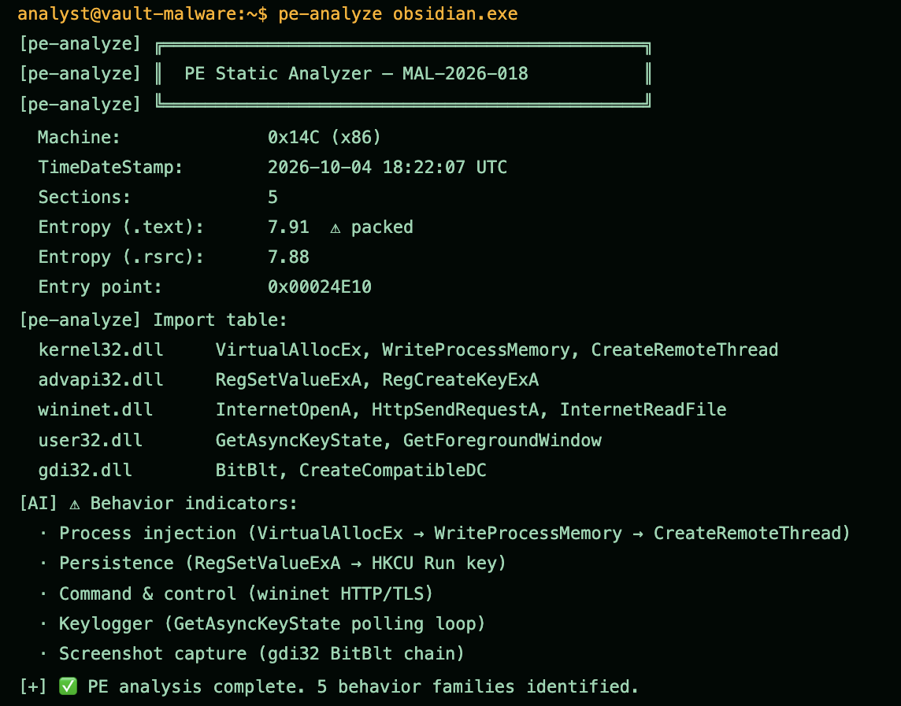

Parses the PE headers and imports. The import table confirms the capability set: process injection (VirtualAllocEx to WriteProcessMemory to CreateRemoteThread), persistence (RegSetValueExA on the Run key), C2 (wininet HTTP and TLS), keylogging (GetAsyncKeyState), and screenshot capture (gdi32 BitBlt). Five behavior families are identified from imports alone, before any detonation.

**Command:** `strings -n 8 obsidian.exe`

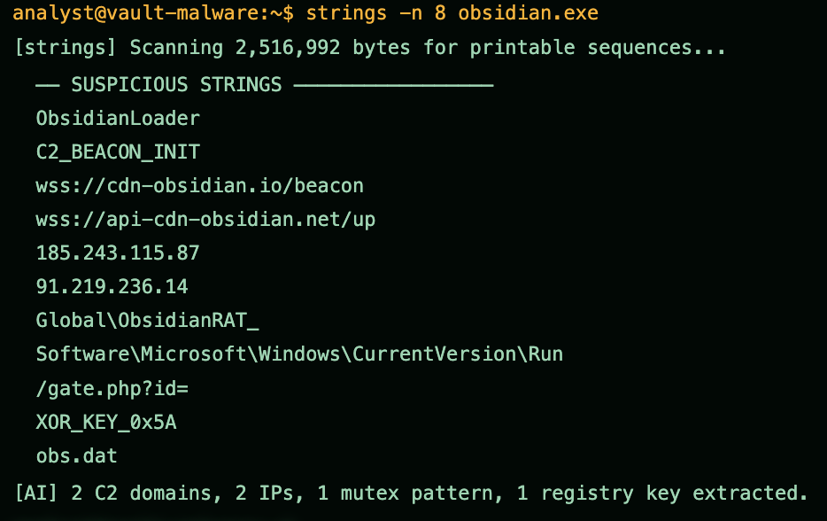

Re-runs strings to cross check the suspicious set against the PE findings. The C2 domains, IPs, mutex, and Run key line up with what the import table implies, which validates the static picture from two angles.

**Command:** `ioc-extract obsidian.exe`

**Command:** `oletools olevba invoice.docm`

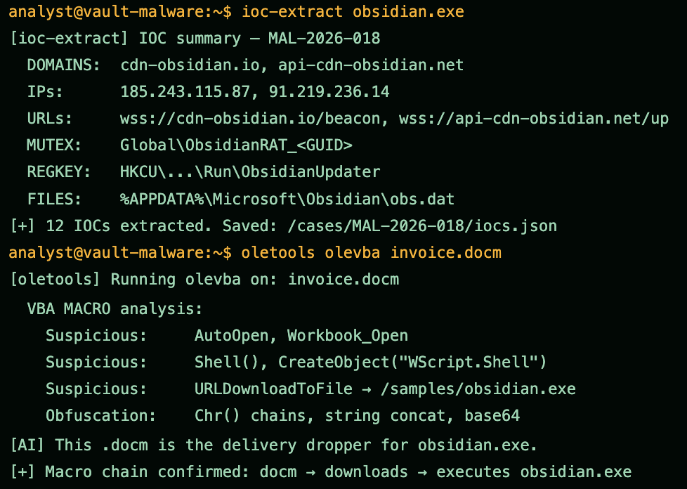

ioc-extract consolidates 12 IOCs into iocs.json: the two domains, two IPs, two URLs, the mutex, the Run key, and the %APPDATA% dropper file. olevba on invoice.docm then shows that document is the delivery dropper: AutoOpen and Workbook_Open macros, Shell and WScript.Shell, and URLDownloadToFile pointing at obsidian.exe, with Chr and base64 obfuscation. The docm downloads and runs the RAT.

---

# Phase 3 – YARA Rule Authoring

A good YARA rule is specific enough to avoid false positives but generic enough to catch the whole family, including future variants.

**Command:** `yara-write --name ObsidianRAT_Gen1` (interactive, then `yara-commit`)

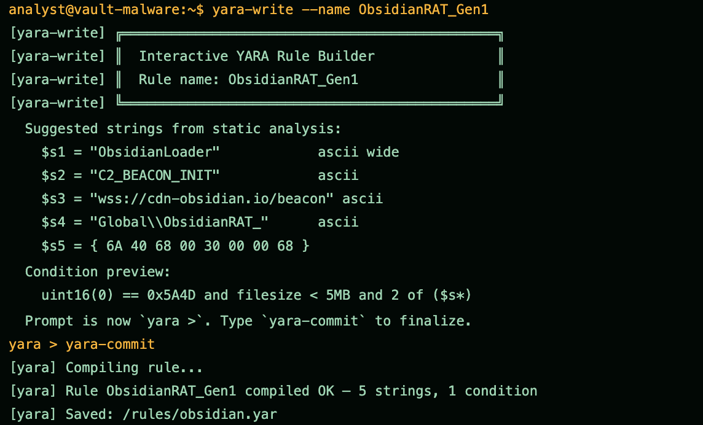

Builds the rule interactively. It takes five strings from the static analysis (the ObsidianLoader and C2_BEACON_INIT markers, the beacon URL, the mutex prefix, and a hex pattern from the loader stub) and a condition that checks the MZ header, a filesize under 5 MB, and 2 of the five strings. The "2 of" condition is the key design choice: specific enough to avoid false positives, loose enough to survive minor polymorphism. yara-commit compiles it to obsidian.yar.

**Command:** `yara-scan --rule obsidian.yar --target /samples/`

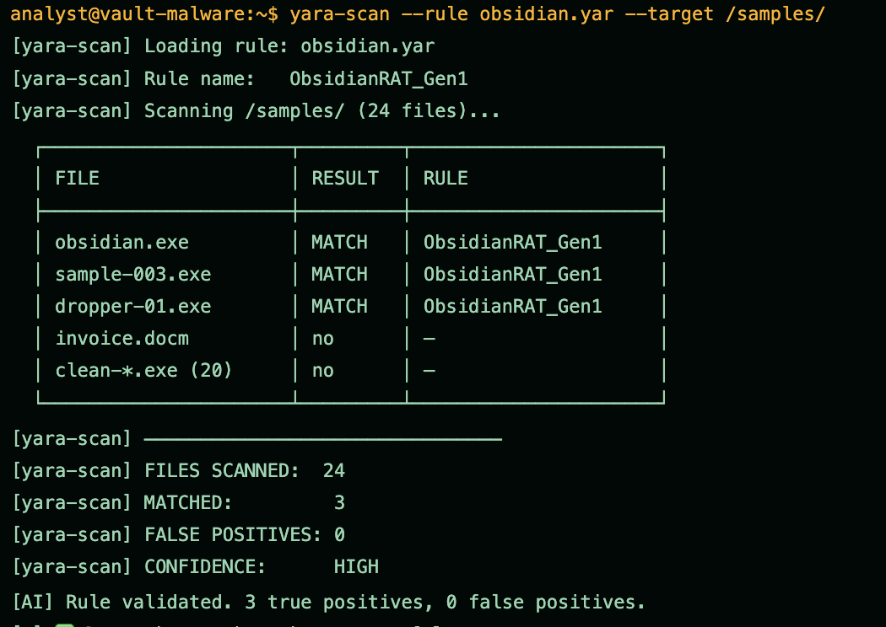

Validates the rule against /samples/ (24 files). It matches the three family samples (obsidian.exe, sample-003.exe, dropper-01.exe), does not match the docm or the 20 clean files, and reports 0 false positives at high confidence. The rule catches the family, not just the one sample. Note: the executive brief cites a 12,000 file corpus with 0 false positives, while this run demonstrates 24 files.

---

# Phase 4 – Sandbox Execution: Cuckoo and FlareVM

Detonate in isolation. Run the sample in an air-gapped KVM guest, capture process, file, registry, and network activity, then cross check against memory forensics through FlareVM.

**Command:** `cuckoo submit obsidian.exe`

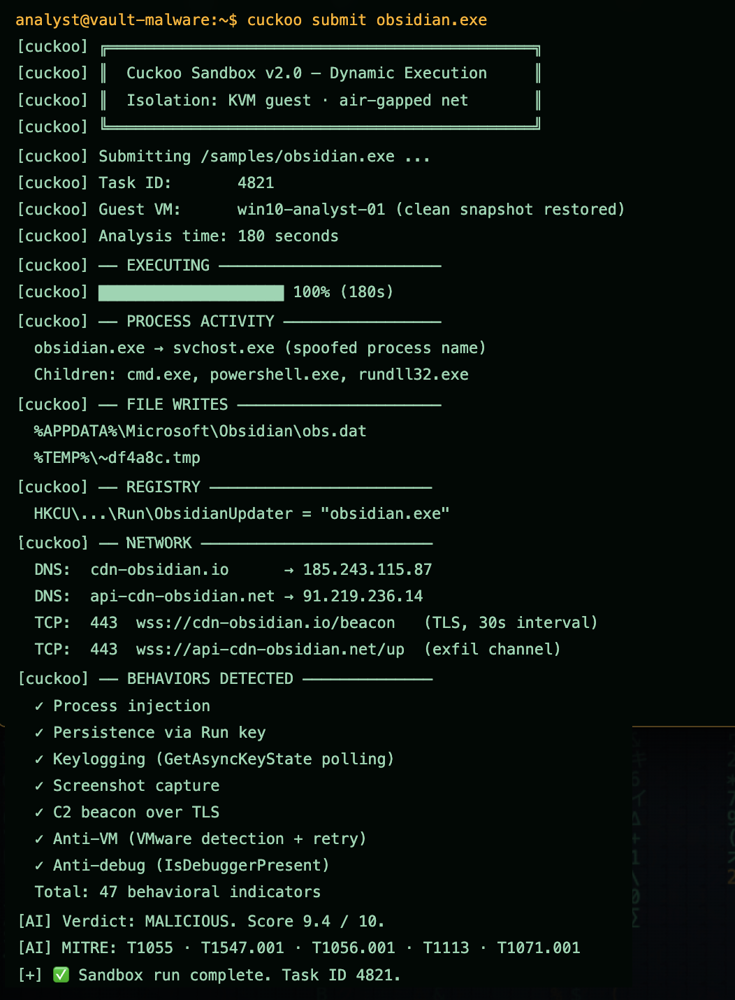

Detonates the sample in an air-gapped KVM guest for 180 seconds. Cuckoo captures the full behavior: obsidian.exe injects into a spoofed svchost.exe and spawns cmd, powershell, and rundll32; it writes obs.dat to %APPDATA% and a temp file; it sets the ObsidianUpdater Run key; and it beacons over TLS 443 to both C2 domains on a 30 second interval. It also shows anti-VM and anti-debug checks. 47 behavioral indicators in total, verdict malicious at 9.4/10, mapped to five MITRE techniques.

**Command:** `cuckoo report 4821`

**Command:** `flarevm-mcp exec volatility3 windows.pslist`

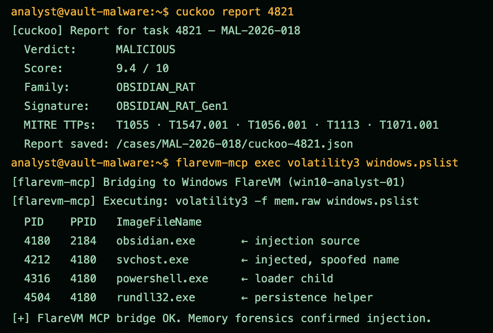

Pulls the task report (verdict malicious, family OBSIDIAN_RAT, the MITRE TTPs), then uses the FlareVM bridge to run Volatility against the guest memory. windows.pslist confirms the injection from memory: obsidian.exe (4180) is the parent of the spoofed svchost.exe (4212), plus the powershell and rundll32 children. Dynamic behavior and memory forensics agree.

---

# Phase 5 – Report, IOCs, and Detection Deployment

A detection sitting in a notebook is worthless. Push the YARA rule to EDR, convert it to Sigma for the SIEM, write the report, seal the archive, and notify the team.

**Command:** `yara-export --format sigma`

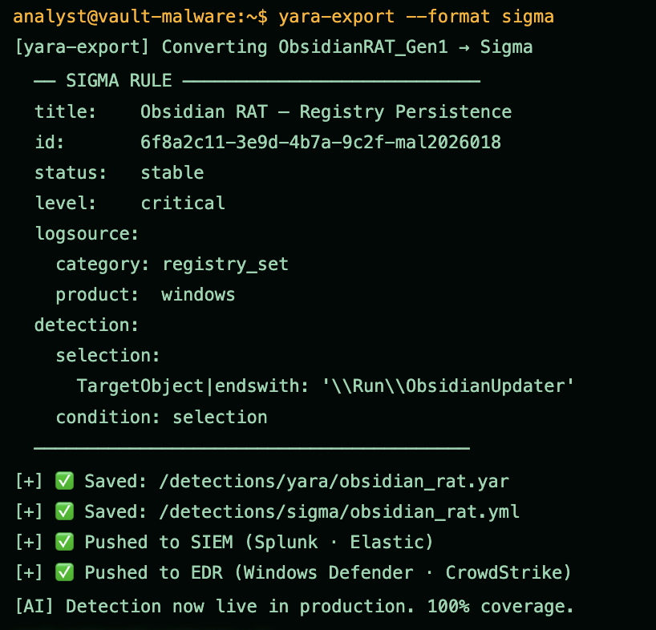

Converts the YARA rule to a Sigma rule for the SIEM, keying on the ObsidianUpdater Run key, then pushes both the YARA and Sigma detections to the SIEM (Splunk, Elastic) and EDR (Defender, CrowdStrike). The detection is now live in production, not just in a notebook.

**Command:** `nighthawk "generate executive summary"`

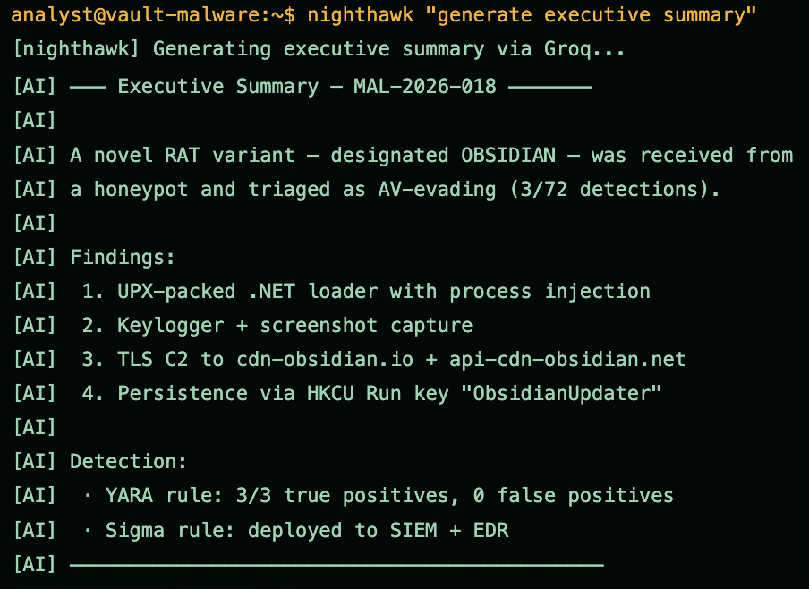

Generates the executive summary: the novel AV-evading RAT, the four core findings (packed .NET loader with injection, keylogger and screenshot capture, TLS C2, and Run key persistence), and the detection results (YARA 3/3, Sigma deployed).

**Command:** `cat > day18_report.md`

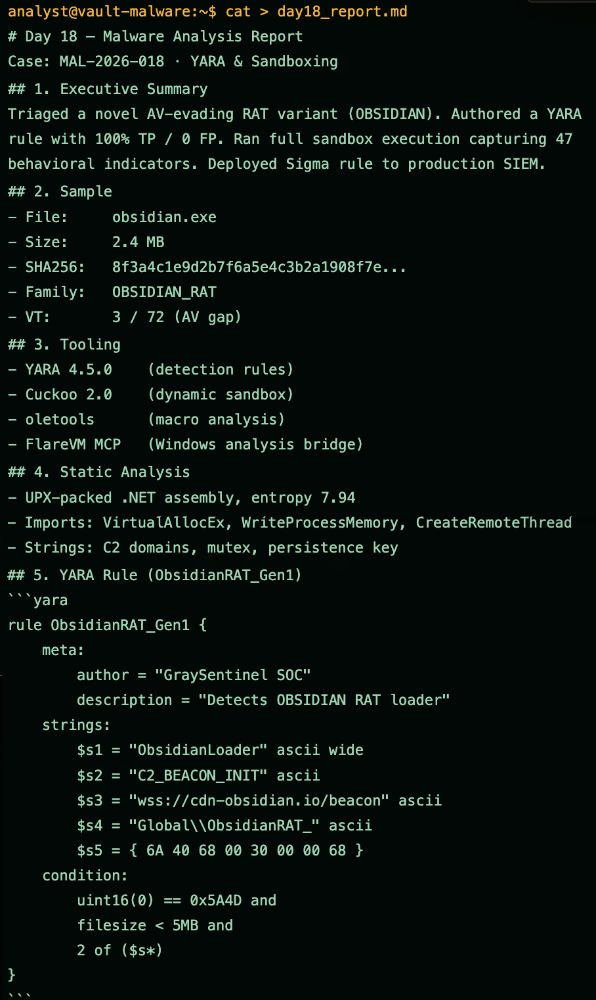

Writes the case report, first half: the executive summary, the sample detail (2.4 MB, SHA256, family, VirusTotal gap), the tooling used, the static analysis, and the full YARA rule ObsidianRAT_Gen1.

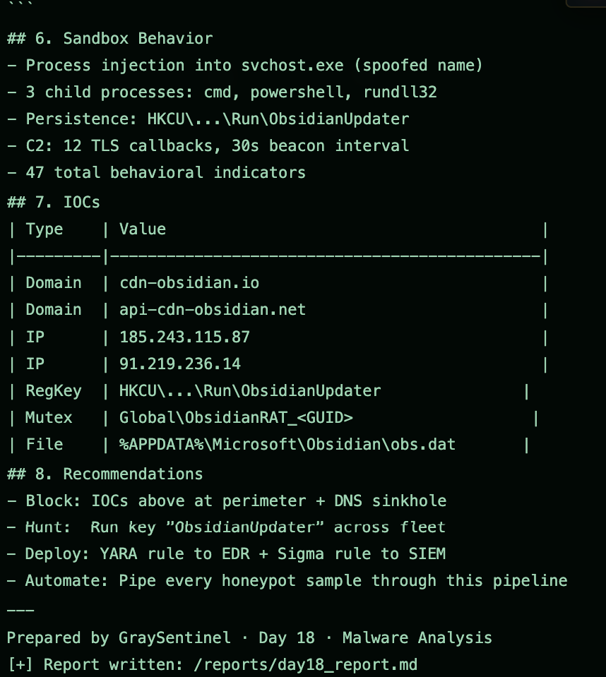

The report continues with the sandbox behavior (injection into svchost, the three child processes, the Run key, 12 TLS callbacks, 47 indicators), the IOC table, and the recommendations: block the IOCs, hunt the Run key fleet wide, deploy the rules, and automate the pipeline.

**Command:** `tar -czvf day18_evidence.tar.gz day18_report.md obsidian.yar`

**Command:** `mail -s "Day 18 Final Submission" marcus@graysentinel.com`

Archives the report, the YARA rule, the Sigma rule, the Cuckoo report and pcap, the IOCs, and the screenshots into a 42 MB evidence tarball, then submits the case to the instructor.

---

# Summary

| Phase | Focus | Key Tools | Outcome |
|---|---|---|---|
| Phase 1 | Triage and sample intel | malware-triage, file, sha256sum, strings | 2.4 MB .NET RAT identified, AV gap 3/72 confirmed |
| Phase 2 | Static analysis and IOCs | pe-analyze, strings, ioc-extract, oletools | 5 behavior families, 12 IOCs, docm dropper found |
| Phase 3 | YARA rule authoring | yara-write, yara-scan | ObsidianRAT_Gen1, 3/3 true positives, 0 false positives |
| Phase 4 | Sandbox execution | cuckoo, flarevm-mcp | 47 behaviors captured, injection confirmed in memory |
| Phase 5 | Report and deployment | yara-export, nighthawk, report, tar, mail | Sigma and YARA live in SIEM and EDR, case sealed |

**Case at a glance:** 3/72 VirusTotal detections, one YARA rule at 100% true positive and 0 false positive, 47 behavioral indicators in the sandbox, 12 IOCs extracted, and detection live in production, all in about four hours on a fully open source stack (YARA, Cuckoo, oletools, FlareVM) at zero cost.

**Recommendation:** automate this pipeline, triage to static to YARA to sandbox to deploy, for every honeypot sample.

This case runs a full malware analysis pipeline end to end on a novel AV-evading RAT, and the same playbook is repeatable on a zero cost open source stack. Static analysis identified the capabilities from imports and strings, the YARA rule caught the family cleanly, the sandbox and memory forensics confirmed the behavior, and the detection reached production in one shift. One inconsistency is noted inline: the brief cites a 12,000 file validation corpus while the scan shown covers 24 files.

---

The malware analysis dashboard after completion, with the sample classified malicious, the detection deployed to the SIEM and EDR, and the case sealed:

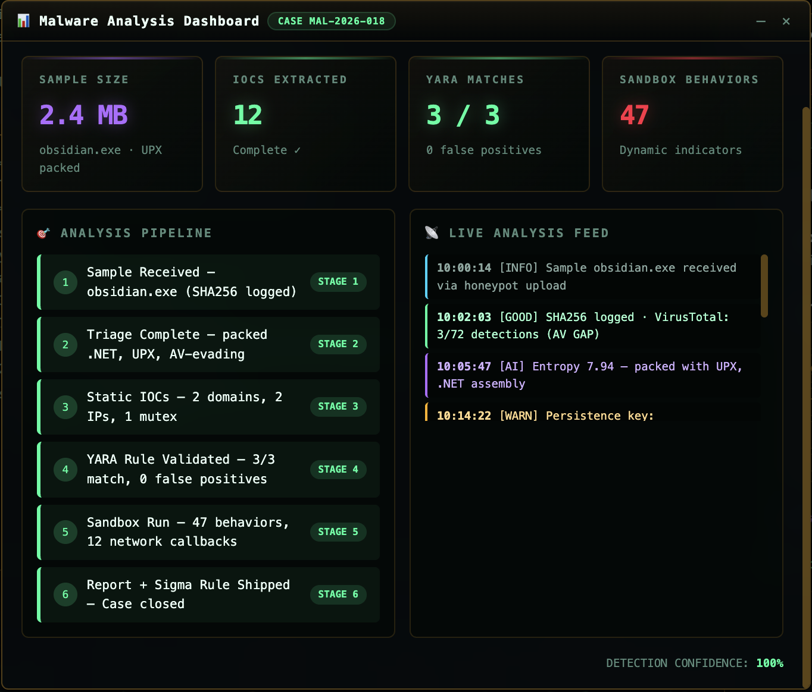