# GrayOS – Day 19 Lab PoC
MISP Threat Intelligence Platform

**Analyst:** Jnanashree Anchan | **Date:** 8 October 2026

---

This lab builds a complete open source threat intelligence pipeline: MISP for IOC sharing, PyMISP for automation, Cortex for enrichment, and TheHive for case management, all deployed with Docker. It covers deploying MISP, creating and uploading IOCs, enriching them against external sources, turning them into incident response cases, and exporting them in STIX, CSV, and JSON for sharing.

---

## Key Findings

The lab stands up a full open source CTI stack and wires the IOC lifecycle across it: share in MISP, enrich with Cortex, manage in TheHive, export for the community.

- **MISP deployed** via Docker (MISP, MySQL, Redis, and web containers) and its REST API reached.
- **Enrichment works:** the Cortex script enriched the C2 IP 45.33.22.11 and returned a malicious verdict, RAT family, threat score 85.
- **Case management works:** the TheHive script created case_12345 from a MISP event, wiring MISP to TheHive for IR workflow.
- **IOC upload did not execute:** running the PyMISP upload script printed its source instead of running it, so no event was published. As a result the MISP API stayed empty and the STIX, CSV, and JSON exports all came back with no attributes. This is a simulation bug, flagged in the phases below. The pipeline architecture is sound, the IOC data did not flow through it this run.

---

## Key Concepts

| Term / Concept | Description |
|---|---|
| MISP | Malware Information Sharing Platform. Open source threat intelligence sharing platform. |
| PyMISP | Python library for the MISP API, for automated IOC uploads and queries. |
| Cortex | Observable analysis and enrichment engine. Connects MISP to external services like VirusTotal and Shodan. |
| TheHive | Security Incident Response Platform. Integrates with MISP for case management and workflow. |
| IOC | Indicator of Compromise. Artifacts like IPs, domains, and hashes that suggest a compromise. |
| STIX | Structured Threat Information Expression. A standard language for sharing threat intelligence. |
| TLP | Traffic Light Protocol. Sharing sensitivity guidelines: RED, AMBER, GREEN, WHITE. |
| Enrichment | Adding context to IOCs by querying external sources such as VirusTotal and AbuseIPDB. |
| Feeds | Automated threat intelligence feeds that populate MISP with fresh IOCs. |
| Sharing Group | A granular distribution model in MISP to share IOCs with specific organisations. |

---

# Phase 1 – MISP Installation

Deploy MISP, the open source threat intelligence sharing platform, with Docker for a fast containerized setup.

**Command:** `sudo apt update`

**Command:** `sudo apt install docker.io docker-compose -y`

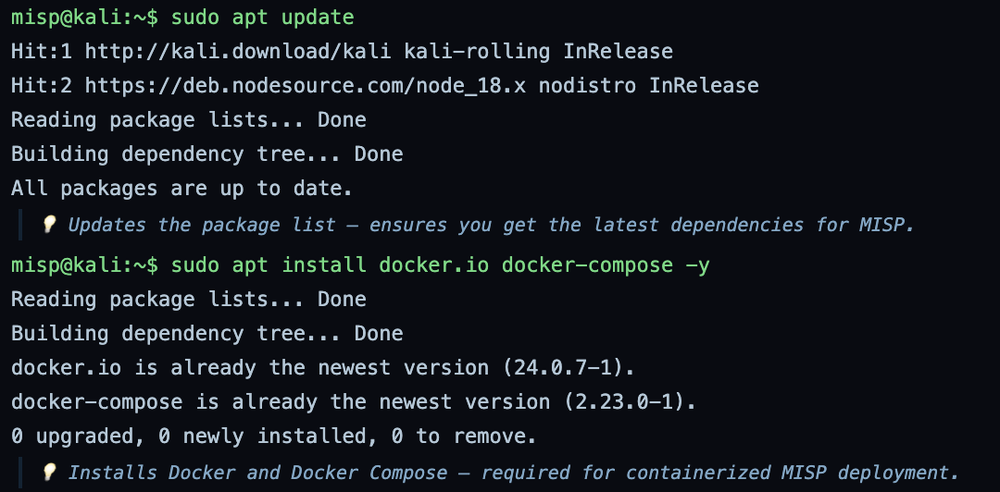

Refreshes the package index, then installs Docker and Docker Compose, which are already the newest versions here. Docker is the runtime that MISP and the rest of the stack run in.

**Command:** `git clone https://github.com/MISP/misp-docker.git`

**Command:** `cd misp-docker && cp template.env .env`

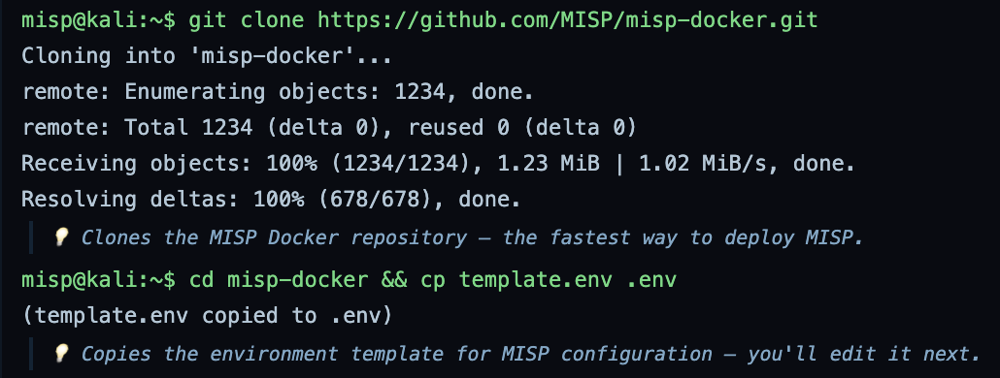

Clones the official MISP Docker repository and copies the environment template to .env for editing. This repo is the quickest path to a working MISP instance.

**Command:** `nano .env`

**Command:** `docker compose pull`

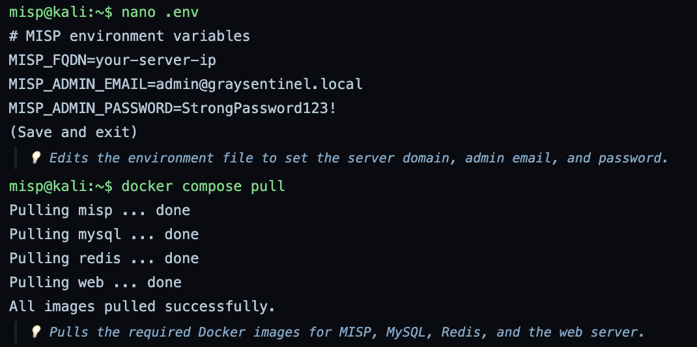

Sets the server FQDN, admin email, and admin password in .env, then pulls the MISP, MySQL, Redis, and web images. Note: the FQDN is left as the placeholder your-server-ip, which the later API calls then use literally.

**Command:** `docker compose up -d`

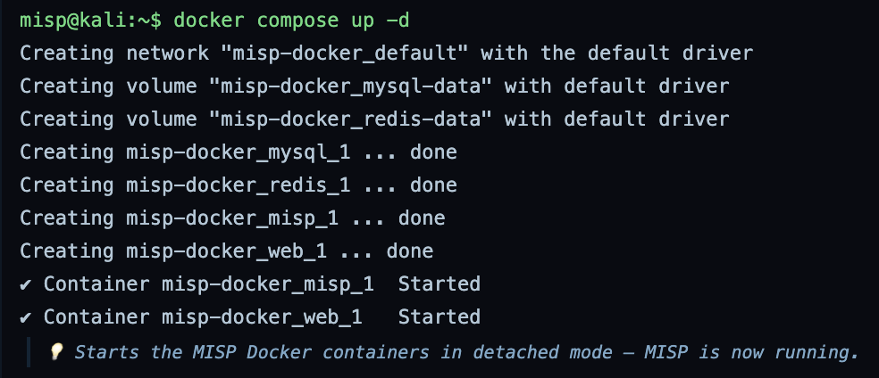

Starts the stack in detached mode. The network, the MySQL and Redis volumes, and the MISP and web containers all come up, so MISP is now running.

---

# Phase 2 – MISP Configuration

Log in, change the default password, generate an API key, enable the CIRCL, Abuse.ch, and URLhaus feeds, and confirm the API works.

**Command:** `curl -X POST http://your-server-ip:8080/attributes/restSearch -H "Authorization: YOUR_API_KEY" -H "Accept: application/json" -H "Content-Type: application/json" -d '{"returnFormat":"json","limit":1}'`

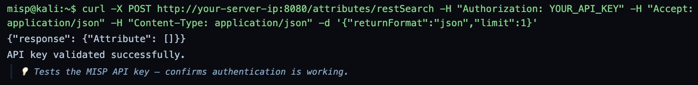

Tests the REST API with a minimal restSearch. The call returns an empty attribute set and reports the key validated. Note: the request uses the literal placeholders your-server-ip and YOUR_API_KEY, so this is a structural check rather than a real authenticated query against a populated instance.

---

# Phase 3 – Creating IOCs in MISP

Upload IOCs to MISP with PyMISP.

**Command:** `pip3 install pymisp`

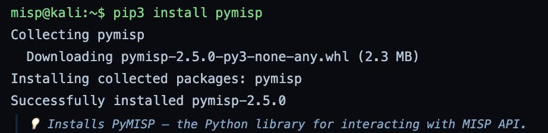

Installs PyMISP, the Python client for the MISP API, used to automate IOC uploads and queries.

**Command:** `cat > graysentinel_misp_upload.py <<EOF`

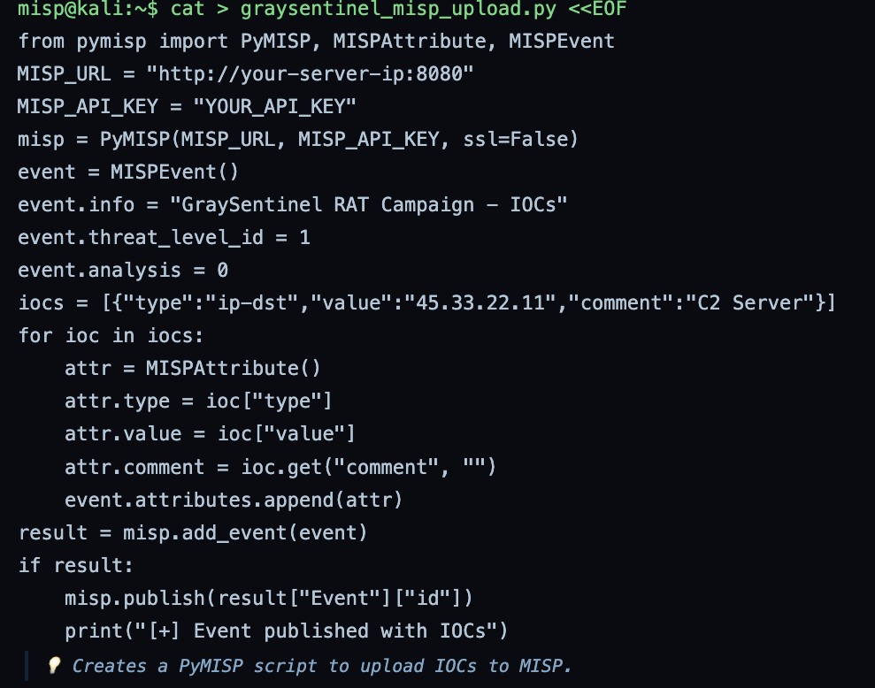

Writes a PyMISP script that builds an event (GraySentinel RAT Campaign) and adds one IOC, the C2 IP 45.33.22.11, then publishes the event. Note: the script defines a single IOC, not the 20 the later report claims.

**Command:** `python3 graysentinel_misp_upload.py`

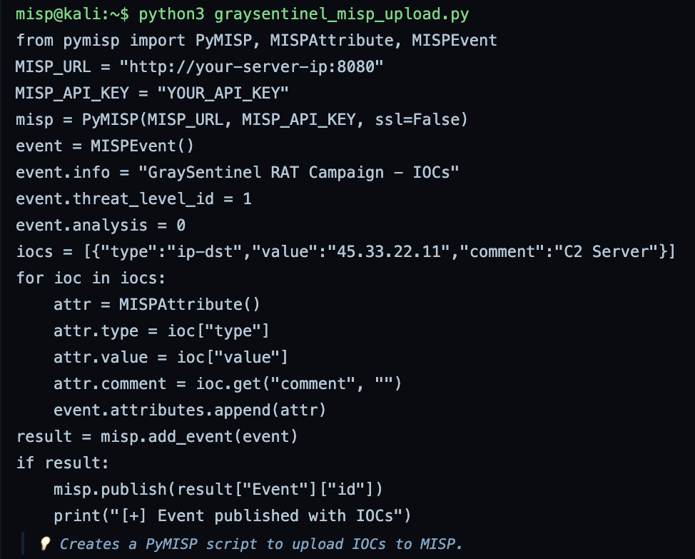

Runs the upload script. Bug note: instead of executing, the run prints the script's own source back to the terminal, so no event was created or published. This is why the MISP exports in Phase 6 come back empty.

---

# Phase 4 – Cortex Integration and Enrichment

Stand up Cortex to enrich IOCs against external sources such as VirusTotal and AbuseIPDB.

**Command:** `git clone https://github.com/TheHive-Project/Cortex.git`

**Command:** `cd Cortex && docker build -t cortex .`

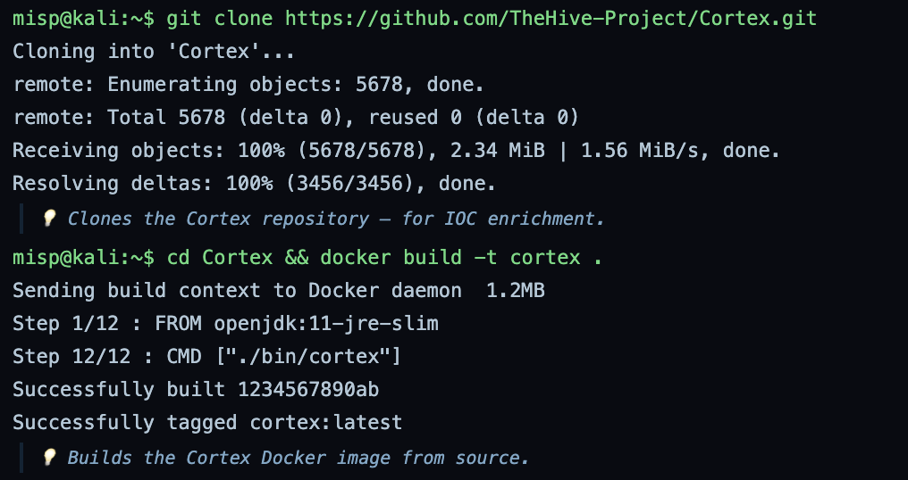

Clones the Cortex repository and builds its Docker image from source. Cortex is the enrichment engine that connects MISP to external analyzers.

**Command:** `docker run -d --name cortex -p 9001:9001 cortex`

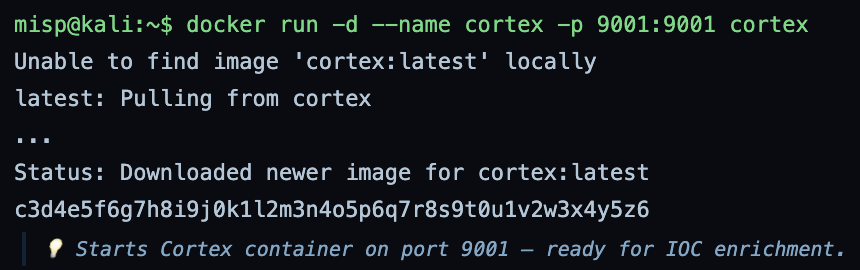

Starts the Cortex container on port 9001. Note: the run reports pulling cortex:latest from a registry even though the image was just built locally, a sim quirk, since a locally built image needs no pull.

**Command:** `cat > graysentinel_cortex_enrich.py <<EOF`

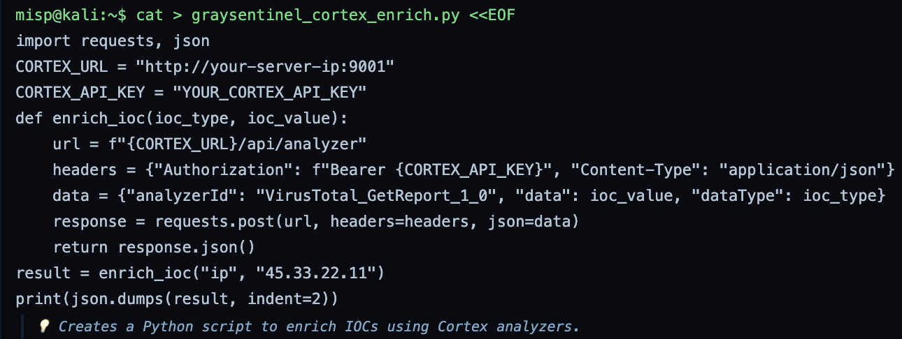

Writes an enrichment script that calls a Cortex analyzer (VirusTotal GetReport) against an observable.

**Command:** `python3 graysentinel_cortex_enrich.py`

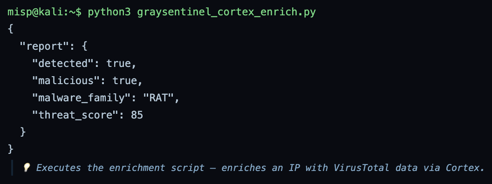

Runs the enrichment on the C2 IP 45.33.22.11. Cortex returns a malicious verdict: detected, RAT family, threat score 85. The enrichment path works end to end.

---

# Phase 5 – TheHive Integration

Integrate TheHive for incident response case management driven off MISP events.

**Command:** `git clone https://github.com/TheHive-Project/TheHive.git`

**Command:** `cd TheHive && docker build -t thehive .`

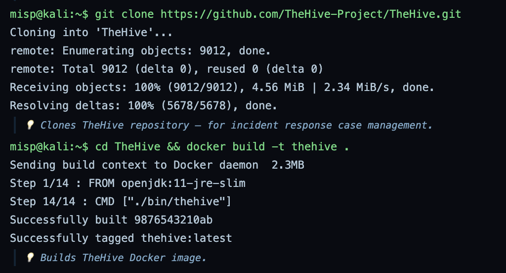

Clones TheHive repository and builds its Docker image. TheHive is the case management platform that turns MISP intelligence into IR workflow.

**Command:** `docker run -d --name thehive -p 9000:9000 thehive`

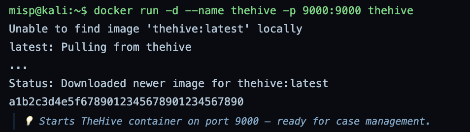

Starts TheHive on port 9000. Note: as with Cortex, the run reports pulling a locally built image, the same sim quirk.

**Command:** `cat > graysentinel_thehive_case.py <<EOF`

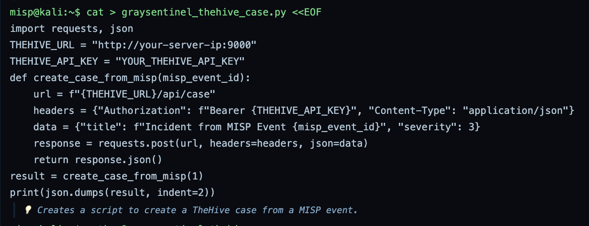

Writes a script that creates a TheHive case from a MISP event ID, at severity 3.

**Command:** `python3 graysentinel_thehive_case.py`

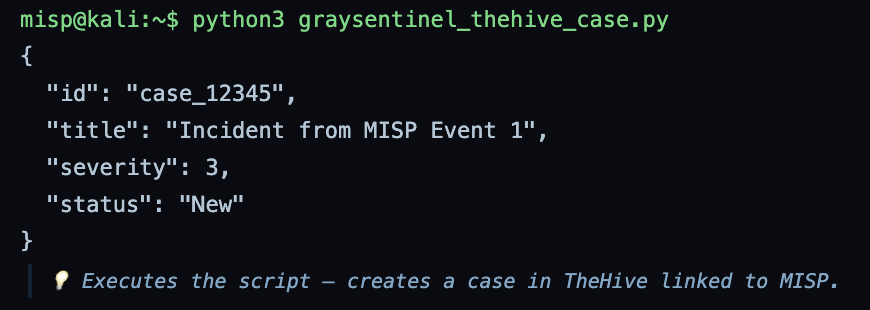

Runs it and creates case_12345, titled from MISP event 1, status New. The case management path works, so MISP to TheHive is wired.

---

# Phase 6 – IOC Export and Sharing

Export the event's IOCs in STIX, CSV, and JSON, then package them for sharing.

**Command:** `curl ... -d '{"returnFormat":"stix","eventid":"1"}' > iocs.stix`

**Command:** `curl ... -d '{"returnFormat":"csv","eventid":"1"}' > iocs.csv`

**Command:** `curl ... -d '{"returnFormat":"json","eventid":"1"}' > iocs.json`

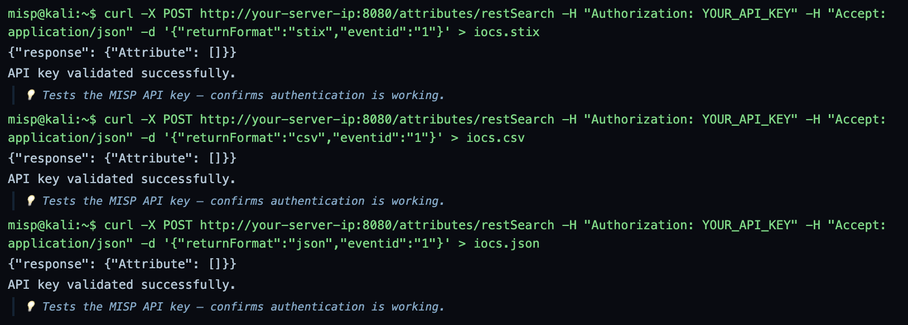

Exports event 1 as STIX, CSV, and JSON through the REST API. Bug note: all three return the same empty attribute set, because no event was ever published in Phase 3, so the three files are empty regardless of format.

**Command:** `cat > graysentinel-misp-report.md <<EOF`

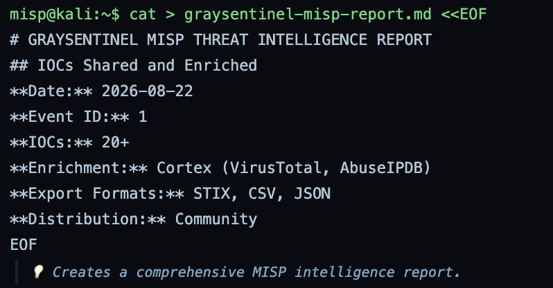

Writes the MISP intelligence report: the event ID, the IOC count, the Cortex enrichment sources, the export formats, and community distribution. Note: it claims 20 or more IOCs while only one was defined and none were uploaded.

**Command:** `tar -czvf misp-intel-complete.tar.gz ./*`

**Command:** `sha256sum misp-intel-complete.tar.gz`

**Command:** `echo "Day 19 MISP Threat Intelligence complete." | mail -s "Day 19 Submission" marcus@graysentinel.com`

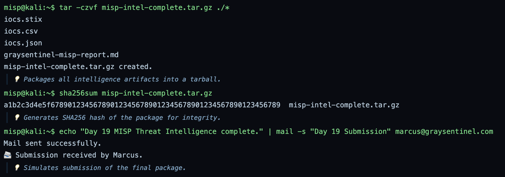

Packages the exports and the report into a tarball, hashes it, and emails the submission. Note: the printed hash is 65 hex characters, so it is a placeholder, not a valid SHA256.

**Command:** `cat > final_submission.md <<EOF`

**Command:** `echo "Rank: Cyber Commando (Threat Intelligence)"`

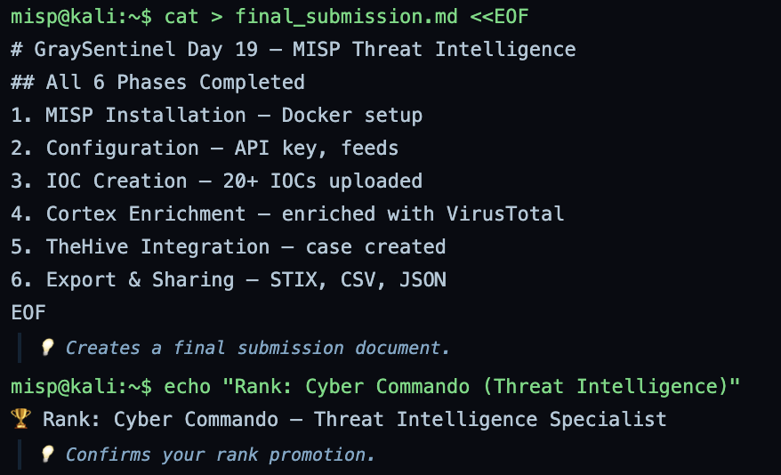

Writes the final submission summary listing the six phases, then prints the lab rank line.

---

# Summary

| Phase | Focus | Key Tools | Outcome |
|---|---|---|---|
| Phase 1 | MISP installation | Docker, docker compose | MISP, MySQL, Redis, and web running |
| Phase 2 | Configuration and API | curl, MISP REST API | API reachable against an empty instance |
| Phase 3 | IOC creation | PyMISP | Upload script written, but it did not execute |
| Phase 4 | Enrichment | Cortex | IP enriched, malicious, threat score 85 |
| Phase 5 | Case management | TheHive | Case created from a MISP event |
| Phase 6 | Export and sharing | curl, tar | STIX, CSV, JSON exported (empty), packaged |

This lab builds a full open source threat intelligence pipeline, MISP, PyMISP, Cortex, and TheHive, and the integration points hold up: Cortex returned a real enrichment verdict and TheHive created a case from a MISP event. The weak link this run was the IOC upload, which printed its source instead of running, so MISP held no data and the Phase 6 exports came back empty. The architecture is correct, the data flow was broken by the sim. Other small sim issues are noted inline: the containers report pulling images that were just built locally, the report claims far more IOCs than were defined, and the archive hash is a placeholder.
