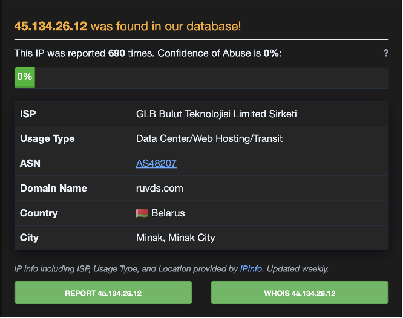
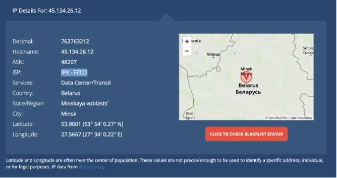

# SOC Triage Report
### SOC-2026-0912-07
**Analyst:** Jnanashree Anchan | **Date:** 12 September 2026

---

## Alert Details

| Field | Value |
|---|---|
| Alert ID | SOC-2026-0912-07 |
| Rule | Multiple Failed Logins + Multiple MFA Push Notifications |
| Severity | HIGH |
| User | rahul.verma@company.com |
| Source | Azure AD / Microsoft 365 |

---

## Verdict
**TRUE POSITIVE - Confirmed Account Compromise - MFA Fatigue**

---

| | |
|---|---|
| **WHAT** | MFA Fatigue Attack + Mailbox Rule Creation - Account Compromise |
| **WHEN** | Sep 12, 02:15 IST to 02:20 IST |
| **WHERE** | Azure AD / M365 - User: rahul.verma@company.com |
| **WHO** | Attacker IP 45.134.26.12 (Russia) + Victim rahul.verma |
| **WHY** | Account Takeover to steal emails |
| **HOW** | 1. Brute force password 2. Bombard MFA pushes till user approves by mistake 3. Create forwarding rule to persist |

---

## Attack Chain
Brute Force → MFA Fatigue → Forwarding Rule

---

## Timeline

| Timestamp | Log Event Details | Attack Phase |
|---|---|---|
| Sep 12 02:15:10 | Failed Login - rahul.verma@company.com - IP 45.134.26.12 - Russia - User-Agent: python-requests/2.28 | Brute Force |
| Sep 12 02:15:45 | Failed Login - rahul.verma@company.com - IP 45.134.26.12 - Russia | |
| Sep 12 02:16:22 | Failed Login - rahul.verma@company.com - IP 45.134.26.12 - Russia | |
| Sep 12 02:17:05 | Failed Login - rahul.verma@company.com - IP 45.134.26.12 - Russia | |
| Sep 12 02:18:30 | SUCCESS Login - rahul.verma@company.com - IP 45.134.26.12 - Russia | |
| Sep 12 02:18:45 | MFA Push Sent - rahul.verma@company.com - Denied by user | MFA Fatigue |
| Sep 12 02:19:10 | MFA Push Sent - rahul.verma@company.com - Denied by user | |
| Sep 12 02:19:42 | MFA Push Sent - rahul.verma@company.com - Denied by user | |
| Sep 12 02:20:15 | MFA Push Sent - rahul.verma@company.com - APPROVED | |
| Sep 12 02:20:18 | Mailbox Forwarding Rule Created - Forward to attacker.01@gmail.com | Forwarding Rule Creation |

---

## Evidence

1. 4 failed logins + 1 success from Russia in 3 mins - Brute force pattern
2. 4 MFA pushes in 2 mins - 3 Denied, 1 Approved - MFA Fatigue pattern
3. IP is from Russia with low abuse score - Not user's location (Pune)
4. Immediately after login, forwarding rule to attacker.01@gmail.com created - Persistence

**AbuseIPDB:**

**IP Location:**

---

## MFA Fatigue
An attacker repeatedly sends MFA push notifications until the victim approves one out of frustration or exhaustion. Here, Rahul denied 3 pushes before approving the 4th at 2:20 AM, likely while asleep.

## Email Forwarding Rule
Created within 3 seconds of login - every email the victim receives is silently copied to attacker.01@gmail.com, even after the session ends.

---

## MITRE ATT&CK

| Technique | ID |
|---|---|
| Brute Force | T1110 |
| MFA Request Generation | T1621 |
| Email Forwarding Rule | T1114.003 |

---

## Impact
**CRITICAL** - All emails being forwarded to attacker.

---

## Actions

| Action Phase | Details |
|---|---|
| CONTAIN | Disable user rahul.verma + Revoke all sessions + Force password reset + Reset MFA |
| ERADICATE | Delete forwarding rule attacker.01@gmail.com from M365 + Remove inbox rules |
| BLOCK | Block IP 45.134.26.12 on firewall + Conditional Access |
| INVESTIGATE | Check mailbox for data exfiltration, Check other users targeted from same IP |
| ESCALATE | To L2/IR Team + Inform user about MFA Fatigue training |

---

## Status
**Escalated to L2 - Containment Done**