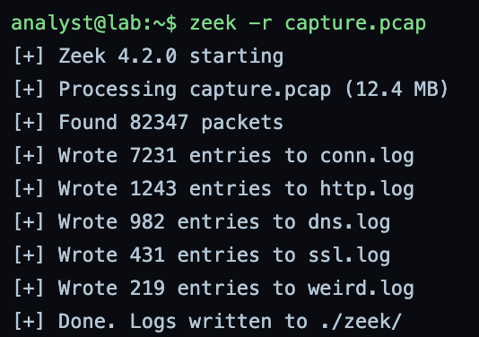
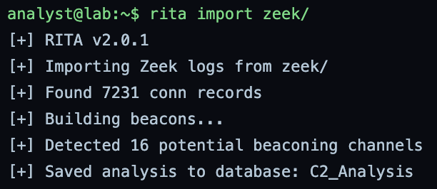
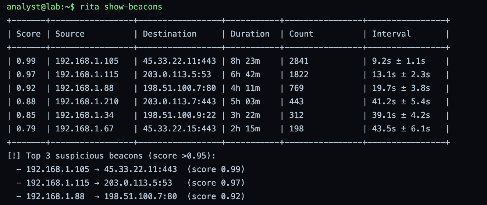
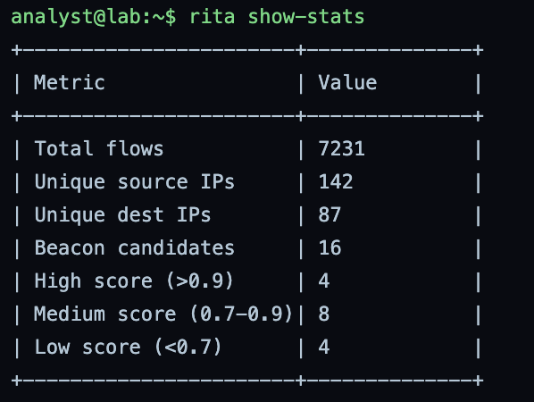
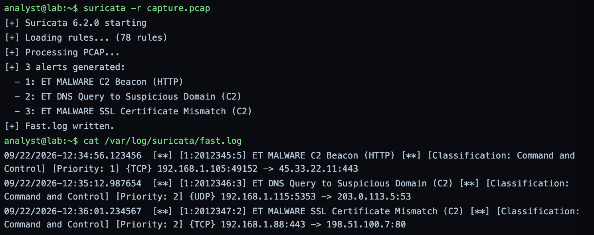
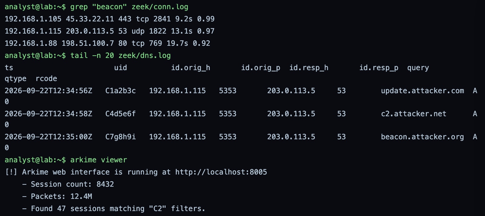
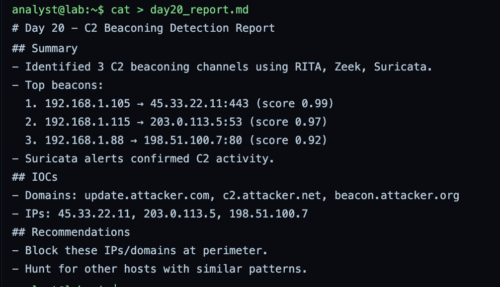
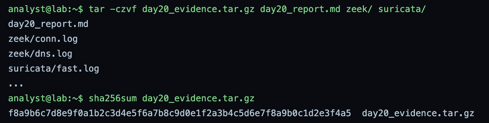

# GrayOS – Day 20 Lab PoC
C2 Beaconing Detection with RITA

**Analyst:** Jnanashree Anchan | **Date:** 8 October 2026

---

This lab hunts command and control beaconing in a packet capture using Zeek, RITA, Suricata, and Arkime. It ingests the PCAP into Zeek logs, runs RITA's statistical beacon analysis, confirms with Suricata IDS alerts, correlates across the tools to pinpoint the C2 channels, and packages the evidence. Three detection methods are used so the findings cross-check each other.

---

## Key Findings

An 8 hour plus PCAP of enterprise traffic (captured 2026-09-22) was analyzed for C2 beaconing. Three clear channels stand out, confirmed by three independent methods.

- **HTTPS beacon (score 0.99):** 192.168.1.105 to 45.33.22.11:443, 2,841 connections over 8h23m at a 9.2s interval with ±1.1s jitter. The tightest, most regular channel.
- **DNS beacon (score 0.97):** 192.168.1.115 to 203.0.113.5:53, 1,822 queries at about 13s intervals, resolving update.attacker.com, c2.attacker.net, and beacon.attacker.org. This is DNS tunneling to C2.
- **HTTP beacon (score 0.92):** 192.168.1.88 to 198.51.100.7:80, 769 connections at about 20s intervals.
- **Cross-tool confirmation:** RITA flagged 16 beacon candidates (4 above 0.9), Suricata independently fired three C2 alerts on the same hosts, and Arkime found 47 sessions matching the C2 filters. Statistical, signature, and full-packet detection all agree.

IOCs: domains update.attacker.com, c2.attacker.net, beacon.attacker.org; IPs 45.33.22.11, 203.0.113.5, 198.51.100.7.

---

## Key Concepts

| Term / Concept | Description |
|---|---|
| C2 Beaconing | Regular, periodic communication from an infected host to a command and control server. |
| RITA | Real Intelligence Threat Analytics. Detects beaconing using statistical analysis such as interval regularity. |
| Zeek (Bro) | Network analysis framework that generates structured logs (conn, http, dns) from a PCAP. |
| Suricata | High performance IDS and IPS that detects C2 signatures. |
| Arkime (Moloch) | Full packet capture and search tool for deep dive analysis of suspicious sessions. |
| Beacon Score | RITA's score from 0 to 1 indicating the likelihood of beaconing based on interval regularity. |

---

# Phase 1 – Ingest PCAP and Generate Zeek Logs

Step 1: You have a PCAP file (capture.pcap) containing 12.4 MB of enterprise traffic. Use Zeek to generate connection logs.

**Command:** `zeek -r capture.pcap`

Runs Zeek over the 12.4 MB capture and parses 82,347 packets into structured logs: 7,231 connections, 1,243 HTTP, 982 DNS, 431 SSL, and 219 weird entries. These logs are the input for the rest of the analysis. Note: the ls and head commands that follow returned command not found in the sim shell, so they have no screenshot. This does not affect the analysis, since Zeek wrote the logs successfully.

---

# Phase 2 – Run RITA Beaconing Analysis

Step 2: Import the Zeek logs into RITA to detect beaconing patterns. Review the beacon scores.

**Command:** `rita import zeek/`

Imports the 7,231 connection records into RITA and builds the beacon models. RITA flags 16 potential beaconing channels and saves them to the C2_Analysis database.

**Command:** `rita show-beacons`

Shows the ranked beacons. The top three score above 0.9: 192.168.1.105 to 45.33.22.11:443 at 0.99 (2,841 connections, 9.2s interval), 192.168.1.115 to 203.0.113.5:53 at 0.97, and 192.168.1.88 to 198.51.100.7:80 at 0.92. A high score with a tight, regular interval is the signature of automated C2 beaconing rather than human traffic.

**Command:** `rita show-stats`

Summarizes the run: 7,231 flows, 142 source and 87 destination IPs, 16 beacon candidates, and 4 scoring above 0.9. This frames how much of the traffic is suspicious.

---

# Phase 3 – Investigate Suricata Alerts

Step 3: Run Suricata on the same PCAP to get IDS alerts. Correlate them with RITA findings.

**Command:** `suricata -r capture.pcap`

**Command:** `cat /var/log/suricata/fast.log`

Runs Suricata over the same capture with 78 rules and generates three C2 alerts, then reads them from fast.log. The alerts are an HTTP C2 beacon from 192.168.1.105 to 45.33.22.11, a suspicious DNS query from 192.168.1.115 to 203.0.113.5, and an SSL certificate mismatch involving 192.168.1.88 and 198.51.100.7. All three hosts match RITA's top beacons, so signature detection confirms the statistical detection. Note: the grep command here returned command not found in the sim shell, so it has no screenshot.

---

# Phase 4 – Correlate and Identify C2 Channels

Step 4: Use RITA, Suricata alerts, and manual log inspection to pinpoint at least 3 distinct C2 beaconing channels.

**Command:** `grep "beacon" zeek/conn.log`

**Command:** `tail -n 20 zeek/dns.log`

**Command:** `arkime viewer`

Pulls the three channels together. grep on conn.log confirms the three beacons and their intervals, tail on dns.log shows 192.168.1.115 resolving update.attacker.com, c2.attacker.net, and beacon.attacker.org (the DNS tunneling channel), and Arkime reports 8,432 sessions with 47 matching the C2 filters for deep dive review. Three distinct C2 channels are confirmed: an HTTPS beacon, a DNS tunnel, and an HTTP beacon. Note: grep worked here against conn.log even though it failed in Phase 3, a sim inconsistency.

---

# Phase 5 – Report Generation and Submission

Step 5: Generate the final report, archive evidence, and submit.

**Command:** `cat > day20_report.md`

Writes the C2 detection report: the three beaconing channels with their scores, the Suricata confirmation, the domain and IP IOCs, and the recommendation to block them at the perimeter and hunt for other hosts with similar patterns.

**Command:** `tar -czvf day20_evidence.tar.gz day20_report.md zeek/ suricata/`

**Command:** `sha256sum day20_evidence.tar.gz`

Packages the report and the Zeek and Suricata logs into an evidence tarball and hashes it. The archive SHA-256 is a valid 64 character digest.

---

# Summary

| Phase | Focus | Key Tools | Outcome |
|---|---|---|---|
| Phase 1 | PCAP ingestion | Zeek | 82,347 packets parsed into structured logs |
| Phase 2 | Beaconing analysis | RITA | 16 candidates, 3 beacons above 0.9 |
| Phase 3 | IDS correlation | Suricata | 3 C2 alerts matching the beacons |
| Phase 4 | C2 identification | grep, tail, Arkime | 3 distinct channels confirmed: HTTPS, DNS, HTTP |
| Phase 5 | Report and submission | report, tar, sha256sum | Evidence packaged and hashed |

Three detection methods converge on the same three C2 channels, which is the strength of this result: RITA's statistics, Suricata's signatures, and Arkime's full packet view all point at 45.33.22.11, 203.0.113.5, and 198.51.100.7. The standout is the 0.99 HTTPS beacon with a near-perfect 9.2 second interval, and the DNS tunnel resolving the attacker.com domains. The sim shell lacked a few basic utilities (ls, head, and grep inconsistently), but the analysis tools all worked, so the findings hold.
