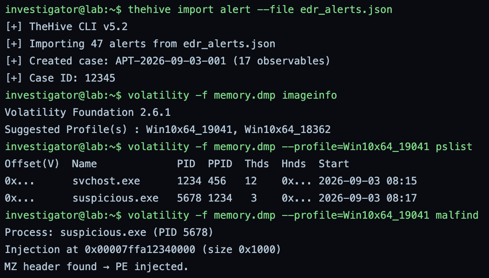
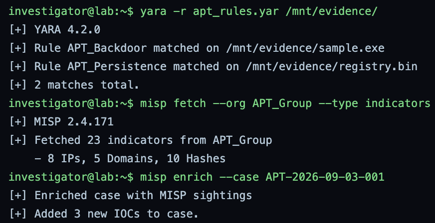
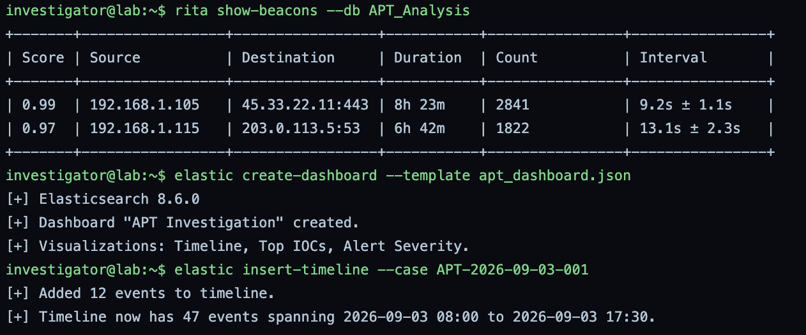
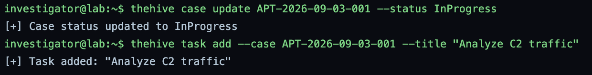
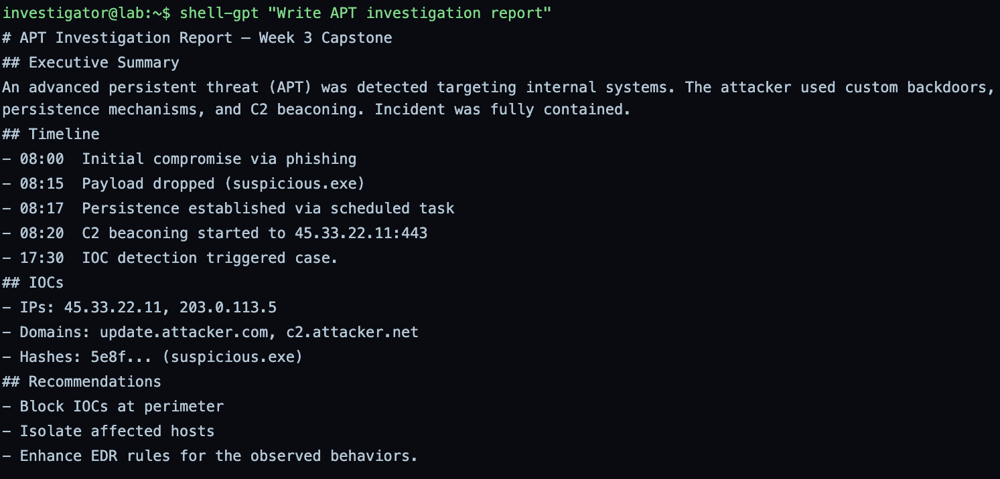
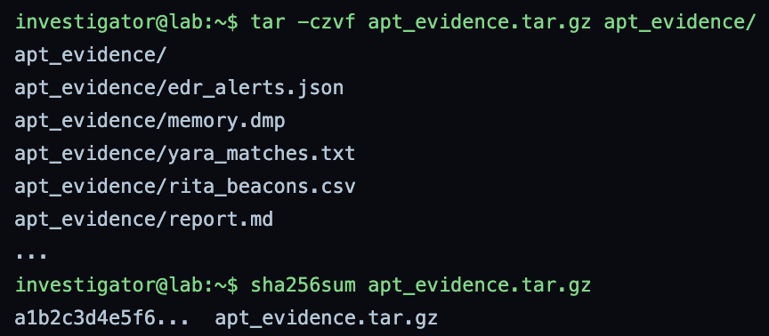

# GrayOS – Day 21 Lab PoC
APT Investigation Capstone

**Analyst:** Jnanashree Anchan | **Date:** 9 October 2026

---

This capstone runs a full APT investigation end to end, tying together the tools from across the program: TheHive for case management, Volatility for memory forensics, YARA for malware identification, MISP for threat intelligence, RITA for C2 analysis, and the Elastic Stack for timeline and dashboard. It works a single intrusion (case APT-2026-09-03-001) from EDR alerts through to a finished report.

---

## Key Findings

A capstone investigation against internal systems, worked as case APT-2026-09-03-001, confirms a full APT intrusion across six tools that cross-check each other.

- **Case opened:** 47 EDR alerts imported into TheHive as case APT-2026-09-03-001 with 17 observables.
- **Memory forensics:** Volatility found suspicious.exe (PID 5678) spawned by svchost.exe, with a PE injected into it (MZ header in an executable region), confirming process injection.
- **Malware and persistence:** YARA matched APT_Backdoor on sample.exe and APT_Persistence on registry.bin.
- **Threat intel:** MISP supplied 23 indicators attributed to APT_Group (8 IPs, 5 domains, 10 hashes) and enriched the case.
- **C2 confirmed:** RITA confirmed two beacons, the 0.99 HTTPS channel to 45.33.22.11:443 and the 0.97 DNS channel to 203.0.113.5, and Elastic built a 47-event timeline spanning 08:00 to 17:30 on 2026-09-03.

IOCs: IPs 45.33.22.11 and 203.0.113.5, domains update.attacker.com and c2.attacker.net, and the suspicious.exe hash.

---

## Key Concepts

| Term / Concept | Description |
|---|---|
| APT | Advanced Persistent Threat. A targeted, long term campaign. |
| TheHive | Case management platform for incident response. |
| Elastic Stack | Visualisation and search for forensic data. |
| YARA | Pattern matching rule engine for malware identification. |
| MISP | Open source threat intelligence sharing platform. |
| Volatility | Memory forensics framework for analysing RAM dumps. |

---

# Phase 1 – Ingest EDR Alerts and Memory Dump

Step 1: Import EDR alerts into TheHive and analyse memory dump with Volatility.

**Command:** `thehive import alert --file edr_alerts.json`

**Command:** `volatility -f memory.dmp imageinfo`

**Command:** `volatility -f memory.dmp --profile=Win10x64_19041 pslist`

**Command:** `volatility -f memory.dmp --profile=Win10x64_19041 malfind`

Imports the 47 EDR alerts into TheHive, which creates case APT-2026-09-03-001 with 17 observables, then analyzes the memory dump with Volatility. imageinfo identifies the profile as Win10x64_19041, pslist shows suspicious.exe (PID 5678) spawned by svchost.exe (PID 1234), and malfind finds a PE injected into suspicious.exe, an MZ header in an executable region. The case is open and memory forensics already confirms process injection.

---

# Phase 2 – YARA Scanning and MISP Enrichment

Step 2: Run YARA rules on collected artefacts and fetch IOCs from MISP.

**Command:** `yara -r apt_rules.yar /mnt/evidence/`

**Command:** `misp fetch --org APT_Group --type indicators`

**Command:** `misp enrich --case APT-2026-09-03-001`

Scans the evidence with the APT YARA rules and pulls threat intel from MISP. YARA matches APT_Backdoor on sample.exe and APT_Persistence on registry.bin, confirming both the backdoor and its persistence. MISP then supplies 23 indicators attributed to APT_Group (8 IPs, 5 domains, 10 hashes) and enriches the case with 3 new IOCs. The local findings now map to a known APT group.

---

# Phase 3 – C2 Correlation and Timeline

Step 3: Use RITA to confirm C2 beaconing and build a visual timeline in Elastic.

**Command:** `rita show-beacons --db APT_Analysis`

**Command:** `elastic create-dashboard --template apt_dashboard.json`

**Command:** `elastic insert-timeline --case APT-2026-09-03-001`

Confirms the C2 beaconing with RITA and visualizes the incident in Elastic. RITA shows two beacons, 192.168.1.105 to 45.33.22.11:443 at 0.99 and 192.168.1.115 to 203.0.113.5:53 at 0.97. Elastic then builds the APT Investigation dashboard (timeline, top IOCs, alert severity) and inserts a 47-event timeline spanning 08:00 to 17:30 on 2026-09-03. The beaconing is confirmed and the whole incident is now on one timeline.

---

# Phase 4 – Case Management and Dashboard

Step 4: Update TheHive case with tasks and status, and finalise dashboard.

**Command:** `thehive case update APT-2026-09-03-001 --status InProgress`

**Command:** `thehive task add --case APT-2026-09-03-001 --title "Analyze C2 traffic"`

Drives the case forward in TheHive. The status is moved to InProgress and an investigation task, Analyze C2 traffic, is added. This keeps the case management in sync with the technical findings.

---

# Phase 5 – Report Generation and Submission

Step 5: Generate the final report using shell-gpt, archive all evidence, and submit.

**Command:** `shell-gpt "Write APT investigation report"`

Generates the APT investigation report. It lays out the executive summary, the attack timeline from the phishing compromise at 08:00 through the payload drop, scheduled-task persistence, and C2 beaconing to 45.33.22.11, to the IOC detection at 17:30, then the IOCs and the recommendations: block the IOCs at the perimeter, isolate affected hosts, and tune EDR rules for the observed behaviors.

**Command:** `tar -czvf apt_evidence.tar.gz apt_evidence/`

**Command:** `sha256sum apt_evidence.tar.gz`

Archives all the evidence, the EDR alerts, the memory dump, the YARA matches, the RITA beacons, and the report, into a tarball and hashes it. Note: the archive hash is shown abbreviated in the output.

---

# Summary

| Phase | Focus | Key Tools | Outcome |
|---|---|---|---|
| Phase 1 | Case and memory forensics | TheHive, Volatility | Case opened, process injection found |
| Phase 2 | Malware and threat intel | YARA, MISP | Backdoor and persistence matched, APT_Group attribution |
| Phase 3 | C2 and timeline | RITA, Elastic | 2 beacons confirmed, 47-event timeline built |
| Phase 4 | Case management | TheHive | Case moved to InProgress, C2 task added |
| Phase 5 | Report and submission | shell-gpt, tar, sha256sum | Report generated, evidence packaged |

This capstone runs the full APT investigation workflow with each tool feeding the next: EDR alerts into TheHive, memory forensics confirming the injection, YARA and MISP identifying and attributing the malware, RITA and Elastic confirming and timelining the C2, and a generated report to close it out. The threads converge on one campaign, a phishing-delivered backdoor with scheduled-task persistence beaconing to 45.33.22.11 and 203.0.113.5, attributed to APT_Group. It pulls together the tools from across the program, memory forensics, YARA, MISP, RITA, and TheHive, into a single coherent investigation.
