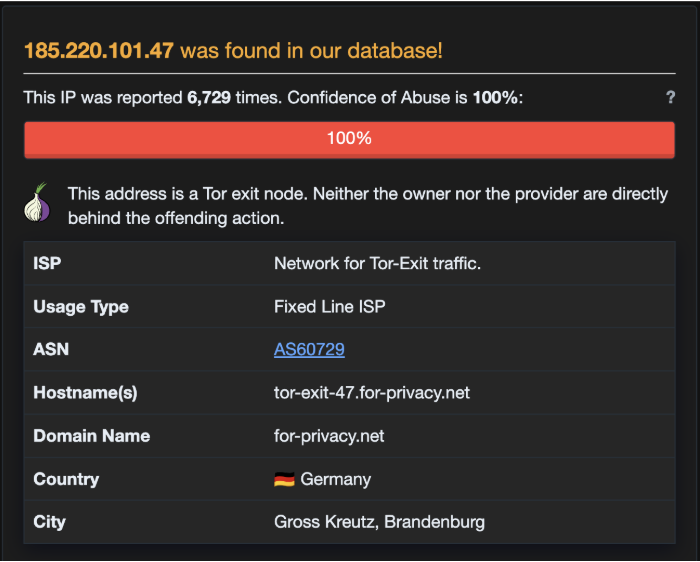
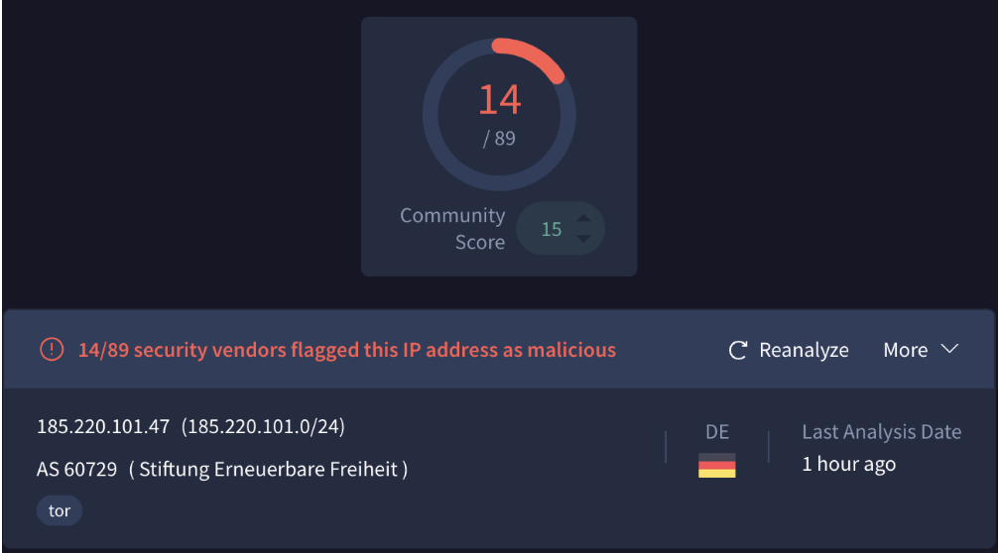

# SOC TRIAGE REPORT
### SOC-2026-0912-08

| | |
|---|---|
| **Alert ID** | SOC-2026-0912-08 |
| **Rule** | Suspicious HTML File with Embedded ZIP - O365 Quarantine |
| **Severity** | HIGH |
| **Target User** | priya.sharma@company.com |
| **Data Source** | M365 Defender + Proxy Logs |

## Event Timeline Logs

| Timestamp | Event Type | Event Description & Context |
|---|---|---|
| Sep 12 11:20:10 | Email Received | To: priya.sharma@company.com  From: hr-payroll@company-support[.]com  Subject: Urgent - Salary Slip  Attachment: Salary_Slip_Aug.html  SPF=FAIL |
| Sep 12 11:21:05 | User Action | Opened Salary_Slip_Aug.html in browser |
| Sep 12 11:21:06 | Browser Action | Salary_Slip_Aug.html auto-downloaded Invoice.zip via Blob (window.URL.createObjectURL) |
| Sep 12 11:21:20 | File Created | Path: C:\Users\Priya\Downloads\Invoice.zip (Size: 2.4MB) |
| Sep 12 11:21:45 | Archive Extracted | Extracted -> Invoice.pdf.exe (Double Extension) |
| Sep 12 11:22:10 | Process Created | Path: C:\Users\Priya\Downloads\Invoice.pdf.exe \| Parent: explorer.exe \| Cmd: /c whoami |
| Sep 12 11:22:15 | Network Connection | Invoice.pdf.exe -> 185.220.101[.]47:443 (JA3: 6135c7a0e9d1e2f5...) |
| Sep 12 11:22:30 | Defender Alert | Trojan:Win32/Wacatac detected in Invoice.pdf.exe |

| Section | Information |
|---|---|
| **WHAT** | Phishing with HTML Smuggling - Leads to Trojan Execution |
| **WHEN** | Sep 12, 11:20 IST to 11:22 IST |
| **WHERE** | M365 + Endpoint: priya.sharma@company.com - Host: PRIYA-LAPTOP |
| **WHO** | Attacker domain: company-support[.]com \| C2 IP: 185.220.101.47 \| Victim: priya.sharma |
| **WHY** | Initial Access to drop malware and establish C2 connection |
| **HOW** | 1. Phishing email with .html attachment |

**Attack Chain:** Phishing -> HTML Smuggling -> Double Extension -> C2

| |
|---|
| **VERDICT - TRUE POSITIVE** - Confirmed Phishing + Malware Execution - HTML Smuggling |

**EVIDENCE:**
1. SPF FAIL + Spoofed HR domain + Subject lures salary slip
2. HTML file auto-downloaded ZIP via blob (HTML Smuggling)
3. Double extension Invoice.pdf.exe created and executed
4. C2 connection to 185.220.101.47 (Tor exit node / High Abuse Score 100%)
5. Defender flagged Wacatac Trojan

**ACTIONS:**

| Phase/Step | Action Details |
|---|---|
| **1. CONTAIN** | Isolate PRIYA-LAPTOP + Block hash of Invoice.pdf.exe + Block IP 185.220.101.47 + Block sender domain |
| **2. ERADICATE** | Delete Invoice.zip & Invoice.pdf.exe + Clear browser cache |
| **3. INVESTIGATE** | Check proxy logs for other recipients + Check for persistence (Run keys, Scheduled tasks) + Review today's .html attachments |
| **4. RECOVER** | Re-image host if needed + Force password reset for priya.sharma |
| **5. ESCALATE** | To L2/IR Team + Inform HR of domain spoofing |

| | |
|---|---|
| **STATUS** | Escalated to L2 - Host Isolated |