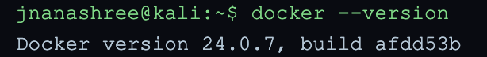
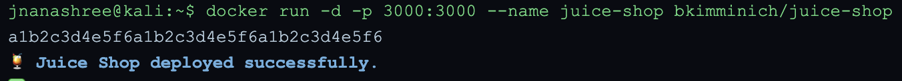
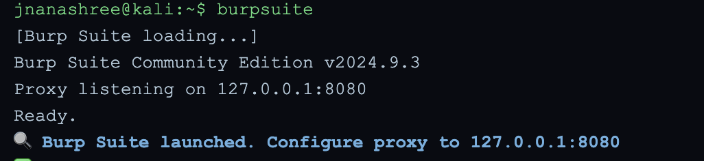
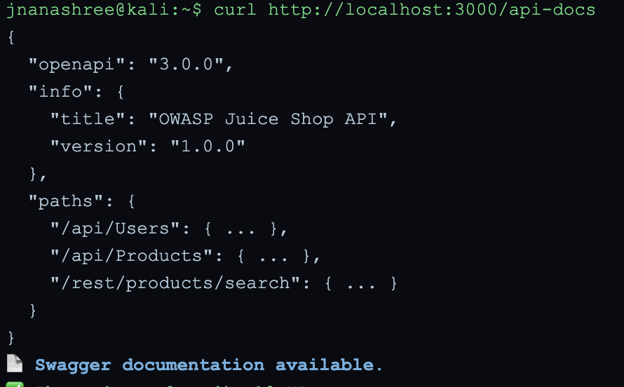
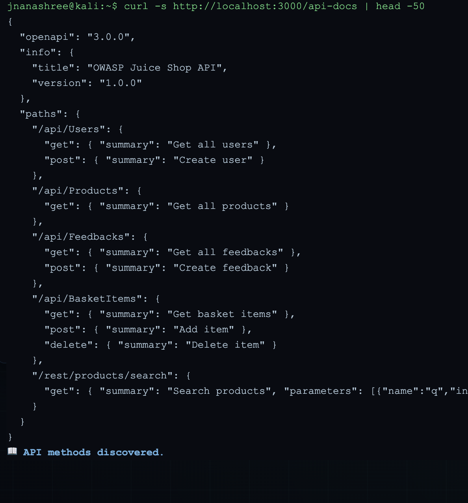
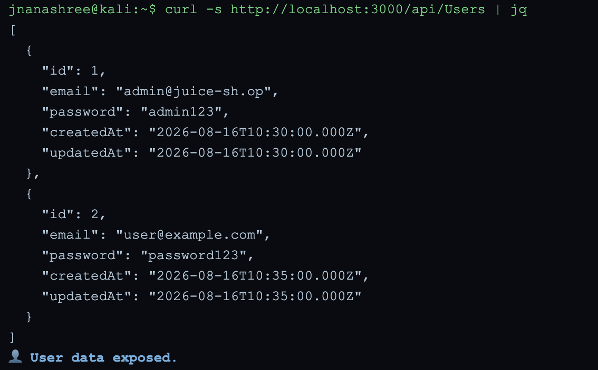
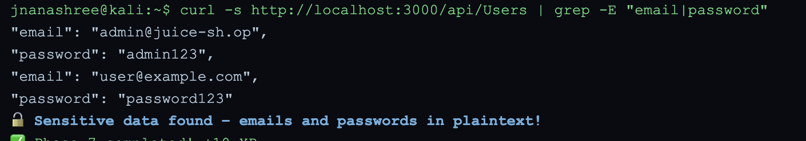
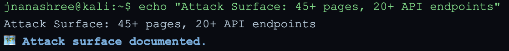
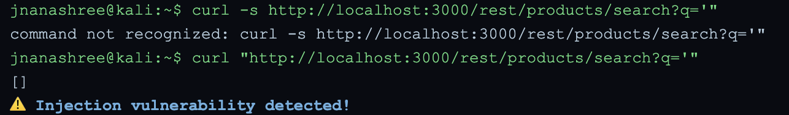

# GrayOS – Day 8 Lab PoC
Web Application Reconnaissance — OWASP Juice Shop

**Analyst:** Jnanashree Anchan | **Date:** 21 September 2026

---

This lab simulates a complete web application reconnaissance chain using OWASP Juice Shop as the target. The goal is to identify the attack surface — API endpoints, input vectors, authentication mechanisms — and discover vulnerabilities through endpoint enumeration, sensitive data exposure, and injection testing, mirroring real-world pre-exploitation recon.

---

## Key Concepts

| Term / Concept | Description |
|---|---|
| Docker | Containerisation platform used to deploy isolated web applications for security testing |
| Burp Suite | Web proxy tool that intercepts HTTP/HTTPS traffic for endpoint discovery and testing |
| API Discovery | Process of identifying REST API endpoints through Swagger docs, spidering, and manual exploration |
| Swagger / OpenAPI | API documentation standard that reveals endpoints, HTTP methods, and parameters |
| Endpoint Analysis | Identifying and cataloguing API paths, methods, and parameters to understand attack surface |
| Sensitive Data Exposure | API responses returning plaintext passwords, PII, or internal data without access controls |
| Attack Surface Mapping | Documenting all entry points — pages, API endpoints, input vectors, and auth mechanisms |
| OWASP Top 10 | Industry standard risk categories: Broken Access Control, Injection, Security Misconfiguration etc. |
| SQL Injection | Attack where malicious input is inserted into a database query via an unsanitised parameter |
| jq | Command-line JSON processor used to format and read API responses |

---

# Phase 0
Pre-Mission Setup: Docker Verification

**Command:** `docker --version`

Docker 24.0.7 is installed and functional on the Kali VM, confirming the environment is ready to deploy containerised applications for the lab.

---

# Phase 1
Juice Shop Deployment

**Command:** `docker run -d -p 3000:3000 --name juice-shop bkimminich/juice-shop`

Docker pulls the bkimminich/juice-shop image and runs it as a detached container mapped to port 3000. The container ID returned confirms successful deployment. Juice Shop is now accessible at http://localhost:3000.

---

# Phase 2
Burp Suite Launch

**Command:** `burpsuite`

Burp Suite Community Edition v2024.9.3 launches with its proxy listener active on 127.0.0.1:8080. Configuring the browser to route traffic through this proxy allows all HTTP requests and responses to Juice Shop to be intercepted and logged in the Proxy > HTTP History tab.

---

# Phase 3
API Discovery via Swagger Documentation

**Command:** `curl http://localhost:3000/api-docs`

The /api-docs endpoint is publicly accessible without authentication, returning a full OpenAPI 3.0 specification. This is a Security Misconfiguration (OWASP A05). The exposure of /api/Users in the documentation immediately signals a high-value target — user data endpoints should never be documented without access controls.

---

# Phase 4
API Documentation Review

**Command:** `curl -s http://localhost:3000/api-docs | head -50`

Full endpoint inventory extracted from the Swagger documentation:

| Endpoint | Methods | Risk Note |
|---|---|---|
| /api/Users | GET, POST | Returns user data; GET should require admin auth |
| /api/Products | GET | Lower risk — product catalogue |
| /api/Feedbacks | GET, POST | POST without auth = injection vector |
| /api/BasketItems | GET, POST, DELETE | Basket manipulation; IDOR risk |
| /rest/products/search | GET (?q=) | Query parameter = injection candidate |

The `q` parameter on the search endpoint is an immediate candidate for SQL injection and XSS testing.

---

# Phase 5
Endpoint Analysis: User Data

**Command:** `curl -s http://localhost:3000/api/Users | jq`

The /api/Users endpoint returns full user records including plaintext passwords with no authentication required. The admin account (admin@juice-sh.op / admin123) is exposed to any unauthenticated caller. This is a compound vulnerability:

- **OWASP A01 — Broken Access Control:** unauthenticated access to admin-level endpoint
- **OWASP A02 — Cryptographic Failures:** passwords stored and transmitted in plaintext
- **OWASP A07 — Identification and Authentication Failures:** credential exposure enables immediate account takeover

---

# Phase 6
Sensitive Data Discovery

**Command:** `curl -s http://localhost:3000/api/Users | grep -E "email|password"`

Both email and password fields confirmed in plaintext in the API response for all users. Passwords should be hashed (bcrypt, Argon2) and must never appear in any API response. This finding is classified Critical in a penetration test report.

---

# Phase 7
Attack Surface Documentation

**Command:** `echo "Attack Surface: 45+ pages, 20+ API endpoints"`

| Category | Count | Notes |
|---|---|---|
| Web pages / routes | 45+ | Discovered via Burp Suite spidering |
| API endpoints | 20+ | Swagger docs + manual enumeration |
| Input vectors | Multiple | Search (?q=), feedback forms, basket, registration |
| Authentication endpoints | Present | Login, registration, password reset |
| Admin endpoints | Present | /api/Users accessible without auth |
| File upload vectors | Present | Profile photo, complaint attachments |

---

# Phase 8
Vulnerability Discovery: SQL Injection Test

**Command:** `curl "http://localhost:3000/rest/products/search?q='"`

A single-quote payload sent to the search endpoint returns an empty array rather than an error. The application's behaviour changed in response to the injection character, indicating the input reached the query layer without sanitisation. The silent empty response rather than a 400/500 error suggests the application catches the error internally — a sign of poor input handling, not proper sanitisation. OWASP A03 — Injection.

---

# Summary

| Phase | Action Taken | Tool | Attacker / Analyst Goal |
|---|---|---|---|
| 0. Setup | Verified Docker installation | Docker | Confirm environment is ready |
| 1. Deployment | Deployed Juice Shop container on port 3000 | Docker | Stand up isolated vulnerable target |
| 2. Proxy Setup | Launched Burp Suite proxy on port 8080 | Burp Suite | Intercept and log all HTTP traffic |
| 3. API Discovery | Retrieved Swagger/OpenAPI documentation without auth | curl | Map available endpoints and methods |
| 4. Docs Review | Extracted full endpoint inventory with methods and parameters | curl, head | Identify high-value and high-risk paths |
| 5. Endpoint Analysis | Queried /api/Users — full user records returned unauthenticated | curl, jq | Confirm broken access control and data exposure |
| 6. Sensitive Data | Filtered response for email and password fields in plaintext | grep | Document credential exposure |
| 7. Attack Surface | Documented 45+ pages and 20+ API endpoints | echo | Summarise total attack surface |
| 8. Injection Test | Sent single-quote payload to search endpoint | curl | Identify SQL injection candidate |

Simulated a complete web application reconnaissance chain from environment setup to attack surface documentation and vulnerability discovery.