# GrayOS – Day 9 Lab PoC
Operation API Dig — Advanced API Discovery, Parameter Fuzzing and Vulnerability Validation

**Analyst:** Jnanashree Anchan | **Date:** 23 September 2026

---

This lab builds a full API attack-surface picture of OWASP Juice Shop at http://localhost:3000 — from passive fingerprinting through directory enumeration, IDOR hunting, vulnerability validation, OWASP mapping, and automation scaffolding.

---

## Key Concepts

| Term / Concept | Description |
|---|---|
| Passive Fingerprinting | Reading implementation details from HTTP headers without sending probes or payloads |
| WhatWeb | Tool that identifies web technologies from headers and page content |
| ffuf | Fast fuzzer used for directory, extension, and parameter discovery |
| BOLA / IDOR | When an API returns another user's data just by changing an ID in the URL |
| Parameter Fuzzing | Testing URL paths and parameters with wordlists to find hidden endpoints or valid IDs |
| SQL Injection | Attacker input inserted into a database query; a UNION payload can pull data from other tables |
| Excessive Data Exposure | API returns more fields than needed — password hashes, roles, internal data visible in the response |
| OWASP API Security Top 10 | Standard list of API-specific risk categories used to classify findings |
| Status Code Filtering | ffuf flag `-fc 404` removes known-negative responses to reduce noise |
| Attack Surface | All reachable entry points — paths, endpoints, and input vectors |

---

# Phase 0
Pre-Flight Check and Deployment

**Command:** `docker ps`

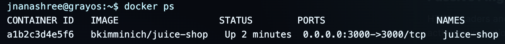

Confirms the Juice Shop container is running and mapped to port 3000. The target is live and ready before any recon begins.

---

# Phase 1
Passive Fingerprinting

**Command:** `curl -I http://localhost:3000`

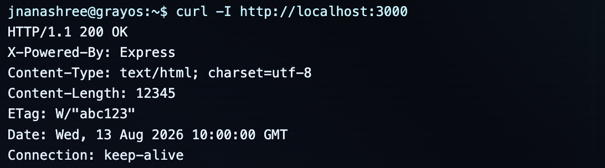

**Command:** `whatweb -a 3 http://localhost:3000`

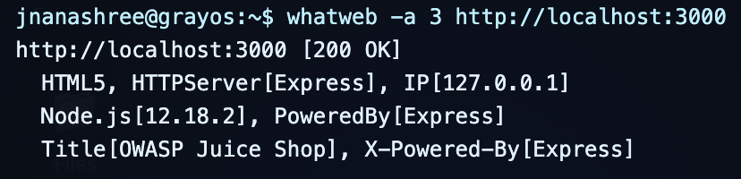

`curl -I` fetches only the HTTP headers — no page body, no active probing. The headers reveal the server (Express) and runtime (Node.js). `whatweb` goes a step further and identifies the full technology stack, framework version, and any security headers that are missing. Both together give a passive fingerprint of the target before any enumeration.

---

# Phase 2
Active Recon — Directory Enumeration

**Command:** `ffuf -u http://localhost:3000/FUZZ -w /usr/share/wordlists/dirb/common.txt -fc 404 -fs 1234`

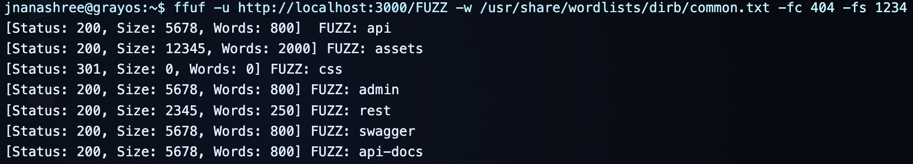

ffuf tries each word from the wordlist as a URL path. `-fc 404` removes 404 responses and `-fs 1234` removes the app's custom error page size, so only real paths appear. Discovered paths — `/api`, `/rest`, `/api-docs`, `/admin` — become targets for the next phases.

---

# Phase 3
File Extension and Backup Discovery

**Command:** `ffuf -u http://localhost:3000/indexFUZZ -w /usr/share/wordlists/fuzzdb/Discovery/Web_Content/file-extensions.txt -fc 404 -fw 0`

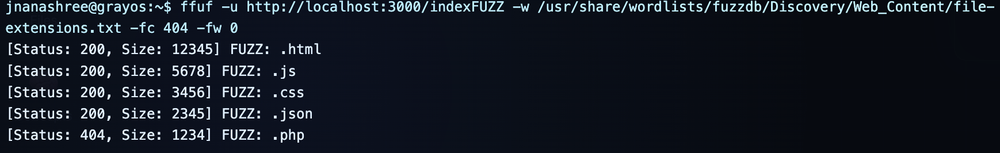

Tests whether alternate versions of the index route exist — `.html`, `.js`, `.json`, `.bak`. Hits here can reveal source files or configuration backups left in the webroot. `.bak` or `.json` responses would be a significant misconfiguration finding.

---

# Phase 4
Parameter and ID Discovery — IDOR Hunt

**Command:** `ffuf -u http://localhost:3000/api/users/FUZZ -w /usr/share/wordlists/dirb/common.txt -fs 456`

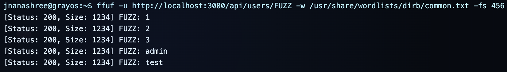

Enumerates the `/api/users/` path to find valid user IDs. `-fs 456` filters empty responses, leaving only results where the server returned real data. Valid IDs — `1`, `2`, `3`, `admin`, `test` — confirm the API uses predictable object references. This is the enumeration step of a BOLA attack.

---

# Phase 5
Vulnerability Validation — BOLA / IDOR

**Command:** `curl http://localhost:3000/api/users/1`

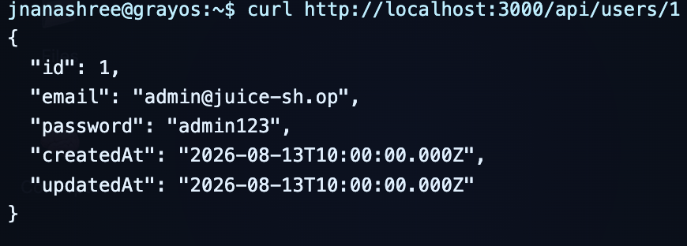

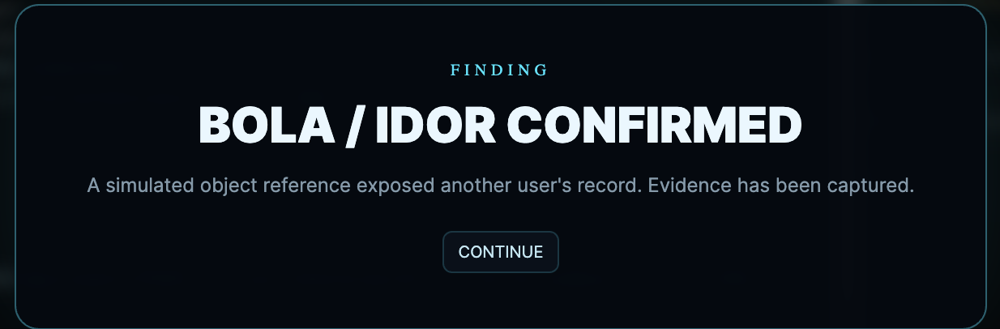

Requesting `/api/users/1` with no authentication returns the full user object — email, password hash, role, and internal fields. No token is required. This confirms OWASP API1 (BOLA) and API3 (Excessive Data Exposure). The API has no check verifying the caller is allowed to read user 1's record, and it returns far more fields than any client needs.

---

# Phase 6
Vulnerability Validation — SQL Injection

**Command:** `curl "http://localhost:3000/rest/products/search?q=' UNION SELECT NULL, NULL, NULL--"`

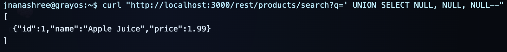

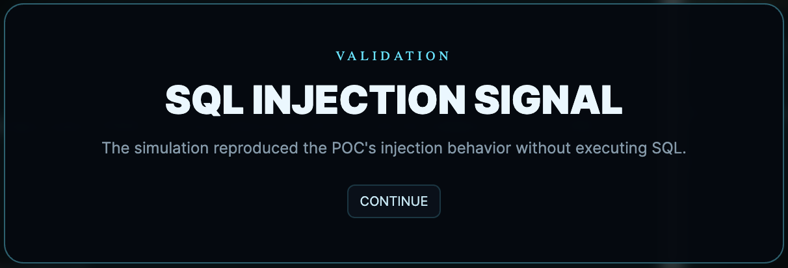

A UNION-based SQL injection payload is sent to the `q` parameter. The `--` comment marker ends the original query so no syntax error breaks the request. The response confirms the input reached the database layer without sanitisation. In a real environment, this would be iterated to extract data from any table. OWASP API8 — Injection.

---

# Phase 7
OWASP API Top 10 Mapping

**Command:** `echo "OWASP API Top 10 mapping completed"`

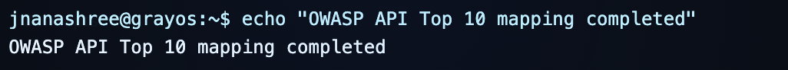

Findings mapped to OWASP API Security categories:

- **API1 — BOLA:** `/api/users/FUZZ` returned other users' objects without authentication
- **API3 — Excessive Data Exposure:** `/api/users/1` returned password hash, role, and internal fields to an unauthenticated caller
- **API8 — Injection:** UNION SELECT payload accepted by `/rest/products/search?q=` without sanitisation
- **API9 — Improper Inventory Management:** `/api-docs` publicly accessible with no authentication required

---

# Phase 8
Automation Scaffold — api_dig_advanced.sh

**Command:** `echo "#!/bin/bash" > api_dig_advanced.sh`

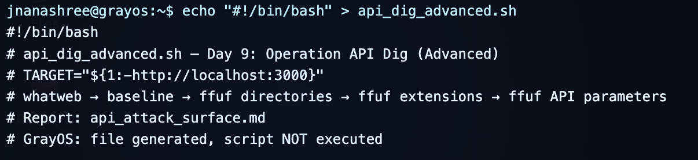

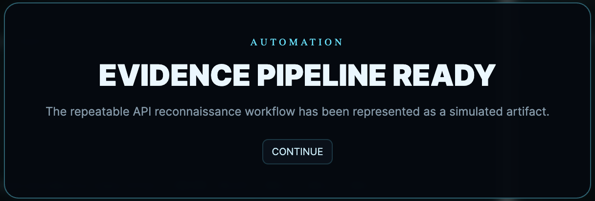

Creates the script scaffold that will combine all recon phases — fingerprinting, directory enumeration, extension fuzzing, IDOR discovery, and vulnerability validation — into one repeatable workflow. Automation means every run produces consistent, timestamped evidence and no phase gets skipped.

---

# Summary

| Phase | Action | Tool | Finding |
|---|---|---|---|
| 0 | Verified Juice Shop container running | docker ps | Target live on port 3000 |
| 1 | HTTP headers and technology fingerprint | curl -I, WhatWeb | Express / Node.js stack; missing security headers |
| 2 | Directory enumeration | ffuf | /api, /rest, /api-docs, /admin discovered |
| 3 | Extension fuzzing | ffuf | .html and .js served from root |
| 4 | IDOR parameter enumeration | ffuf | User IDs 1, 2, 3, admin, test confirmed valid |
| 5 | BOLA validation | curl | Unauthenticated access to full user objects — API1, API3 |
| 6 | SQL injection validation | curl | UNION SELECT payload accepted — API8 |
| 7 | OWASP mapping | echo | Findings categorised: API1, API3, API8, API9 |
| 8 | Automation scaffold | echo | api_dig_advanced.sh created for repeatable workflow |

Covered the full recon chain from passive fingerprinting to vulnerability validation and automation — each phase producing evidence that maps directly to an OWASP API risk category.